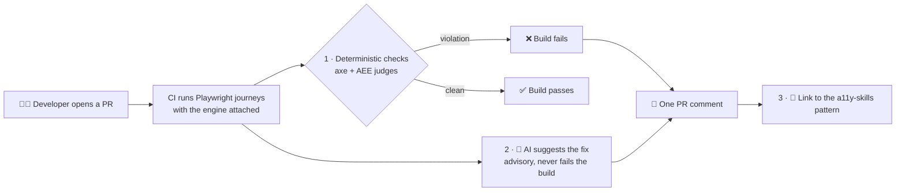
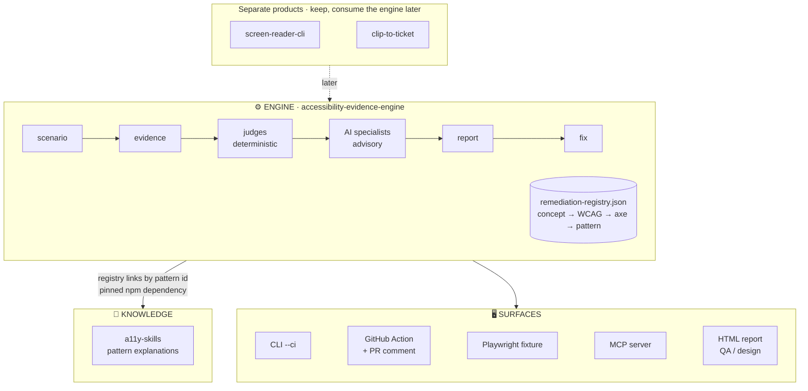
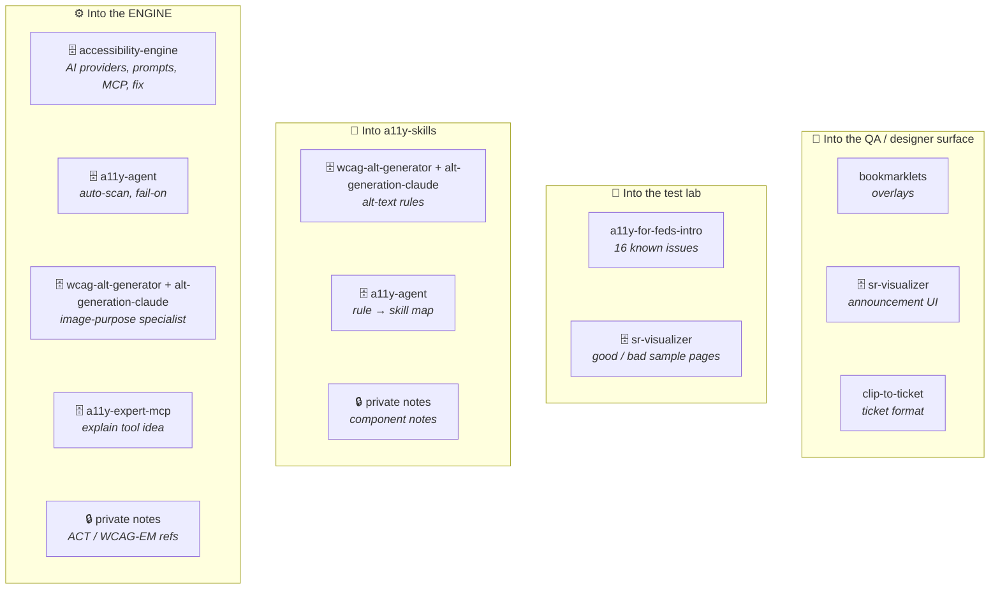

# Master plan: one accessibility toolkit

This is the working plan for turning a dozen accessibility repos into one tool developers use on every pull request. It is the single source of truth for that cross-repo work. Engine internals keep their own detail in `docs/implementation-roadmap.md`; this plan links to it rather than repeating it.

## How to use this file

- **Start a session:** open a Claude Code session on `accessibility-evidence-engine` and say _"continue the master plan"_. `CLAUDE.md` points here, so a fresh chat picks up the context without any earlier conversation.
- **One step per session.** Each step is sized for one sitting and has a "done when" line.
- **Tick the box in the same PR that does the work.** The file is then always true, and git history is the log.
- **Decisions go in the Decisions log below**, not in chat. Chat is lost; this file is not.

## Goal

A developer opens a PR. CI runs their Playwright journeys with the engine attached, then:

1. **Deterministic checks fail the build** on real violations (axe plus AEE's own judges).
2. **AI suggests the fix** for each violation, using a screenshot of the section and the page context. This is advisory, labelled as AI, and never fails the build.
3. **Each finding links to the pattern** that explains it (a11y-skills).

The first rules covered are unlabeled buttons, unlabeled links, missing alt text, missing form labels and empty headings. This is the exit test of Milestone 3 in `docs/implementation-roadmap.md`, widened from one rule to five.

## Target shape

**Why the registry is the map:** it already joins each concept to WCAG criteria, axe rules, required evidence, the AI allowlist and verification. Adding a `pattern` field that points at a11y-skills keeps every mapping in one file. a11y-skills stays pure explanation with no second rule map.

## Inventory: every source and where its value goes

Nothing is archived until its row says **harvested**. That is how no information gets lost.

🗄️ archived once harvested (so is `accessibility-validator`, which has nothing to take) · 🔒 scrubbed before it moves · no icon: stays live.

### Core (keep, active)

| Repo                            | Role                             | Notes                                                   |
| ------------------------------- | -------------------------------- | ------------------------------------------------------- |
| `accessibility-evidence-engine` | **The engine**                   | —                                                       |
| `a11y-skills`                   | **The knowledge**                | Gains the alt-text and component-note improvements (M1) |
| `screen-reader-cli`             | Separate product: screen readers | Later: `scan` calls the engine (M7)                     |
| `a11y-engineering-toolkit`      | Portfolio page only              | Portfolio map updated at the end (M8)                   |

### Merge into the engine, then archive

| Repo                      | Value to harvest                                                                                                                                                                                                                                                                                                                                                                       | Goes to                                                                                                                                                 | Harvested |
| ------------------------- | -------------------------------------------------------------------------------------------------------------------------------------------------------------------------------------------------------------------------------------------------------------------------------------------------------------------------------------------------------------------------------------- | ------------------------------------------------------------------------------------------------------------------------------------------------------- | --------- |
| `accessibility-engine`    | **The most to harvest.** Working AI provider layer (Claude, local Ollama with no API key, stub; this engine only has an OpenAI adapter). Naming, alt-text and vision judge prompts. MCP server (`@aee/mcp`). Apply-fix-to-source including JSX (`@aee/fix`). Triage CLI. The graph-guard test that keeps AI away from the live page. Content-addressed artifact store. ADRs 0002–0005. | Providers → `@aee/ai-fixes` (M2); prompts → specialists (M2); MCP → new package (M6); fix → `--fix` (M5); graph guard → tests (M2); ADRs → `docs/` (M2) | [ ]       |
| `a11y-agent`              | Auto-scan on navigation; `A11Y_STRICT` severity threshold; axe-rule → skill map (stale filenames)                                                                                                                                                                                                                                                                                      | Fixture auto-checkpoint (M4); `fail-on` (M4); registry `pattern` fields (M1)                                                                            | [ ]       |
| `a11y-expert-mcp`         | Tool ideas only; its patterns are a stale copy of a11y-skills                                                                                                                                                                                                                                                                                                                          | MCP `explain` tool (M6)                                                                                                                                 | [ ]       |
| `accessibility-validator` | Nothing new; axe covers it                                                                                                                                                                                                                                                                                                                                                             | —                                                                                                                                                       | [ ]       |
| `sr-visualizer`           | "Good" and "bad" sample pages; streaming SR-announcement UI                                                                                                                                                                                                                                                                                                                            | Samples → test lab (M3); UI → QA surface (M7)                                                                                                           | [ ]       |
| `wcag-alt-generator`      | Image-role classification (decorative / functional / informative)                                                                                                                                                                                                                                                                                                                      | `image-purpose` specialist (M2)                                                                                                                         | [ ]       |
| `alt-generation-claude`   | Alt-text best-practice rules and prompt; image + context input                                                                                                                                                                                                                                                                                                                         | `image-purpose` specialist (M2); image-labeling pattern (M1)                                                                                            | [ ]       |

### Harvest from, keep live

| Repo                  | Value                                                            | Goes to                                                                                       | Harvested |
| --------------------- | ---------------------------------------------------------------- | --------------------------------------------------------------------------------------------- | --------- |
| `a11y-for-feds-intro` | A deliberately broken page with 16 listed issues and their fixes | Test-lab cases with known answers (M3); before/after showcase (4.6); stays live as a workshop | [ ]       |
| `bookmarklets`        | Visual overlays: headings, tab order, alt text, focus indicator  | QA/designer surface (M7)                                                                      | [ ]       |
| `clip-to-ticket`      | Ticket format; WCAG 2.2 and APG data files                       | Ticket format → reporter (M7); data only if the registry's WCAG fields prove insufficient     | [ ]       |

### Private notes (read, scrub, then move)

| Source                                                                   | Value                                                                                                                                   | Goes to                                       | Harvested |
| ------------------------------------------------------------------------ | --------------------------------------------------------------------------------------------------------------------------------------- | --------------------------------------------- | --------- |
| `e11i-brain` → `Work old/2 - Resources/A11y` and `Accessible components` | Short notes on links, contrast, non-text contrast, mouse-only, RTL, mobile, cards, multi- vs single-select, drag and drop, autocomplete | Pattern improvements in a11y-skills (M1)      | [ ]       |
| `e11i-brain` → `Clippings`                                               | ACT Rules Format, WCAG-EM, ARIA-AT, WCAG 3                                                                                              | References for registry and judge design (M2) | [ ]       |

**Scrub rule:** anything that moves from a private note into a public repo is rewritten generically. No employer, product or partner names, and no internal links or screenshots. If a note only makes sense with that context, it doesn't move. `CONTRIBUTING.md` already forbids proprietary page evidence; this rule extends it to notes.

### Out of scope (no action)

`visua11y` (reading aid for end users, not a developer tool), `any-access` (three small 2020 scripts, all covered by a11y-skills), `accessible-search`, `a11y-first-ext`, `a11y-booth-game`, and the forks `a11y-memory-game`, `a11y-interactions`, `a11y-html-aria`. Also checked and unrelated to accessibility: `TTS`, `the-vault`, and the rest of the personal and family repos.

## Milestones

See it as a picture on the [live roadmap](https://elizabeth1979.github.io/accessibility-evidence-engine/roadmap.html), which is built from this section on every deploy. Each milestone's **Outcome** line is what the page shows.

Each "day" is one focused session. Skipping days is fine; skipping order is not.

### M0 — Home base (day 1)

**Outcome:** The plan lives in this repo, and every session starts from it.

- [x] **0.1** Review and merge the PR that adds this file and `CLAUDE.md`. Close accessibility-engine PR #1, which had the plan in the wrong repo. _Done when:_ this file is on `main`.
- [x] **0.2** Answer the open questions (below) and record the answers in the Decisions log. _Done when:_ no open question blocks M1–M4.
- [x] **0.3** Replace the example that named a real product with a generic `examples/public-site/` scenario that targets this project's own demo site. The old name is removed from the scripts, README, CHANGELOG and CLI tests. _Done when:_ a case-insensitive grep for the old name finds nothing outside git history.

### M1 — Knowledge link (days 2–4)

**Outcome:** Every finding links to the pattern that explains it.

- [x] **1.1** Registry: add a `pattern` field to each entry (for example `accessible-name` → `buttons`, `link`, `forms`) and extend the axe mappings for the MVP rules: `link-name`, `image-alt`, `label` and `empty-heading`. Only `button-name` is mapped today. Update the registry schema. _Done when:_ `npm run check` and the unit tests pass, and every MVP axe rule resolves to a registry entry and a pattern.
- [ ] **1.2** a11y-skills: make the package publishable (drop `private`, set `files`) and publish it. The engine pins that version and checks every registry `pattern` points to a file that exists. _Done when:_ a test fails if a pattern file is renamed.
- [ ] **1.3** a11y-skills: merge alt-text rules from `alt-generation-claude` and `wcag-alt-generator` into `image-labeling.instructions.md`, keeping only what isn't already there. _Done when:_ image-role classification (decorative / functional / informative) has good and bad examples.
- [ ] **1.4** Scrub and move the private component notes into a11y-skills. This is several small PRs, one topic each; skip any note that is only a link. _Done when:_ each note row in the inventory is ticked or marked "nothing to move".

### M2 — Harvest the AI layer (days 5–8)

**Outcome:** AI suggestions run on Claude, a local model or a free stub.

- [ ] **2.1** Port the provider seam from `accessibility-engine`: Claude, local (Ollama) and stub, next to the existing OpenAI adapter, all behind the existing `AccessibleLabelModelProvider` interface. With no key, the default is stub. _Done when:_ the unit tests pass with the stub, and a live test runs when a local model is present.
- [ ] **2.2** Port the graph-guard test: the AI package must not import a browser driver. _Done when:_ adding a Playwright import to `ai-fixes` fails the tests.
- [ ] **2.3** Port the naming and alt-text judge prompts into the allowlisted specialists (`accessible-name` icon-only, `image-purpose`), adding image-role classification. _Done when:_ the test-lab icon-button case gets a labelled AI name from the stub fixture.
- [ ] **2.4** Carry the design decisions over as ADRs in `docs/`: accessibility-engine's ADRs 0002–0005, plus the ACT-rules shape of the registry. _Done when:_ the ADRs exist; this step changes no code.
- [ ] **2.5** Wire the accessibility-engineer prompt (`packages/ai-fixes/prompts/accessibility-engineer.md`) in as the system prompt of every AI specialist (and add `prompts/` to the package `files`), and turn its measurable disagreements into deterministic judges: text that looks like a heading but has no heading role, a mouse target that is not a tab stop, and hover content with no focus equivalent. _Done when:_ a test fails if a specialist runs without the prompt, and the heading judge flags the old roadmap markup (milestone titles inside `
`).

### M3 — Known-answer test cases (days 9–10)

**Outcome:** Test pages with known answers catch any missed or false finding.

- [ ] **3.1** Add the `a11y-for-feds-intro` broken page and the sr-visualizer samples as test-lab cases with expected findings, following `site/test-lab-contract.json`. _Done when:_ `npm run test:playwright` fails if a known violation is missed or a good page gets a finding.

### M4 — The PR experience (days 11–15)

**Outcome:** ⭐ The goal: a PR with an accessibility bug gets red CI and one comment with the fix and the pattern.

- [ ] **4.1** Reporter: a PR-comment variant of the Markdown report. Blocking findings come first, then AI suggestions labelled as AI; each finding is collapsed and shows the element, the problem, the fix and the pattern link. _Done when:_ a snapshot test on a test-lab page passes.
- [ ] **4.2** Playwright fixture: a drop-in `test` export that captures a checkpoint automatically on page load, so a team can adopt it without writing scenario YAML. _Done when:_ an existing spec with only the import swapped produces findings.
- [ ] **4.3** A composite `action.yml` with inputs `run` (a scenario or test command), `fail-on` and `ai-provider` (default `stub`). It posts one sticky comment that later runs update. _Done when:_ running it twice leaves exactly one comment.
- [ ] **4.4** A self-test workflow: every PR in this repo runs the Action against the test lab. _Done when:_ a PR that adds a nameless icon button gets red CI and a comment with the buttons pattern link.
- [ ] **4.5** AI on in CI with a provider key secret. _Done when:_ the comment shows an AI-suggested button name, labelled as AI.
- [ ] **4.6** Showcase on `a11y-for-feds-intro`: next to its broken page, show the PR comment the tool produces for each of the 16 issues (blocking finding, AI fix, pattern link), then the fixed page. The site stays a workshop; it links to the engine docs and does not copy them. _Done when:_ the site shows the tool's output for all 16 issues.

### M5 — Ship and dogfood (days 16–19)

**Outcome:** The tool runs on a real app and can apply fixes to the code.

- [ ] **5.1** Adopt it in one of your own public apps, installed from GitHub (no npm publish yet). _Done when:_ that repo's PRs get the comment, and every friction point is filed as an issue.
- [ ] **5.2** `--fix`: apply a reviewed label proposal to source, including JSX, using `@aee/fix` from accessibility-engine. Apply it on a branch and rerun the journey to verify. _Done when:_ Milestone 3's exit test in the roadmap passes.
- [ ] **5.3** Decide distribution: open core, product, or npm only. Check the employment contract first. If publishing, add a publish workflow gated on the full CI suite under the `@e11i` scope. _Done when:_ the decision is in the Decisions log, and, if published, installing in an empty project works.

### M6 — One MCP (days 20–21)

**Outcome:** A coding agent asks "explain button-name" and gets the pattern.

- [ ] **6.1** Port `@aee/mcp` from accessibility-engine, rewired to this engine, and add an `explain` tool: rule id or UI element in, the a11y-skills pattern out, through the registry. _Done when:_ a coding agent asked "explain button-name" gets the buttons pattern.
- [ ] **6.2** a11y-expert-mcp: final PyPI release whose README points to the new MCP. _Done when:_ the PyPI page shows the notice.

### M7 — QA and designer surface (later, after M5 is used for real)

**Outcome:** QA and designers get a visual report, not only developers.

- [ ] **7.1** Design spec only: add bookmarklets-style overlays, the sr-visualizer announcement list and the clip-to-ticket ticket format to the existing HTML report. _Done when:_ a spec is in `docs/`.
- [ ] **7.2** screen-reader-cli: have `scan` call the engine. This is an issue first, per that repo's rules. _Done when:_ the issue is filed with the proposed change.

### M8 — Archive and re-map (last)

**Outcome:** Old repos are archived, and the portfolio shows the new shape.

- [ ] **8.1** For each repo marked "archive" whose inventory row is ticked: add a README banner saying it's superseded by accessibility-evidence-engine, then use GitHub's Archive button. _Done when:_ every archive row is ticked and archived.
- [ ] **8.2** Update the portfolio map in `a11y-engineering-toolkit`. _Done when:_ the public page shows the new shape.

## Open questions

None right now. Add new ones here and move each answer to the Decisions log.

## Decisions log

Newest first. One line each: date, decision, why.

- 2026-09-26 — The engine gets one accessibility-engineer prompt (`packages/ai-fixes/prompts/accessibility-engineer.md`), auditor and fixer in one role: walk every pillar, a finding is where two pillars disagree, confirm with a second pillar, report how each finding was found, propose the smallest fix and the re-test that proves it. The keyboard is tested as an input device with no screen reader running, and every mouse interaction is replayed by keyboard. Why: that is how a human auditor finds what axe cannot, and it must be the product's behaviour, not a README.
- 2026-09-26 — `a11y-for-feds-intro` becomes the developer showcase; no new demo site. Why: it already has a broken page, 16 known issues and their fixes.
- 2026-09-26 — Dogfood before distributing: M5 installs from GitHub first; publishing waits for step 5.3. Why: publishing is hard to undo and closes off productising, so decide with real usage in hand.
- 2026-09-25 — Publish under the `@e11i` npm scope (the owner's existing npm account, which already publishes `screen-reader-cli`). Why: a user scope is guaranteed free and avoids the `@aee` clash with accessibility-engine.
- 2026-09-25 — Developers get both paths: YAML scenarios stay for reviewers, and a drop-in Playwright fixture is added for existing `.spec.ts` tests (4.2). Why: developers adopt what fits their current tests.
- 2026-09-25 — The fixture checkpoints automatically on page load, plus explicit checkpoints after interactions. Why: zero-effort adoption; explicit checkpoints cover states after interactions.
- 2026-09-25 — The default `fail-on` is `serious` and above. Why: it matches axe's own severity, and teams can lower it.
- 2026-09-24 — `accessibility-evidence-engine` is the engine; `accessibility-engine` is harvested, then archived. Why: it is the actively developed codebase (about 4× the code), and its registry, deterministic-first routing, evidence correlation and reports are the foundation. accessibility-engine contributes its AI providers, prompts, MCP and fix.
- 2026-09-24 — The remediation registry is the only concept → WCAG → axe → pattern map; a11y-skills holds explanations only. Why: one mapping, no drift.
- 2026-09-24 — AI output never fails CI; only deterministic checks do. Why: a false positive that blocks a merge gets the tool turned off.
- 2026-09-24 — The CI default AI provider is `stub`; AI turns on with a key. Why: running a local model on CI runners is slow and heavy.
