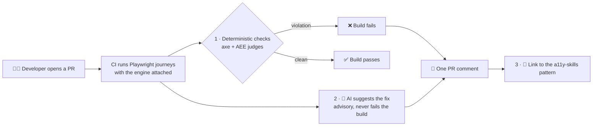
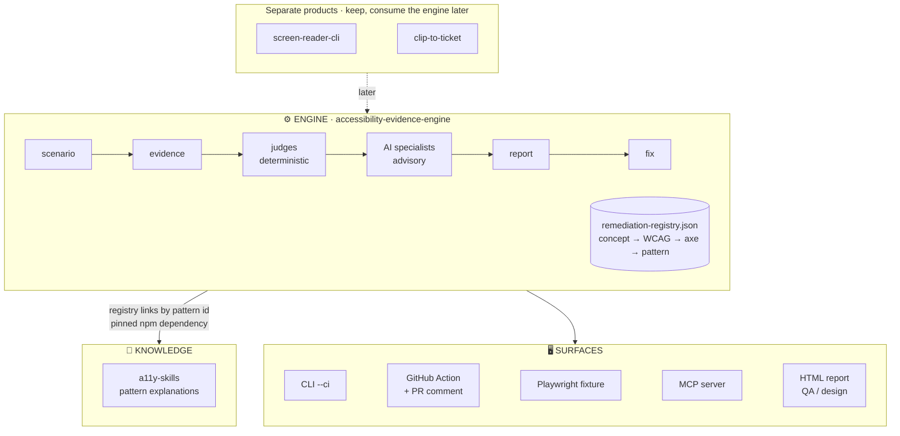
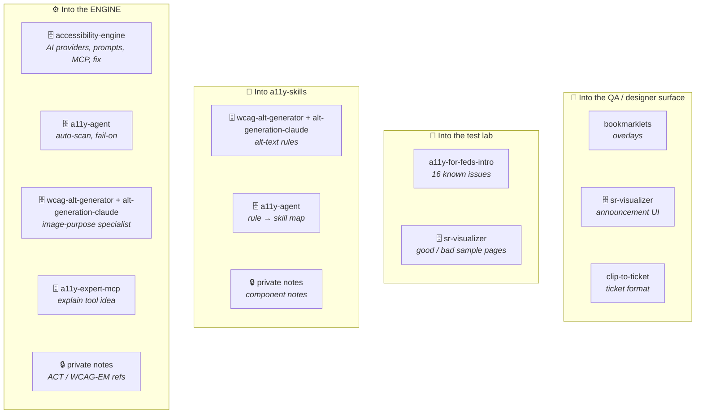

# Master plan: one accessibility toolkit

This is the working plan for turning a dozen accessibility repos into one tool developers use on every pull request. It is the single source of truth for that cross-repo work. Engine internals keep their own detail in `docs/implementation-roadmap.md`; this plan links to it rather than repeating it.

## How to use this file

- **Start a session:** open a Claude Code session on `accessibility-evidence-engine` and say _"continue the master plan"_. `CLAUDE.md` points here, so a fresh chat picks up the context without any earlier conversation.
- **One step per session.** Each step is sized for one sitting and has a "done when" line.
- **Tick the box in the same PR that does the work.** The file is then always true, and git history is the log.
- **Decisions go in the Decisions log below**, not in chat. Chat is lost; this file is not.
- **Current focus: the tool works for its owner.** Publishing (npm, PyPI), public showcases and the portfolio map wait in [Later](#later-parked) until it does.

## Goal

A developer opens a PR. CI runs their Playwright journeys with the engine attached, then:

1. **Deterministic checks fail the build** on real violations (axe plus AEE's own judges).
2. **AI suggests the fix** for each violation, using a screenshot of the section and the page context. This is advisory, labelled as AI, and never fails the build.
3. **Each finding links to the pattern** that explains it (a11y-skills).

The first rules covered are unlabeled buttons, unlabeled links, missing alt text, missing form labels and empty headings. This is the exit test of Milestone 3 in `docs/implementation-roadmap.md`, widened from one rule to five.

## Target shape

**Why the registry is the map:** it already joins each concept to WCAG criteria, axe rules, required evidence, the AI allowlist and verification. Adding a `pattern` field that points at a11y-skills keeps every mapping in one file. a11y-skills stays pure explanation with no second rule map.

## Inventory: every source and where its value goes

Nothing is archived until its row says **harvested**. That is how no information gets lost.

🗄️ archived once harvested · 🔒 scrubbed before it moves · no icon: stays live. Every verdict is in the review list below.

### Review list: every repo in one place

This table is the only place a repo's fate is decided. **Archive is the default:** it is reversible and keeps history and links working. **Delete** only a repo with nothing to harvest and nothing linking to it, or a fork with no commits of its own; a deletion is hard to undo. A repo is archived the day its harvest row is ticked, not at the end.

| Repo                                                                 | Verdict                                                                                                                                                | Waits on               |
| -------------------------------------------------------------------- | ------------------------------------------------------------------------------------------------------------------------------------------------------ | ---------------------- |
| `accessibility-evidence-engine`                                      | **Keep:** the tool                                                                                                                                     | —                      |
| `a11y-skills`                                                        | **Keep:** the knowledge                                                                                                                                | —                      |
| `screen-reader-cli`                                                  | **Keep:** separate product for screen readers. Its `scan` repeats the engine's Playwright + axe pipeline, so it routes through the engine later (7.2). | —                      |
| `a11y-engineering-toolkit`                                           | **Keep:** portfolio page                                                                                                                               | —                      |
| `a11y-for-feds-intro`                                                | **Keep:** workshop                                                                                                                                     | Harvest (M2)           |
| `bookmarklets`                                                       | **Keep**                                                                                                                                               | Harvest (M7)           |
| `clip-to-ticket`                                                     | **Keep:** separate product                                                                                                                             | Harvest (M7)           |
| `accessibility-engine`                                               | **Archive**                                                                                                                                            | Harvest (M3, M5, M6)   |
| `a11y-agent`                                                         | **Archive**                                                                                                                                            | Harvest (4.2, 4.3)     |
| `a11y-expert-mcp`                                                    | **Archive**; its patterns are a stale copy of a11y-skills                                                                                              | Harvest (6.1)          |
| `sr-visualizer`                                                      | **Archive**                                                                                                                                            | Harvest (M2, M7)       |
| `wcag-alt-generator`                                                 | **Archive**                                                                                                                                            | Harvest (M3)           |
| `alt-generation-claude`                                              | **Archive**                                                                                                                                            | Harvest (M3)           |
| `accessibility-validator`                                            | **Delete:** a hand-written Python checker for rules axe already covers; nothing to harvest                                                             | Owner's last look      |
| `any-access`                                                         | **Delete:** three small 2020 scripts, all covered by a11y-skills                                                                                       | Owner's last look      |
| `a11y-memory-game`, `a11y-interactions`, `a11y-html-aria`            | **Delete** each fork with no commits of its own; archive the others                                                                                    | Owner's check per fork |
| `visua11y`, `accessible-search`, `a11y-first-ext`, `a11y-booth-game` | **No action:** not duplicates (`visua11y` is a reading aid for end users, not a developer tool)                                                        | —                      |

Also checked and unrelated to accessibility: `TTS`, `the-vault`, and the rest of the personal and family repos.

### Harvest details

| Repo                    | Value to harvest                                                                                                                                                                                                                                                                                                                                                                       | Goes to                                                                                                                                                 | Harvested |
| ----------------------- | -------------------------------------------------------------------------------------------------------------------------------------------------------------------------------------------------------------------------------------------------------------------------------------------------------------------------------------------------------------------------------------- | ------------------------------------------------------------------------------------------------------------------------------------------------------- | --------- |
| `accessibility-engine`  | **The most to harvest.** Working AI provider layer (Claude, local Ollama with no API key, stub; this engine only has an OpenAI adapter). Naming, alt-text and vision judge prompts. MCP server (`@aee/mcp`). Apply-fix-to-source including JSX (`@aee/fix`). Triage CLI. The graph-guard test that keeps AI away from the live page. Content-addressed artifact store. ADRs 0002–0005. | Providers → `@aee/ai-fixes` (M3); prompts → specialists (M3); MCP → new package (M6); fix → `--fix` (M5); graph guard → tests (M3); ADRs → `docs/` (M3) | [ ]       |
| `a11y-agent`            | Auto-scan on navigation; `A11Y_STRICT` severity threshold; axe-rule → skill map (stale filenames)                                                                                                                                                                                                                                                                                      | Fixture auto-checkpoint (4.2); `fail-on` (4.3); the skill map is replaced by registry `pattern` fields (1.1, done)                                      | [ ]       |
| `a11y-expert-mcp`       | Tool and prompt ideas only                                                                                                                                                                                                                                                                                                                                                             | MCP `explain` tool (M6)                                                                                                                                 | [ ]       |
| `sr-visualizer`         | "Good" and "bad" sample pages; streaming SR-announcement UI                                                                                                                                                                                                                                                                                                                            | Samples → test lab (M2); UI → QA surface (M7)                                                                                                           | [ ]       |
| `wcag-alt-generator`    | Image-role classification (decorative / functional / informative)                                                                                                                                                                                                                                                                                                                      | `image-purpose` specialist (M3)                                                                                                                         | [ ]       |
| `alt-generation-claude` | Alt-text best-practice rules and prompt; image + context input                                                                                                                                                                                                                                                                                                                         | `image-purpose` specialist (M3); image-labeling pattern (Later)                                                                                         | [ ]       |
| `a11y-for-feds-intro`   | A deliberately broken page with 16 listed issues and their fixes                                                                                                                                                                                                                                                                                                                       | Test-lab cases with known answers (M2); before/after showcase (Later)                                                                                   | [ ]       |
| `bookmarklets`          | Visual overlays: headings, tab order, alt text, focus indicator                                                                                                                                                                                                                                                                                                                        | QA/designer surface (M7)                                                                                                                                | [ ]       |
| `clip-to-ticket`        | Ticket format; WCAG 2.2 and APG data files                                                                                                                                                                                                                                                                                                                                             | Ticket format → reporter (M7); data only if the registry's WCAG fields prove insufficient                                                               | [ ]       |

### Private notes (read, scrub, then move)

| Source                                                                   | Value                                                                                                                                   | Goes to                                       | Harvested |
| ------------------------------------------------------------------------ | --------------------------------------------------------------------------------------------------------------------------------------- | --------------------------------------------- | --------- |
| `e11i-brain` → `Work old/2 - Resources/A11y` and `Accessible components` | Short notes on links, contrast, non-text contrast, mouse-only, RTL, mobile, cards, multi- vs single-select, drag and drop, autocomplete | Pattern improvements in a11y-skills (Later)   | [ ]       |
| `e11i-brain` → `Clippings`                                               | ACT Rules Format, WCAG-EM, ARIA-AT, WCAG 3                                                                                              | References for registry and judge design (M3) | [ ]       |

**Scrub rule:** anything that moves from a private note into a public repo is rewritten generically. No employer, product or partner names, and no internal links or screenshots. If a note only makes sense with that context, it doesn't move. `CONTRIBUTING.md` already forbids proprietary page evidence; this rule extends it to notes.

## Milestones

See it as a picture on the [live roadmap](https://elizabeth1979.github.io/accessibility-evidence-engine/roadmap.html), which is built from this section on every deploy. Each milestone's **Outcome** line is what the page shows.

Each "day" is one focused session. Skipping days is fine; skipping order is not.

### M0 — Home base (day 1)

**Outcome:** The plan lives in this repo, and every session starts from it.

- [x] **0.1** Review and merge the PR that adds this file and `CLAUDE.md`. Close accessibility-engine PR #1, which had the plan in the wrong repo. _Done when:_ this file is on `main`.
- [x] **0.2** Answer the open questions (below) and record the answers in the Decisions log. _Done when:_ no open question blocks M1–M4.
- [x] **0.3** Replace the example that named a real product with a generic `examples/public-site/` scenario that targets this project's own demo site. The old name is removed from the scripts, README, CHANGELOG and CLI tests. _Done when:_ a case-insensitive grep for the old name finds nothing outside git history.

### M1 — Knowledge link (days 2–3)

**Outcome:** Every finding links to the pattern that explains it.

- [x] **1.1** Registry: add a `pattern` field to each entry (for example `accessible-name` → `buttons`, `link`, `forms`) and extend the axe mappings for the MVP rules: `link-name`, `image-alt`, `label` and `empty-heading`. Only `button-name` is mapped today. Update the registry schema. _Done when:_ `npm run check` and the unit tests pass, and every MVP axe rule resolves to a registry entry and a pattern.
- [x] **1.2** Pin a11y-skills from GitHub (a git dependency at a fixed commit; no npm publish), and check every registry `pattern` points to a file that exists. _Done when:_ a test fails if a pattern file is renamed.
- [ ] **1.3** Reporter: show each finding's pattern link in the HTML, JSON and Markdown reports. Until this step, the link from 1.1 is data no reader sees. _Done when:_ the report for the test-lab `icon-labels` case links `button-name` to the buttons pattern.

### M2 — Known answers and a report you can trust (days 4–6)

**Outcome:** Test pages with known answers catch any missed or false finding, and the report never contradicts itself.

- [ ] **2.1** Add the `a11y-for-feds-intro` broken page and the sr-visualizer samples as test-lab cases with expected findings, following `site/test-lab-contract.json`. _Done when:_ `npm run test:playwright` fails if a known violation is missed or a good page gets a finding.
- [ ] **2.2** The portable virtual screen reader takes each item's role and name from the browser's accessibility tree, which the engine already captures over CDP, and the hand-written tag → role map and name code are deleted. One helper fetches the tree; today it is fetched in two places. Why: the browser implements the W3C mappings (HTML-AAM, accname); the copy gets `<a>` without `href`, `<header>` inside `<article>`, `` and an unnamed `<form>` wrong. _Done when:_ test-lab cases for those four are announced as HTML-AAM says.
- [ ] **2.3** The report tells one story: when a rule fails, the matching status row fails too, and the virtual-reader row says which items were announced without a name. A run on the `icon-labels` case today blocks release for `button-name` while showing "Semantics: no confirmed issue" and "Virtual reader: 3/3 commands passed". _Done when:_ a test on that case asserts both rows report the problem.
- [ ] **2.4** Link the test lab from the site's home page, so the known-answer pages are visible, not only deployed. _Done when:_ `test-lab.html` is reachable from `index.html` by keyboard.

### M3 — Harvest the AI layer (days 7–10)

**Outcome:** AI suggestions run on Claude, a local model or a free stub.

- [ ] **3.1** Port the provider seam from `accessibility-engine`: Claude, local (Ollama) and stub, next to the existing OpenAI adapter, all behind the existing `AccessibleLabelModelProvider` interface. With no key, the default is stub. _Done when:_ the unit tests pass with the stub, and a live test runs when a local model is present.
- [ ] **3.2** Port the graph-guard test: the AI package must not import a browser driver. _Done when:_ adding a Playwright import to `ai-fixes` fails the tests.
- [ ] **3.3** Port the naming and alt-text judge prompts into the allowlisted specialists (`accessible-name` icon-only, `image-purpose`), adding image-role classification. _Done when:_ the test-lab icon-button case gets a labelled AI name from the stub fixture.
- [ ] **3.4** Carry the design decisions over as ADRs in `docs/`: accessibility-engine's ADRs 0002–0005, plus the ACT-rules shape of the registry. _Done when:_ the ADRs exist; this step changes no code.
- [ ] **3.5** Wire the accessibility-engineer prompt (`packages/ai-fixes/prompts/accessibility-engineer.md`) in as the system prompt of every AI specialist (and add `prompts/` to the package `files`), and turn its measurable disagreements into deterministic judges: text that looks like a heading but has no heading role, a mouse target that is not a tab stop, and hover content with no focus equivalent. _Done when:_ a test fails if a specialist runs without the prompt, and the heading judge flags the old roadmap markup (milestone titles inside `
`).

### M4 — The PR experience (days 11–15)

**Outcome:** ⭐ The goal: a PR with an accessibility bug gets red CI and one comment with the fix and the pattern.

- [ ] **4.1** Reporter: a PR-comment variant of the Markdown report. Blocking findings come first, then AI suggestions labelled as AI; each finding is collapsed and shows the element, the problem, the fix and the pattern link. _Done when:_ a snapshot test on a test-lab page passes.
- [ ] **4.2** Playwright fixture: a drop-in `test` export that captures a checkpoint automatically on page load, so a team can adopt it without writing scenario YAML. _Done when:_ an existing spec with only the import swapped produces findings.
- [ ] **4.3** A composite `action.yml` with inputs `run` (a scenario or test command), `fail-on` and `ai-provider` (default `stub`). It posts one sticky comment that later runs update. _Done when:_ running it twice leaves exactly one comment.
- [ ] **4.4** A self-test workflow: every PR in this repo runs the Action against the test lab. _Done when:_ a PR that adds a nameless icon button gets red CI and a comment with the buttons pattern link.
- [ ] **4.5** AI on in CI with a provider key secret. _Done when:_ the comment shows an AI-suggested button name, labelled as AI.

### M5 — Dogfood (days 16–18)

**Outcome:** The tool runs on a real app and can apply fixes to the code.

- [ ] **5.1** Adopt it in one of your own public apps, installed from GitHub (no npm publish yet). _Done when:_ that repo's PRs get the comment, and every friction point is filed as an issue.
- [ ] **5.2** `--fix`: apply a reviewed label proposal to source, including JSX, using `@aee/fix` from accessibility-engine. Apply it on a branch and rerun the journey to verify. _Done when:_ Milestone 3's exit test in the roadmap passes.

### M6 — One MCP (days 19–20)

**Outcome:** A coding agent asks "explain button-name" and gets the pattern.

- [ ] **6.1** Port `@aee/mcp` from accessibility-engine, rewired to this engine, and add an `explain` tool: rule id or UI element in, the a11y-skills pattern out, through the registry. _Done when:_ a coding agent asked "explain button-name" gets the buttons pattern.

### M7 — QA and designer surface (later, after M5 is used for real)

**Outcome:** QA and designers get a visual report, not only developers.

- [ ] **7.1** Design spec only: add bookmarklets-style overlays, the sr-visualizer announcement list and the clip-to-ticket ticket format to the existing HTML report. _Done when:_ a spec is in `docs/`.
- [ ] **7.2** screen-reader-cli: have `scan` call the engine. This is an issue first, per that repo's rules. _Done when:_ the issue is filed with the proposed change.

### M8 — Clean up the repos (any day, as rows become ready)

**Outcome:** Every repo in the review list has its verdict carried out.

- [ ] **8.1** Work the review list: archive each repo on the day its harvest row is ticked (README banner saying it is superseded by accessibility-evidence-engine, then GitHub's Archive button), and delete a "Delete" repo after the owner's last look. These steps block nothing and can run between milestones. _Done when:_ every review-list row is carried out.

## Later (parked)

Parked until the tool works for its owner. Each item keeps its old step number so history still makes sense.

- **Was 1.2:** publish a11y-skills to npm. Its PR (a11y-skills #5) closes unmerged; 1.2 pins from GitHub instead.
- **Was 1.3:** merge the alt-text rules from `alt-generation-claude` and `wcag-alt-generator` into `image-labeling.instructions.md`.
- **Was 1.4:** scrub and move the private component notes into a11y-skills.
- **Was 4.6:** the showcase on `a11y-for-feds-intro` (its broken page, the PR comment for each of the 16 issues, then the fixed page).
- **Was 5.3:** decide distribution (open core, product or npm only; check the employment contract first) and, if publishing, the publish workflow under `@e11i`.
- **Was 6.2:** a11y-expert-mcp's final PyPI release pointing to the new MCP.
- **Was 8.2:** update the portfolio map in `a11y-engineering-toolkit`.
- **Real screen readers** (Milestone 4 in `docs/implementation-roadmap.md`): reuse screen-reader-cli's Guidepup live bridge for VoiceOver and NVDA; do not write a second one.

## Open questions

None right now. Add new ones here and move each answer to the Decisions log.

## Decisions log

Newest first. One line each: date, decision, why.

- 2026-09-26 — Tool first; publishing is parked. npm and PyPI releases, the public showcase and the portfolio map move to [Later](#later-parked), and a11y-skills is pinned from GitHub instead of npm. Why: the owner wants the tool working for her before anything is shared.
- 2026-09-26 — Known answers and a trustworthy report (now M2) come before the AI harvest (now M3). Why: AI suggestions cannot be judged without pages whose answers are known, and a real run showed the report contradicting its own finding.
- 2026-09-26 — The virtual screen reader takes role and name from the browser's accessibility tree; the engine keeps no hand-written copy of the W3C mapping rules. Why: one source of truth, and the copy was already wrong on four HTML-AAM cases.
- 2026-09-26 — Real screen readers come from screen-reader-cli's live bridge, not a second implementation. Why: it already drives VoiceOver and NVDA; two copies would drift.
- 2026-09-26 — Repos are archived by default and deleted only when the review list says so, on the day their harvest is done rather than at the end. Why: archiving is reversible and keeps links working; waiting for the last milestone kept duplicate repos around for no gain.
- 2026-09-26 — Each axe detection rule carries its own `pattern`, which must be one of its entry's `patterns`. Why: a `button-name` finding must link to buttons, not to the entry's whole list (buttons, link, forms).
- 2026-09-26 — The engine gets one accessibility-engineer prompt (`packages/ai-fixes/prompts/accessibility-engineer.md`), auditor and fixer in one role: walk every pillar, a finding is where two pillars disagree, confirm with a second pillar, report how each finding was found, propose the smallest fix and the re-test that proves it. The keyboard is tested as an input device with no screen reader running, and every mouse interaction is replayed by keyboard. Why: that is how a human auditor finds what axe cannot, and it must be the product's behaviour, not a README.
- 2026-09-26 — `a11y-for-feds-intro` becomes the developer showcase; no new demo site. Why: it already has a broken page, 16 known issues and their fixes.
- 2026-09-26 — Dogfood before distributing: M5 installs from GitHub first; publishing waits for step 5.3. Why: publishing is hard to undo and closes off productising, so decide with real usage in hand.
- 2026-09-25 — Publish under the `@e11i` npm scope (the owner's existing npm account, which already publishes `screen-reader-cli`). Why: a user scope is guaranteed free and avoids the `@aee` clash with accessibility-engine.
- 2026-09-25 — Developers get both paths: YAML scenarios stay for reviewers, and a drop-in Playwright fixture is added for existing `.spec.ts` tests (4.2). Why: developers adopt what fits their current tests.
- 2026-09-25 — The fixture checkpoints automatically on page load, plus explicit checkpoints after interactions. Why: zero-effort adoption; explicit checkpoints cover states after interactions.
- 2026-09-25 — The default `fail-on` is `serious` and above. Why: it matches axe's own severity, and teams can lower it.
- 2026-09-24 — `accessibility-evidence-engine` is the engine; `accessibility-engine` is harvested, then archived. Why: it is the actively developed codebase (about 4× the code), and its registry, deterministic-first routing, evidence correlation and reports are the foundation. accessibility-engine contributes its AI providers, prompts, MCP and fix.
- 2026-09-24 — The remediation registry is the only concept → WCAG → axe → pattern map; a11y-skills holds explanations only. Why: one mapping, no drift.
- 2026-09-24 — AI output never fails CI; only deterministic checks do. Why: a false positive that blocks a merge gets the tool turned off.
- 2026-09-24 — The CI default AI provider is `stub`; AI turns on with a key. Why: running a local model on CI runners is slow and heavy.
