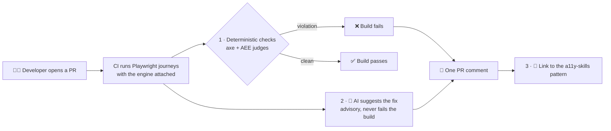
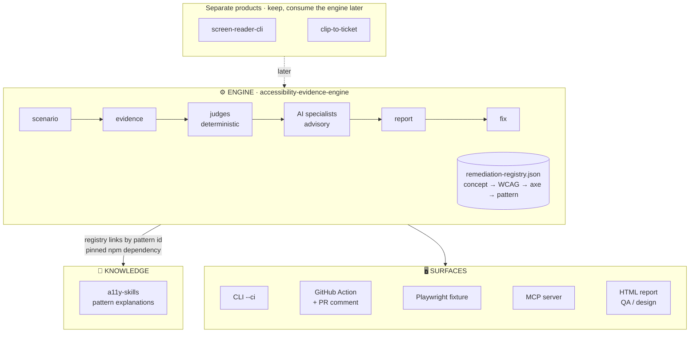
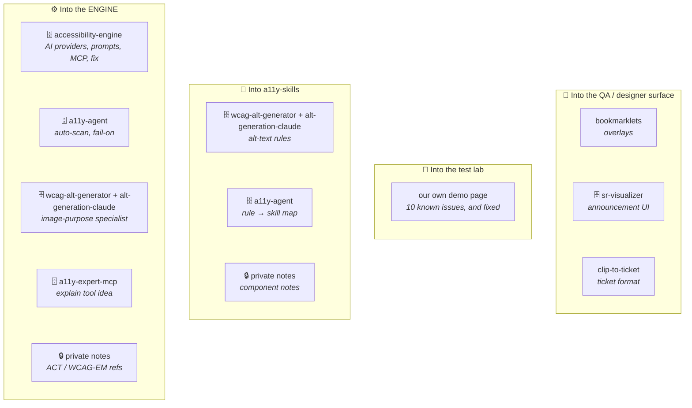

# Master plan: one accessibility toolkit

This is the working plan for turning a dozen accessibility repos into one tool developers use on every pull request. It is the single source of truth for that cross-repo work. Engine internals keep their own detail in `docs/implementation-roadmap.md`; this plan links to it rather than repeating it.

## How to use this file

- **Start a session:** open a Claude Code session on `accessibility-evidence-engine` and say _"continue the master plan"_. `CLAUDE.md` points here, so a fresh chat picks up the context without any earlier conversation.
- **One step per session.** Each step is sized for one sitting and has a "done when" line.
- **Tick the box in the same PR that does the work.** The file is then always true, and git history is the log.
- **Decisions go in the Decisions log below**, not in chat. Chat is lost; this file is not.
- **Current focus: the tool works for its owner.** Publishing (npm, PyPI), public showcases and the portfolio map wait in [Later](#later-parked) until it does.

## Goal

A developer opens a PR. CI runs their Playwright journeys with the engine attached, then:

1. **Deterministic checks fail the build** on real violations (axe plus AEE's own judges).
2. **AI suggests the fix** for each violation, using a screenshot of the section and the page context. This is advisory, labelled as AI, and never fails the build.
3. **Each finding links to the pattern** that explains it (a11y-skills).

```mermaid
flowchart LR
  PR["👩‍💻 Developer opens a PR"] --> CI["CI runs Playwright journeys<br/>with the engine attached"]
  CI --> DET{"1 · Deterministic checks<br/>axe + AEE judges"}
  DET -- "violation" --> RED["❌ Build fails"]
  DET -- "clean" --> GREEN["✅ Build passes"]
  CI --> AI["2 · 🤖 AI suggests the fix<br/>advisory, never fails the build"]
  RED --> COMMENT["💬 One PR comment"]
  AI --> COMMENT
  COMMENT --> PAT["3 · 📘 Link to the a11y-skills pattern"]
```

The first rules covered are unlabeled buttons, unlabeled links, missing alt text, missing form labels and empty headings. This is the exit test of Milestone 3 in `docs/implementation-roadmap.md`, widened from one rule to five.

## Target shape

```mermaid
flowchart TB
  subgraph SEPARATE["Separate products · keep, consume the engine later"]
    direction LR
    SRC["screen-reader-cli"] ~~~ CTT["clip-to-ticket"]
  end
  subgraph ENGINE["⚙️ ENGINE · accessibility-evidence-engine"]
    direction LR
    S["scenario"] --> E["evidence"] --> J["judges<br/>deterministic"] --> A["AI specialists<br/>advisory"] --> R["report"] --> F["fix"]
    REG[("remediation-registry.json<br/>concept → WCAG → axe → pattern")]
  end
  subgraph KNOWLEDGE["📘 KNOWLEDGE"]
    SK["a11y-skills<br/>pattern explanations"]
  end
  subgraph SURFACES["🖥️ SURFACES"]
    direction LR
    CLI["CLI --ci"] ~~~ GHA["GitHub Action<br/>+ PR comment"] ~~~ FIX["Playwright fixture"] ~~~ MCP["MCP server"] ~~~ HTML["HTML report<br/>QA / design"]
  end
  SEPARATE -. "later" .-> ENGINE
  ENGINE -- "registry links by pattern id<br/>pinned npm dependency" --> KNOWLEDGE
  ENGINE --> SURFACES
```

**Why the registry is the map:** it already joins each concept to WCAG criteria, axe rules, required evidence, the AI allowlist and verification. Adding a `pattern` field that points at a11y-skills keeps every mapping in one file. a11y-skills stays pure explanation with no second rule map.

## Inventory: every source and where its value goes

Nothing is archived until its row says **harvested**. That is how no information gets lost.

```mermaid
flowchart LR
  subgraph ENG["⚙️ Into the ENGINE"]
    direction TB
    e1["🗄️ accessibility-engine<br/><i>AI providers, prompts, MCP, fix</i>"] ~~~ e2["🗄️ a11y-agent<br/><i>auto-scan, fail-on</i>"] ~~~ e3["🗄️ wcag-alt-generator + alt-generation-claude<br/><i>image-purpose specialist</i>"] ~~~ e4["🗄️ a11y-expert-mcp<br/><i>explain tool idea</i>"] ~~~ e5["🔒 private notes<br/><i>ACT / WCAG-EM refs</i>"]
  end
  subgraph SKL["📘 Into a11y-skills"]
    direction TB
    k1["🗄️ wcag-alt-generator + alt-generation-claude<br/><i>alt-text rules</i>"] ~~~ k2["🗄️ a11y-agent<br/><i>rule → skill map</i>"] ~~~ k3["🔒 private notes<br/><i>component notes</i>"]
  end
  subgraph LAB["🧪 Into the test lab"]
    direction TB
    l1["our own demo page<br/><i>10 known issues, and fixed</i>"]
  end
  subgraph QA["🎨 Into the QA / designer surface"]
    direction TB
    q1["bookmarklets<br/><i>overlays</i>"] ~~~ q2["🗄️ sr-visualizer<br/><i>announcement UI</i>"] ~~~ q3["clip-to-ticket<br/><i>ticket format</i>"]
  end
  ENG ~~~ SKL ~~~ LAB ~~~ QA
```

🗄️ archived once harvested · 🔒 scrubbed before it moves · no icon: stays live. Every verdict is in the review list below.

### Review list: every repo in one place

This table is the only place a repo's fate is decided. **Archive is the default:** it is reversible and keeps history and links working. **Delete** only a repo with nothing to harvest and nothing linking to it, or a fork with no commits of its own; a deletion is hard to undo. A repo is archived the day its harvest row is ticked, not at the end.

| Repo                                                                 | Verdict                                                                                                                                                | Waits on               |
| -------------------------------------------------------------------- | ------------------------------------------------------------------------------------------------------------------------------------------------------ | ---------------------- |
| `accessibility-evidence-engine`                                      | **Keep:** the tool                                                                                                                                     | —                      |
| `a11y-skills`                                                        | **Keep:** the knowledge                                                                                                                                | —                      |
| `screen-reader-cli`                                                  | **Keep:** separate product for screen readers. Its `scan` repeats the engine's Playwright + axe pipeline, so it routes through the engine later (7.2). | —                      |
| `a11y-engineering-toolkit`                                           | **Keep:** portfolio page                                                                                                                               | —                      |
| `a11y-for-feds-intro`                                                | **Keep:** workshop, with its own purpose (fix issues one by one)                                                                                       | —                      |
| `bookmarklets`                                                       | **Keep**                                                                                                                                               | Harvest (M7)           |
| `clip-to-ticket`                                                     | **Keep:** separate product                                                                                                                             | Harvest (M7)           |
| `accessibility-engine`                                               | **Archive**                                                                                                                                            | Harvest (M3, M5, M6)   |
| `a11y-agent`                                                         | **Archive**                                                                                                                                            | Harvest (4.2, 4.3)     |
| `a11y-expert-mcp`                                                    | **Archive**; its patterns are a stale copy of a11y-skills                                                                                              | Harvest (6.1)          |
| `sr-visualizer`                                                      | **Archive**                                                                                                                                            | Harvest (M7)           |
| `wcag-alt-generator`                                                 | **Archive**                                                                                                                                            | Harvest (M3)           |
| `alt-generation-claude`                                              | **Archive**                                                                                                                                            | Harvest (M3)           |
| `accessibility-validator`                                            | **Delete:** a hand-written Python checker for rules axe already covers; nothing to harvest                                                             | Owner's last look      |
| `any-access`                                                         | **Delete:** three small 2020 scripts, all covered by a11y-skills                                                                                       | Owner's last look      |
| `a11y-memory-game`, `a11y-interactions`, `a11y-html-aria`            | **Delete** each fork with no commits of its own; archive the others                                                                                    | Owner's check per fork |
| `visua11y`, `accessible-search`, `a11y-first-ext`, `a11y-booth-game` | **No action:** not duplicates (`visua11y` is a reading aid for end users, not a developer tool)                                                        | —                      |

Also checked and unrelated to accessibility: `TTS`, `the-vault`, and the rest of the personal and family repos.

### Harvest details

| Repo                    | Value to harvest                                                                                                                                                                                                                                                                                                                                                                       | Goes to                                                                                                                                                 | Harvested |
| ----------------------- | -------------------------------------------------------------------------------------------------------------------------------------------------------------------------------------------------------------------------------------------------------------------------------------------------------------------------------------------------------------------------------------- | ------------------------------------------------------------------------------------------------------------------------------------------------------- | --------- |
| `accessibility-engine`  | **The most to harvest.** Working AI provider layer (Claude, local Ollama with no API key, stub; this engine only has an OpenAI adapter). Naming, alt-text and vision judge prompts. MCP server (`@aee/mcp`). Apply-fix-to-source including JSX (`@aee/fix`). Triage CLI. The graph-guard test that keeps AI away from the live page. Content-addressed artifact store. ADRs 0002–0005. | Providers → `@aee/ai-fixes` (M3); prompts → specialists (M3); MCP → new package (M6); fix → `--fix` (M5); graph guard → tests (M3); ADRs → `docs/` (M3) | [ ]       |
| `a11y-agent`            | Auto-scan on navigation; `A11Y_STRICT` severity threshold; axe-rule → skill map (stale filenames)                                                                                                                                                                                                                                                                                      | Fixture auto-checkpoint (4.2); `fail-on` (4.3); the skill map is replaced by the registry's `axeRulePatterns` (1.4, done)                               | [x]       |
| `a11y-expert-mcp`       | Tool and prompt ideas only                                                                                                                                                                                                                                                                                                                                                             | MCP `explain` tool (M6)                                                                                                                                 | [ ]       |
| `sr-visualizer`         | Streaming SR-announcement UI; its sample pages are not needed (the test lab covers them)                                                                                                                                                                                                                                                                                               | UI → QA surface (M7)                                                                                                                                    | [ ]       |
| `wcag-alt-generator`    | Image-role classification (decorative / functional / informative)                                                                                                                                                                                                                                                                                                                      | `image-purpose` specialist (M3)                                                                                                                         | [x]       |
| `alt-generation-claude` | Alt-text best-practice rules and prompt; image + context input                                                                                                                                                                                                                                                                                                                         | `image-purpose` specialist (M3); image-labeling pattern (Later)                                                                                         | [ ]       |
| `a11y-for-feds-intro`   | A deliberately broken page with 16 listed issues and their fixes                                                                                                                                                                                                                                                                                                                       | Not the test lab: it is a workshop with its own purpose. Before/after showcase (Later)                                                                  | [ ]       |
| `bookmarklets`          | Visual overlays: headings, tab order, alt text, focus indicator                                                                                                                                                                                                                                                                                                                        | QA/designer surface (M7)                                                                                                                                | [ ]       |
| `clip-to-ticket`        | Ticket format; WCAG 2.2 and APG data files                                                                                                                                                                                                                                                                                                                                             | Ticket format → reporter (M7); data only if the registry's WCAG fields prove insufficient                                                               | [ ]       |

### Private notes (read, scrub, then move)

| Source                                                                   | Value                                                                                                                                   | Goes to                                       | Harvested |
| ------------------------------------------------------------------------ | --------------------------------------------------------------------------------------------------------------------------------------- | --------------------------------------------- | --------- |
| `e11i-brain` → `Work old/2 - Resources/A11y` and `Accessible components` | Short notes on links, contrast, non-text contrast, mouse-only, RTL, mobile, cards, multi- vs single-select, drag and drop, autocomplete | Pattern improvements in a11y-skills (Later)   | [ ]       |
| `e11i-brain` → `Clippings`                                               | ACT Rules Format, WCAG-EM, ARIA-AT, WCAG 3                                                                                              | References for registry and judge design (M3) | [ ]       |

**Scrub rule:** anything that moves from a private note into a public repo is rewritten generically. No employer, product or partner names, and no internal links or screenshots. If a note only makes sense with that context, it doesn't move. `CONTRIBUTING.md` already forbids proprietary page evidence; this rule extends it to notes.

## Milestones

See it as a picture on the [live roadmap](https://elizabeth1979.github.io/accessibility-evidence-engine/roadmap.html), which is built from this section on every deploy. Each milestone's **Outcome** line is what the page shows.

Each "day" is one focused session. Skipping days is fine; skipping order is not.

### M0 — Home base (day 1)

**Outcome:** The plan lives in this repo, and every session starts from it.

- [x] **0.1** Review and merge the PR that adds this file and `CLAUDE.md`. Close accessibility-engine PR #1, which had the plan in the wrong repo. _Done when:_ this file is on `main`.
- [x] **0.2** Answer the open questions (below) and record the answers in the Decisions log. _Done when:_ no open question blocks M1–M4.
- [x] **0.3** Replace the example that named a real product with a generic `examples/public-site/` scenario that targets this project's own demo site. The old name is removed from the scripts, README, CHANGELOG and CLI tests. _Done when:_ a case-insensitive grep for the old name finds nothing outside git history.

### M1 — Knowledge link (days 2–3)

**Outcome:** Every finding links to the pattern that explains it.

- [x] **1.1** Registry: add a `pattern` field to each entry (for example `accessible-name` → `buttons`, `link`, `forms`) and extend the axe mappings for the MVP rules: `link-name`, `image-alt`, `label` and `empty-heading`. Only `button-name` is mapped today. Update the registry schema. _Done when:_ `npm run check` and the unit tests pass, and every MVP axe rule resolves to a registry entry and a pattern.
- [x] **1.2** Pin a11y-skills from GitHub (a git dependency at a fixed commit; no npm publish), and check every registry `pattern` points to a file that exists. _Done when:_ a test fails if a pattern file is renamed.
- [x] **1.3** Reporter: show each finding's pattern link in the HTML, JSON and Markdown reports. Until this step, the link from 1.1 is data no reader sees. _Done when:_ the report for the test-lab `icon-labels` case links `button-name` to the buttons pattern.
- [x] **1.4** Map every axe rule that a11y-skills already covers to its pattern (its `patterns/INDEX.md` routes axe findings to files), not only the five MVP rules. _Done when:_ a test lists each mapped axe rule with its pattern, and a real run shows the link on findings beyond the MVP five.

### M2 — Known answers and a report you can trust (days 4–6)

**Outcome:** Test pages with known answers catch any missed or false finding, and the report never contradicts itself.

- [x] **2.1** Test lab: our own demo page with one issue per registry concept, and the same page fixed. Every issue, its expected finding and how the engine checks it live in `site/test-lab-contract.json`; the lab page is generated from it. _Done when:_ `npm run test:playwright` fails if a known violation is missed or a good page gets a finding.
- [x] **2.2** Keyboard and mouse sweep, all with Playwright and nothing authored by hand: Tab to every stop, press Enter and Space on everything a mouse can click and compare the result with the click, compare hover with focus, and check where focus lands after each action. _Done when:_ the demo page's click-only Export, hover-only plan details and lost focus after archiving are found, the fixed page stays clean, and the lab table shows them as found.
- [x] **2.3** Sweep findings in the report: `aee run` sweeps each journey's start page, pressing controls only when the journey's `allowedActions` include `activate-page-controls`. Each finding joins the report with its plain-language summary and its registry pattern link. _Done when:_ a run on the demo page reports the three keyboard issues and a run on the fixed page reports none.
- [x] **2.4** The portable virtual screen reader takes each item's role and name from the browser's accessibility tree, which the engine already captures over CDP, and the hand-written tag → role map and name code are deleted. One helper fetches the tree; today it is fetched in two places. Why: the browser implements the W3C mappings (HTML-AAM, accname); the copy gets `<a>` without `href`, `<header>` inside `<article>`, `` and an unnamed `<form>` wrong. _Done when:_ the demo page carries those four and they are announced as HTML-AAM says.
- [x] **2.5** The report tells one story: when a rule fails, the matching status row fails too, and the virtual-reader row says which items were announced without a name. It also names what failed correctly: the 1.4 practice run titled plain grey text "Replace the shared low-contrast link color" for "calls to action". A run on the old `icon-labels` test page blocked release for `button-name` while showing "Semantics: no confirmed issue" and "Virtual reader: 3/3 commands passed". The report and the lab must also agree: `aee run` runs only WCAG-tagged axe rules, so it misses the demo page's empty heading (`empty-heading` is an axe best-practice rule) while the lab counts it as found. So the report also runs axe's best-practice rules, labelled "Best practice" and never blocking release. _Done when:_ a test on the demo page asserts both rows report the problem, a contrast failure on plain text is not called a link, and `aee run` on the demo page reports every issue the lab marks as found.
- [x] **2.6** Product shots and videos: a script runs the engine on the test-lab pages and saves one highlighted crop of the report per feature (finds the bug, explains it, how to fix it, every affected spot, what a screen reader hears, release blocked), each with a one-line caption a non-technical reader understands. It also records two flow videos: a screen reader moving through the page, reusing `screen-reader-cli audit --record`, and a keyboard pass with no screen reader (Tab through every stop, visible focus), reusing the engine's per-lane interaction video. _Done when:_ one command regenerates every shot and both videos from a real run, so nothing is hand-made or stale.
- [x] **2.7** Homepage features section: every feature of the tool as a card with its product shot, a plain-language caption and a link to try it (the test lab, a sample report), plus greyed "coming soon" cards generated from the unchecked milestones. _Done when:_ each shipped feature has a card with a real shot, the section passes axe and a keyboard pass on desktop and phone, and a step that changes a feature also updates its card.

### M3 — Harvest the AI layer (days 7–10)

**Outcome:** AI suggestions run on Claude, a local model or a free stub.

- [x] **3.1** Port the provider seam from `accessibility-engine`: Claude, local (Ollama) and stub, next to the existing OpenAI adapter, all behind the existing `AccessibleLabelModelProvider` interface. With no key, the default is stub. _Done when:_ the unit tests pass with the stub, and a live test runs when a local model is present.
- [x] **3.2** Port the graph-guard test: the AI package must not import a browser driver. _Done when:_ adding a Playwright import to `ai-fixes` fails the tests.
- [x] **3.3** Port the naming and alt-text judge prompts into the allowlisted specialists (`accessible-name` icon-only, `image-purpose`), adding image-role classification. _Done when:_ the test-lab icon-button case gets a labelled AI name from the stub fixture.
- [x] **3.4** Carry the design decisions over as ADRs in `docs/`: accessibility-engine's ADRs 0002–0005, plus the ACT-rules shape of the registry. _Done when:_ the ADRs exist; this step changes no code.
- [x] **3.5** Wire the accessibility-engineer prompt (`packages/ai-fixes/prompts/accessibility-engineer.md`) in as the system prompt of every AI specialist (and add `prompts/` to the package `files`), and turn its measurable disagreements into deterministic judges: text that looks like a heading but has no heading role, a mouse target that is not a tab stop, and hover content with no focus equivalent. _Done when:_ a test fails if a specialist runs without the prompt, and the heading judge flags the old roadmap markup (milestone titles inside `
`).

### M4 — The PR experience (days 11–15)

**Outcome:** ⭐ The goal: a PR with an accessibility bug gets red CI and one comment with the fix and the pattern.

- [x] **4.1** Reporter: a PR-comment variant of the Markdown report. Blocking findings come first, then AI suggestions labelled as AI; each finding is collapsed and shows the element, the problem, the fix and the pattern link. _Done when:_ a snapshot test on a test-lab page passes.
- [x] **4.2** Playwright fixture: a drop-in `test` export that captures a checkpoint automatically on page load, so a team can adopt it without writing scenario YAML. _Done when:_ an existing spec with only the import swapped produces findings.
- [x] **4.3** A composite `action.yml` with inputs `run` (a scenario or test command), `fail-on` and `ai-provider` (default `stub`). It posts one sticky comment that later runs update. _Done when:_ running it twice leaves exactly one comment.
- [x] **4.4** A self-test workflow: every PR in this repo runs the Action against the test lab. _Done when:_ a PR that adds a nameless icon button gets red CI and a comment with the buttons pattern link.
- [x] **4.5** AI on in CI with a free model on the runner (Claude instead once an `ANTHROPIC_API_KEY` secret exists), and the homepage gets an AI suggestion feature card whose shot comes from that run. _Done when:_ the comment shows an AI-suggested button name, labelled as AI, and so does the card.

### M5 — Dogfood (days 16–18)

**Outcome:** The tool runs on a real app and can apply fixes to the code.

- [ ] **5.1** Adopt it in one of your own public apps, installed from GitHub (no npm publish yet). _Done when:_ that repo's PRs get the comment, and every friction point is filed as an issue.
- [ ] **5.2** `--fix`: apply a reviewed label proposal to source, including JSX, using `@aee/fix` from accessibility-engine. Apply it on a branch and rerun the journey to verify. _Done when:_ Milestone 3's exit test in the roadmap passes.

### M6 — One MCP (days 19–20)

**Outcome:** A coding agent asks "explain button-name" and gets the pattern.

- [ ] **6.1** Port `@aee/mcp` from accessibility-engine, rewired to this engine, and add an `explain` tool: rule id or UI element in, the a11y-skills pattern out, through the registry. _Done when:_ a coding agent asked "explain button-name" gets the buttons pattern.

### M7 — QA and designer surface (later, after M5 is used for real)

**Outcome:** QA and designers get a visual report, not only developers.

- [ ] **7.1** Design spec only: add bookmarklets-style overlays, the sr-visualizer announcement list and the clip-to-ticket ticket format to the existing HTML report. _Done when:_ a spec is in `docs/`.
- [ ] **7.2** screen-reader-cli: have `scan` call the engine. This is an issue first, per that repo's rules. _Done when:_ the issue is filed with the proposed change.

### M8 — Clean up the repos (any day, as rows become ready)

**Outcome:** Every repo in the review list has its verdict carried out.

- [ ] **8.1** Work the review list: archive each repo on the day its harvest row is ticked (README banner saying it is superseded by accessibility-evidence-engine, then GitHub's Archive button), and delete a "Delete" repo after the owner's last look. These steps block nothing and can run between milestones. _Done when:_ every review-list row is carried out.
- [ ] **8.2** Restructure the homepage around the finished tool: one story from problem to fix, rebuilt from the features section and product shots, once the big changes of M2–M6 have landed. _Done when:_ the homepage passes axe, a keyboard pass and a virtual screen-reader pass on desktop and phone, and every claim on it links to a shot or a live page.

## Later (parked)

Parked until the tool works for its owner. Each item keeps its old step number so history still makes sense.

- **Was 1.2:** publish a11y-skills to npm. Its PR (a11y-skills #5) closes unmerged; 1.2 pins from GitHub instead.
- **Was 1.3:** merge the alt-text rules from `alt-generation-claude` and `wcag-alt-generator` into `image-labeling.instructions.md`.
- **Was 1.4:** scrub and move the private component notes into a11y-skills.
- **Was 4.6:** the showcase on `a11y-for-feds-intro` (its broken page, the PR comment for each of the 16 issues, then the fixed page).
- **Was 5.3:** decide distribution (open core, product or npm only; check the employment contract first) and, if publishing, the publish workflow under `@e11i`.
- **Was 6.2:** a11y-expert-mcp's final PyPI release pointing to the new MCP.
- **Was 8.2:** update the portfolio map in `a11y-engineering-toolkit`.
- **The image-purpose specialist sees the image** (from `alt-generation-claude`, which describes the image first): pass the element's screenshot crop to vision-capable providers. Until then it drafts from page context only and says in its rationale when that is not enough.
- **Real screen readers** (Milestone 4 in `docs/implementation-roadmap.md`): reuse screen-reader-cli's Guidepup live bridge for VoiceOver and NVDA; do not write a second one.

## Open questions

None right now. Add new ones here and move each answer to the Decisions log.

## Decisions log

Newest first. One line each: date, decision, why.

- 2026-09-28 — AI in CI runs on a free model on the runner, not a provider key: `ai-provider: local` starts Ollama (v0.34.4, downloaded from its GitHub release and checked against its SHA-256) with the local provider's default model, `gemma4:e4b`, so no key, account or bill is needed and page evidence never leaves the runner. `scripts/start-local-model.sh` does it for the Action and the Pages deploy alike. It skips Ollama's GPU libraries (2 GB of 2.2 GB; a runner has no GPU), sets an 8,192-token window (the specialist prompt is about 3,000 tokens and the CPU default is 4,096), keeps the model loaded for the whole run, and turns Ollama's cloud models off, so no model name can send evidence elsewhere. Both workflows switch to Claude by themselves once an `ANTHROPIC_API_KEY` secret exists. The Action's default stays `stub`. The self-test job pays for the download on every pull request, although the fixed page passes and asks the model nothing, so that a change that breaks the page gets a suggestion too. CI's own shots stay on the stub; the Pages deploy names the model, and the shots test fails if the AI card would show anything but a suggestion. M4 closes, so the homepage gets both cards 4.4 promised: the AI suggestion, cropped from the report's button fix, and the pull-request comment, rendered from the same run's `aee-pr-comment.md` with `marked` (a new dev dependency) and styled like a GitHub comment, with its first fix opened. Why: the owner chose to postpone a paid key, and a model on the runner proves the same done-when at no cost.
- 2026-09-28 — The self-test, `.github/workflows/accessibility.yml`, serves the pull request's own copy of `site/` and runs the Action (`uses: ./`) on the lab's fixed page with `examples/test-lab/scenario.yml`, an approved scenario with the lab tests' sweep permissions and reader walk; a unit test keeps it approved as written. It runs on the fixed page, not the issues page, which is always red: a change that breaks the fixed page is the regression to catch. It fails on `incomplete` rather than the Action's default `blocking`: in a rehearsal where the page did not load, the verdict was "not decided", which `blocking` lets through. The Action now pins `actions/setup-node` and `actions/upload-artifact` by commit, like every workflow here, and uses Node 24 like CI. The done-when ran on the step's own pull request: the workflow alone was green with "nothing blocks release"; a demo commit that added a nameless icon button turned the job red and edited the same comment (created 06:59, edited 07:00) to "release blocked, 1 fix needed" with the buttons pattern link; its revert made the job green again. The homepage gets a PR-comment feature card when M4 closes, with 4.5's AI card; until then the "In progress · M4" card stands for it. Why: the Action checks itself on every change, the way a team would use it.
- 2026-09-28 — The Action (`action.yml`, composite) sets up Node 22, installs and builds AEE from its own checkout (nothing is published yet), runs the `run` input (a `.yml`/`.yaml` scenario through `aee run`, anything else as a shell command), keeps the reports as the `aee-reports` artifact, and runs `aee comment`. Inputs reach the shell as environment variables, never pasted into the script, so an input cannot inject commands. `aee comment` gathers every assessment under the output folders into one comment, since a test suite writes one assessment per test: one reads exactly like its 4.1 comment; several are listed failing first, each collapsed under its test or scenario, and past 60,000 characters (GitHub refuses 65,536) the rest are named as left to the full reports. The comment starts with a hidden marker, `<!-- aee-pr-comment -->`; the next run finds the comment that starts with it and updates it, so re-runs never pile up comments. `fail-on` is `blocking` (default: a finding that blocks release fails the job), `incomplete` (an undecided verdict fails it too) or `never`; a test command that fails fails the job whatever the verdict. a11y-agent's `A11Y_STRICT` ranked axe impact; AEE's verdict already separates blocking from advisory and complete from incomplete, so `fail-on` reads the verdict. `ai-provider` defaults to `stub`, so no page evidence leaves the runner. A comment that cannot be posted, as from a fork's read-only token, is a warning, and the comment is also in the job summary. The done-when test runs the real `aee comment --post` twice against a stand-in for GitHub's comment API: one comment, created then updated; 4.4 runs the Action itself. Why: one comment per pull request that always shows the latest run, and a job result that follows the report's verdict.
- 2026-09-28 — The drop-in fixture is `@aee/cli/test` (`test` and `expect`), not a `@aee/playwright` export: it ends in the same `finishAssessment` as `aee run`, so a test writes the same report, manifest and PR comment, and 4.3 can post either. `@playwright/test` is a peer dependency, so the fixture extends the runner a project already has. It checkpoints the page after each load the test starts (`goto`, `reload`, `setContent`, `goBack`, `goForward`), awaited before the test's next step, and the page as a passing test leaves it; `checkpoint(name)` covers states no load reaches, which the 2026-09-25 entry asked for. It does not checkpoint on every `load` event: nothing awaits a load a click starts, so that checkpoint would race the test's next step and be cut off, leaving most reports incomplete; a11y-agent listened to `framenavigated` without awaiting, so its scans could run on a half-loaded page or be lost at teardown. A checkpoint is an input-comparison step with no interaction (focus, DOM, accessibility tree, visual, axe), on the test's own page and session; the sweep and the reader would need their own context and navigation and lose the test's state, so they do not run, those status rows read "Needs review", and the plan's new profile, `playwright-test`, lists only what the fixture does. The fixture never fails a test; `fail-on` comes with 4.3. A file:, data: or about: page (`setContent` leaves about:blank) has no origin (`URL.origin` is "null"), which made the compiled plan invalid; its scheme now stands in. Each checkpoint is one collapsed "AEE checkpoint" step in the test's report, so its browser calls do not crowd the test's own steps. Cost: a checkpoint captures before and after like every step, so it pays for axe and screenshots twice, about 1.3 s on the demo page; if dogfooding (5.1) shows that matters, a checkpoint gets a one-phase run. The done-when test copies `examples/playwright-fixture/existing.spec.ts`, swaps only its import and runs it as its own suite. Why: one report format for scenarios and tests, and a checkpoint the test never races.
- 2026-09-28 — The PR comment is a fourth file every `aee run` writes, `aee-pr-comment.md`, rendered from the same synthesis as the other three, so it cannot disagree with them; 4.3 posts it. It lives in `@aee/cli` beside the Markdown report and reuses its wording (titles, who a problem affects, fixes, pattern links), not in `@aee/reporter`, which renders the older single-run report. Order: verdict and the four status rows, then blocking fixes, then advisory results, then AI suggestions, each labelled as AI and saying it never passes or fails anything. Each finding is a collapsed `
` block with the problem, up to five elements (the full report has the rest), the fix and the pattern. A tested page controls some of the text (element names, axe's summaries quote its markup, AI wording is drawn from it), and the comment is posted where it could otherwise add markup, @-mention people or link issues in other repositories: element names, selectors and AI wording are code spans, and other text is HTML-escaped with a zero-width space after `@name` and `#123`. The AI's rationale stays in the full report. The done-when snapshot is the demo page's comment (`tests/__snapshots__/`, one file for every platform); the lab server's random port is the only thing masked. Why: one source for every view, and a comment is public, so the page must not write into it.
- 2026-09-28 — With M3 done, its "In progress" card leaves the homepage, and AI suggestions get their own feature card in 4.5, from the first run where a real model answers. Why: shots come from real runs, and the only model a run has today is the test lab's stand-in, whose answers are written by hand; the homepage's registry table already says which checks are AI-assisted.
- 2026-09-28 — Every specialist runs with the accessibility-engineer prompt as its system prompt, then one bridging paragraph (answer only with the schema's JSON; the finding card and coverage format do not apply), then its own task. The prompt ships in `@aee/ai-fixes` (`prompts/accessibility-engineer.md` is in `files`), and a test fails if a specialist runs without it. Of the three disagreements the step names, two were already sweep findings from 2.2: a mouse target that is not a tab stop (`pointer-only`) and hover content with no focus equivalent (`hover-only`). The new one, `looks-like-heading`, compares the DOM snapshot's computed font size and weight with the accessibility tree. It flags a short standalone line (80 characters at most) that is bold and at least 5% larger than the page's body text, or 40% larger at any weight (axe's `p-as-heading` margin), with no heading, table header, term, definition, caption, legend or label role above it. Body text is the page's median size and weight, counted per character. Text that is a control's whole name is that control's label; a title line inside a control with more text, like the old roadmap's milestone title between its number and its count in `
`, is flagged. Bold at body size alone is not flagged, although WCAG failure F2 covers `
<strong>Title</strong>
`: on our homepage and test lab it caught table values and card labels, and telling those from titles needs context, which is the heading-structure specialist's job. The finding is advisory: it sits in the Semantics row and never fails release, because typography cannot prove the author meant a heading. The advisory badge now reads "Advisory" for axe best-practice results too (was "Best practice"), so one word means "reported, never blocking". The sweep's own badge counts advisory results apart, so it cannot say "9 findings" in red on a run that passes, and the fix plan's priority column now fits the word "Advisory", which overflowed it. On our own pages it flags the old roadmap's nine milestone titles, nothing on the current roadmap or either lab page, and one homepage line: the "Verified rerun passed" verdict in the example report, left as it is because it is a status, not a section title. The DOM snapshot code moved from the virtual reader to `accessibility-tree.ts`, so both read one function. Why: a heading check that cries wolf on labels gets ignored, and one that blocks on a guess is wrong.
- 2026-09-27 — accessibility-engine's ADRs 0002–0005 are carried over as `docs/adr/0001`–`0004`, rewritten for this engine rather than copied, and the registry's ACT shape is `0005`. Two of them changed on the way: AI never passes or fails anything here (0003; accessibility-engine let an AI judgment fail a check), and MCP is one more surface after CI and the report, not the primary one (0004). 0005 maps each registry field to the ACT Rules Format part it mirrors and keeps `ruleKind: act-rule` for an entry that meets the format in full. Each record says how the code enforces it. Why: a decision that says how it is enforced can be checked, and one copied from another codebase would describe that codebase.
- 2026-09-27 — The two allowlisted AI specialists now exist: `accessible-name-specialist` (icon-only controls) and `image-purpose-specialist` (images). Their ids and answer fields are the registry's own `specialistId` and `outputs`, and a test holds them together, so the registry stays the one allowlist. Their instructions are ported: grounding and "quality in context, not presence" from accessibility-engine's judge prompt; the alt decision rules from `wcag-alt-generator` and `alt-generation-claude`. Image-role classification (decorative, informative, functional, complex) comes from the markup first, and the answer must keep it: an image that is all of a link or button is functional, and one marked `aria-hidden`, `role="presentation"` or `alt=""` is decorative. `wcag-alt-generator` also called an image with no `alt` decorative; that is not ported, since a missing alt is the defect. Every answer must cite which evidence fields it relies on (`citedEvidenceIds`); an answer citing a field it was not given, or only a role word, a file name or "image of…", is rejected. The provider seam is now one `ask(instructions, input, schema)` shared by every specialist, with 3.1's providers renamed to match (`createModelProvider`), so a third specialist needs no new provider code. `@aee/playwright` captures each flagged element's surroundings with the axe result: the nearest heading in its own section, the text around it, icon or image markup hints, and a link's destination. It does this only for rules whose registry concept has a specialist. `aee run` then asks the specialist about at most 10 elements per finding and shows each answer on the fix card as "AI suggestion"; the finding and verdict are unchanged. `aee run` asks a model only when `AEE_LLM_PROVIDER` names one: unlike the library's `auto`, a stray `ANTHROPIC_API_KEY` is not consent to send captured page content. With none named, the card says how to turn it on. The done-when's "stub fixture" is a test double (`labFixtureModel`) that answers with the fixed demo page's own names; the unconfigured stub still answers nothing (3.1). The registry had no axe rule → concept lookup, so `conceptForAxeRule` reads the concepts' axe `detection` requirements; axe findings now take their AI status from the registry, where before every one said "no allowlisted AI task", `button-name` included. The image specialist does not see the image yet (parked in Later). Why: AI answers only where the registry allows it, only from recorded evidence, and never as a verdict.
- 2026-09-27 — The graph guard (`scripts/graph-guard.test.mjs`, in `npm run test:unit`) checks three things. First, each package's `@aee` dependencies must match the graph drawn in `docs/architecture.md`, which it parses, so the picture and the code cannot drift. Second, every package a package's shipped source imports (static, type, `import()` or `require()`, read with TypeScript's own parser) must be in its `dependencies`; npm hoisting would otherwise let an undeclared `playwright` import run. Third, no package outside `@aee/playwright` and the packages built on it may have a browser driver (Playwright, Puppeteer, WebDriver) anywhere in its installed dependency tree, peers included. Test files are not checked: they do not ship, and some use the root's dev tools (the schemas test loads axe-core). A Playwright import added to `ai-fixes` fails the guard whether it is undeclared, declared, or comes through `@aee/playwright`. `test:unit` and `test:coverage` now find the unit tests by pattern (`packages/*/dist/*.test.js`) instead of two hand-kept lists; 3.1 had to add its new test file to both. accessibility-engine's version only compared `package.json` names. Why: a check that trusts `package.json` misses the import that matters, and a hand-kept expected graph would be a second copy of the documented one.
- 2026-09-27 — The homepage keeps a milestone's card until every one of its steps is done, headed "What's next" and marked "In progress" once a step is done ("Coming soon" before). Why: 2.7's rule showed only milestones with no step done, so ticking 3.1 would have dropped M3 from the homepage while its features are still unbuilt; `site:check` caught it.
- 2026-09-27 — The AI label suggestion has four providers behind `AccessibleLabelModelProvider`, chosen by `createLabelProvider()` from the environment: Claude when `ANTHROPIC_API_KEY` is set, a local model with `AEE_LLM_PROVIDER=local` (Ollama and `gemma4:e4b` by default), OpenAI with `AEE_LLM_PROVIDER=openai`, and otherwise the stub. The stub makes no suggestion at all (`AiNotConfiguredError`): unlike accessibility-engine's judge, a label has no UNKNOWN answer, and an invented one would be labelled as AI without being AI. Claude goes through the Anthropic SDK (the only new dependency) on `claude-opus-5` with structured outputs and `fallbacks: "default"`, so a refused request is re-run on the model Anthropic recommends for that refusal and a refusal that stands is an error; accessibility-engine pinned `claude-opus-4-8`. One suggestion schema serves every provider and carries no length or range limits, which Claude's structured outputs do not accept; `validateSuggestion` enforces them on every answer. `AEE_LLM_MODEL` names the model for whichever provider runs. The live tests skip themselves unless a local server answers or a Claude key is set. Why: one seam, one schema, and a default that can never pass anything off as a model's answer.
- 2026-09-27 — The homepage's feature cards and the product shots share one list, `site/features.json` (title, caption, alt text, what the shot crops, where to try it), so a feature's name and caption live in one place. The cards are generated into `site/index.html` and committed, like the registry table; `site:check` fails in CI when they drift from the list or the plan, which is what makes a step that changes a feature update its card. "Coming soon" cards are the milestones with no step done yet, minus those the list names as internal (M8, repository housekeeping), and each video card has a text version (the sweep's steps, the screen reader's words). The shots run also publishes its full report as the sample report the cards link to. Why: two copies of a caption drift, and a hand-kept list of upcoming work goes stale.
- 2026-09-27 — Product shots and videos are generated, never committed: `npm run site:shots` runs the engine on the demo page and writes `site/shots/` (gitignored, like the generated roadmap and lab pages) with `shots.json` giving each file a plain caption and alt text. The Pages deploy regenerates them from the current code, and CI runs the same command, so a change that breaks a shot fails its PR instead of the deploy. The keyboard video is the sweep lane's own recording, which every run now makes and captions step by step (an unnamed control is captioned as having no name), and the report's Keyboard access row shows it when a scenario has no authored keyboard lane. Only the shots run slows the browser, to 800 ms a step (Playwright `slowMo`, screen-reader-cli's pace), so normal runs never pay for it. The screen-reader video is screen-reader-cli 0.7.0 `audit --record`, installed from npm like any user would. Why: committed videos go stale and bloat history, and the sweep is the keyboard pass, so its recording is the honest one.
- 2026-09-27 — The report's four status rows (Keyboard access, Virtual reader, Semantics, Visual contrast) are worked out once, from the findings, into the report JSON (`synthesis.status`); the page, the Markdown, the headline figures and the Ask panel all read them, and the conclusion states a lane's good news only when its row did not fail. A finding's row comes from axe's own category tag (`cat.color` contrast, `cat.keyboard` keyboard, anything else semantics); the reader row fails when the reader announced a control, dialog, heading or image without a name, and says which. An axe rule is advisory when it is tagged best-practice and carries no WCAG tag: it is listed last with a "Best practice" badge, counted apart (`summary.advisories`), and never fails a judgment, a row or release; an untagged rule stays blocking. Findings are named from their own elements: contrast failures are "links" only when every element is a link, the one production site's wording is gone, a rule without its own fix text shows axe's guidance, and the contrast fix candidate is searched lighter as well as darker against axe's required ratio (the old one only darkened, so on a dark background it offered the failing colour as "passing"). Why: one set of facts, told once, cannot contradict itself.
- 2026-09-27 — The portable virtual screen reader reads every role, name and state from the browser's accessibility tree (CDP), and each item's element path and position from one DOM snapshot; the hand-written tag → role map, name code and in-page state code are gone, and `fetchAccessibilityTree` is the one place the tree is fetched. It passes over the roles screen readers pass over in browse mode (generic containers, section headers and footers, words inside a sentence, table internals), announces a form, region or group only when it has a name (Core-AAM; Chromium 151 calls every `<form>` a form and leaves that rule to the platform), reads a paragraph's or list item's text since those have no name, speaks Chromium's `DisclosureTriangle` as a button (HTML-AAM maps `summary` to a button), and reads `aria-current` from the element because the CDP tree has no such property. The demo page now carries the four HTML-AAM cases. Why: the browser implements the W3C mappings; a copy drifts. Before, the reader called the card's header a banner, the decorative logo an image and the unnamed search form a group; it already skipped the `<a>` without href, because it only picked up links with one.
- 2026-09-27 — `aee run` will run axe's best-practice rules too, shown as advisory ("Best practice") and never blocking release (part of 2.5). Why: axe files nearly every heading rule as best practice, so a WCAG-only report never checks headings, and the lab already counts the empty heading as found.
- 2026-09-27 — `aee run` sweeps every journey's start page in its own lane, before any authored step: Tab and hover always, presses only when the journey allows `activate-page-controls`, the one permission that acts on its own. The plan says so in its steps, which changed every plan digest; the public-site example was re-approved. A navigation outside the allowed origins is stopped before it leaves the page, not only noticed afterwards. Key presses go through the element, like clicks, so Playwright waits for any page load they start, and focus at the top of a newly loaded page is not counted as lost. Sweep findings are grouped one per kind, like axe rules; they take their WCAG criteria, pattern link, AI stance and verification steps from the registry concept, fail the verdict, and decide the report's Keyboard access row. Why: a check that needs no authored steps should not need authoring to run; pressing can change data, so it stays opt-in; the registry keeps criteria and links in one place.
- 2026-09-27 — The keyboard and pointer sweep presses controls only when its caller allows it, and never follows links or submits forms. It treats an element as a mouse target when it shows a pointer cursor or has an inline click handler, because listeners a framework attaches to the page root are invisible in the DOM. It reads stylesheet text through Chrome DevTools, because a page cannot read the rules of cross-origin or `file://` stylesheets. Focus left on an element that is no longer shown counts as lost. Why: pressing every button on a real site could change or delete real data, and a hover check that cannot read the CSS finds nothing.
- 2026-09-27 — The homepage header links the test lab now (was part of 2.7). Why: the lab was otherwise unreachable from the site.
- 2026-09-27 — The test lab is our own demo page, one issue per registry concept and all visible at once, plus the same page fixed; the single-issue pages and the `a11y-for-feds-intro` workshop page are gone (supersedes the 2026-09-26 showcase entry for the lab). The lab page is generated from `site/test-lab-contract.json`, the same file the tests read. Keyboard and mouse issues are found with Playwright, never left to a person (2.2). Why: the workshop has its own purpose (people fix issues one by one, and its hidden body masks the rest); one page with every issue plus its fixed twin is all the known answers need; a generated page cannot drift from the tests.
- 2026-09-27 — One table, `axeRulePatterns` in the remediation registry, maps each axe rule to its one a11y-skills pattern, and replaces the per-rule `pattern` field from 1.1 (supersedes the 2026-09-26 per-rule `pattern` entry below). 40 rules are mapped, each only where the pattern file teaches that fix; 20 of them are WCAG A/AA rules a default run reports, the rest are axe best-practice or AAA rules whose links appear once those rules run. ARIA-validity rules stay unmapped because a11y-skills routes them to the widget's own file; rules with no a11y-skills topic (page language, page title, lists, captions, frames, duplicate ids) wait for a pattern. Why: one place for each link, and a wrong link misleads more than none.
- 2026-09-26 — Pattern links cover every axe rule a11y-skills already routes, not only the MVP five (1.4). Why: axe reports about 100 rules; a finding without a "how to build it right" link leaves the reader stuck.
- 2026-09-26 — The homepage shows every feature with a real product shot for readers who do not know accessibility or code (2.6, 2.7); the shots are generated from real runs, never hand-made; the full homepage restructure waits until M2–M6 have landed (8.2). Why: owner's request; a picture of the product explains it better than text, and restructuring earlier would be redone.
- 2026-09-26 — Tool first; publishing is parked. npm and PyPI releases, the public showcase and the portfolio map move to [Later](#later-parked), and a11y-skills is pinned from GitHub instead of npm. Why: the owner wants the tool working for her before anything is shared.
- 2026-09-26 — Known answers and a trustworthy report (now M2) come before the AI harvest (now M3). Why: AI suggestions cannot be judged without pages whose answers are known, and a real run showed the report contradicting its own finding.
- 2026-09-26 — The virtual screen reader takes role and name from the browser's accessibility tree; the engine keeps no hand-written copy of the W3C mapping rules. Why: one source of truth, and the copy was already wrong on four HTML-AAM cases.
- 2026-09-26 — Real screen readers come from screen-reader-cli's live bridge, not a second implementation. Why: it already drives VoiceOver and NVDA; two copies would drift.
- 2026-09-26 — Repos are archived by default and deleted only when the review list says so, on the day their harvest is done rather than at the end. Why: archiving is reversible and keeps links working; waiting for the last milestone kept duplicate repos around for no gain.
- 2026-09-26 — Each axe detection rule carries its own `pattern`, which must be one of its entry's `patterns`. Why: a `button-name` finding must link to buttons, not to the entry's whole list (buttons, link, forms).
- 2026-09-26 — The engine gets one accessibility-engineer prompt (`packages/ai-fixes/prompts/accessibility-engineer.md`), auditor and fixer in one role: walk every pillar, a finding is where two pillars disagree, confirm with a second pillar, report how each finding was found, propose the smallest fix and the re-test that proves it. The keyboard is tested as an input device with no screen reader running, and every mouse interaction is replayed by keyboard. Why: that is how a human auditor finds what axe cannot, and it must be the product's behaviour, not a README.
- 2026-09-26 — `a11y-for-feds-intro` becomes the developer showcase; no new demo site. Why: it already has a broken page, 16 known issues and their fixes.
- 2026-09-26 — Dogfood before distributing: M5 installs from GitHub first; publishing waits for step 5.3. Why: publishing is hard to undo and closes off productising, so decide with real usage in hand.
- 2026-09-25 — Publish under the `@e11i` npm scope (the owner's existing npm account, which already publishes `screen-reader-cli`). Why: a user scope is guaranteed free and avoids the `@aee` clash with accessibility-engine.
- 2026-09-25 — Developers get both paths: YAML scenarios stay for reviewers, and a drop-in Playwright fixture is added for existing `.spec.ts` tests (4.2). Why: developers adopt what fits their current tests.
- 2026-09-25 — The fixture checkpoints automatically on page load, plus explicit checkpoints after interactions. Why: zero-effort adoption; explicit checkpoints cover states after interactions.
- 2026-09-25 — The default `fail-on` is `serious` and above. Why: it matches axe's own severity, and teams can lower it.
- 2026-09-24 — `accessibility-evidence-engine` is the engine; `accessibility-engine` is harvested, then archived. Why: it is the actively developed codebase (about 4× the code), and its registry, deterministic-first routing, evidence correlation and reports are the foundation. accessibility-engine contributes its AI providers, prompts, MCP and fix.
- 2026-09-24 — The remediation registry is the only concept → WCAG → axe → pattern map; a11y-skills holds explanations only. Why: one mapping, no drift.
- 2026-09-24 — AI output never fails CI; only deterministic checks do. Why: a false positive that blocks a merge gets the tool turned off.
- 2026-09-24 — The CI default AI provider is `stub`; AI turns on with a key. Why: running a local model on CI runners is slow and heavy.
