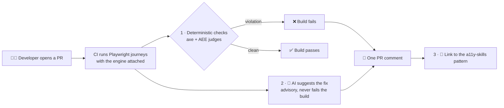
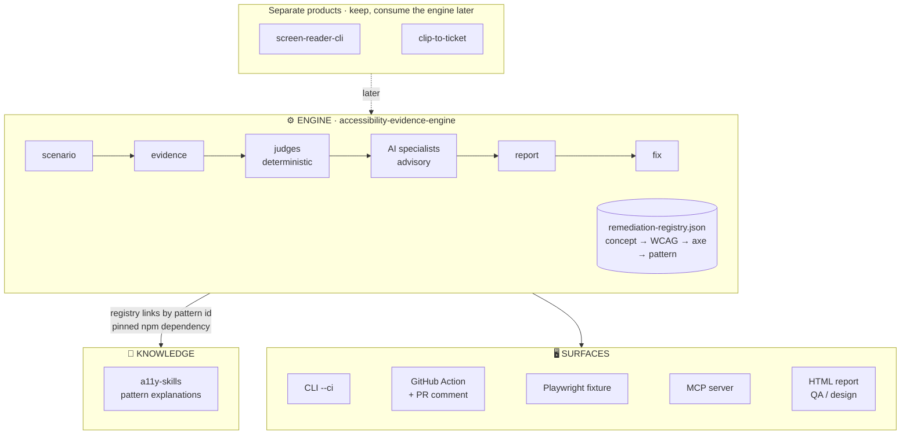
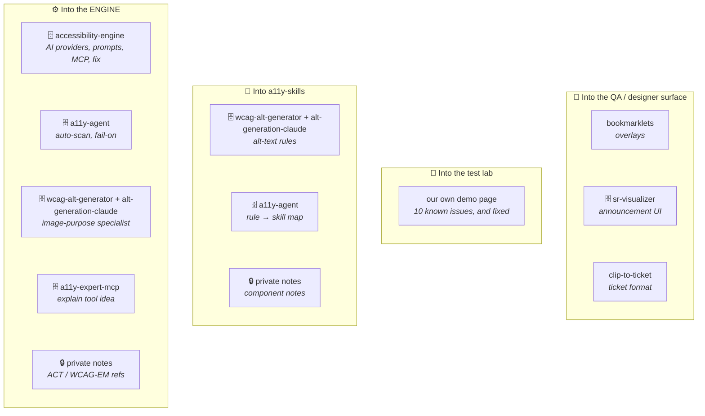

# Master plan: one accessibility toolkit

This is the working plan for turning a dozen accessibility repos into one tool developers use on every pull request. It is the single source of truth for that cross-repo work. Engine internals keep their own detail in `docs/implementation-roadmap.md`; this plan links to it rather than repeating it.

## How to use this file

- **Start a session:** open a Claude Code session on `accessibility-evidence-engine` and say _"continue the master plan"_. `CLAUDE.md` points here, so a fresh chat picks up the context without any earlier conversation.
- **One step per session.** Each step is sized for one sitting and has a "done when" line.
- **Tick the box in the same PR that does the work.** The file is then always true, and git history is the log.
- **Decisions go in the Decisions log below**, not in chat. Chat is lost; this file is not.
- **Current focus: the tool works for its owner.** Publishing (npm, PyPI), public showcases and the portfolio map wait in [Later](#later-parked) until it does.

## Goal

A developer opens a PR. CI runs their Playwright journeys with the engine attached, then:

1. **Deterministic checks fail the build** on real violations (axe plus AEE's own judges).
2. **AI suggests the fix** for each violation, using a screenshot of the section and the page context. This is advisory, labelled as AI, and never fails the build.
3. **Each finding links to the pattern** that explains it (a11y-skills).

```mermaid
flowchart LR
  PR["👩‍💻 Developer opens a PR"] --> CI["CI runs Playwright journeys<br/>with the engine attached"]
  CI --> DET{"1 · Deterministic checks<br/>axe + AEE judges"}
  DET -- "violation" --> RED["❌ Build fails"]
  DET -- "clean" --> GREEN["✅ Build passes"]
  CI --> AI["2 · 🤖 AI suggests the fix<br/>advisory, never fails the build"]
  RED --> COMMENT["💬 One PR comment"]
  AI --> COMMENT
  COMMENT --> PAT["3 · 📘 Link to the a11y-skills pattern"]
```

The first rules covered are unlabeled buttons, unlabeled links, missing alt text, missing form labels and empty headings. This is the exit test of Milestone 3 in `docs/implementation-roadmap.md`, widened from one rule to five.

## Target shape

```mermaid
flowchart TB
  subgraph SEPARATE["Separate products · keep, consume the engine later"]
    direction LR
    SRC["screen-reader-cli"] ~~~ CTT["clip-to-ticket"]
  end
  subgraph ENGINE["⚙️ ENGINE · accessibility-evidence-engine"]
    direction LR
    S["scenario"] --> E["evidence"] --> J["judges<br/>deterministic"] --> A["AI specialists<br/>advisory"] --> R["report"] --> F["fix"]
    REG[("remediation-registry.json<br/>concept → WCAG → axe → pattern")]
  end
  subgraph KNOWLEDGE["📘 KNOWLEDGE"]
    SK["a11y-skills<br/>pattern explanations"]
  end
  subgraph SURFACES["🖥️ SURFACES"]
    direction LR
    CLI["CLI --ci"] ~~~ GHA["GitHub Action<br/>+ PR comment"] ~~~ FIX["Playwright fixture"] ~~~ MCP["MCP server"] ~~~ HTML["HTML report<br/>QA / design"]
  end
  SEPARATE -. "later" .-> ENGINE
  ENGINE -- "registry links by pattern id<br/>pinned npm dependency" --> KNOWLEDGE
  ENGINE --> SURFACES
```

**Why the registry is the map:** it already joins each concept to WCAG criteria, axe rules, required evidence, the AI allowlist and verification. Adding a `pattern` field that points at a11y-skills keeps every mapping in one file. a11y-skills stays pure explanation with no second rule map.

## Inventory: every source and where its value goes

Nothing is archived until its row says **harvested**. That is how no information gets lost.

```mermaid
flowchart LR
  subgraph ENG["⚙️ Into the ENGINE"]
    direction TB
    e1["🗄️ accessibility-engine<br/><i>AI providers, prompts, MCP, fix</i>"] ~~~ e2["🗄️ a11y-agent<br/><i>auto-scan, fail-on</i>"] ~~~ e3["🗄️ wcag-alt-generator + alt-generation-claude<br/><i>image-purpose specialist</i>"] ~~~ e4["🗄️ a11y-expert-mcp<br/><i>explain tool idea</i>"] ~~~ e5["🔒 private notes<br/><i>ACT / WCAG-EM refs</i>"]
  end
  subgraph SKL["📘 Into a11y-skills"]
    direction TB
    k1["🗄️ wcag-alt-generator + alt-generation-claude<br/><i>alt-text rules</i>"] ~~~ k2["🗄️ a11y-agent<br/><i>rule → skill map</i>"] ~~~ k3["🔒 private notes<br/><i>component notes</i>"]
  end
  subgraph LAB["🧪 Into the test lab"]
    direction TB
    l1["our own demo page<br/><i>10 known issues, and fixed</i>"]
  end
  subgraph QA["🎨 Into the QA / designer surface"]
    direction TB
    q1["bookmarklets<br/><i>overlays</i>"] ~~~ q2["🗄️ sr-visualizer<br/><i>announcement UI</i>"] ~~~ q3["clip-to-ticket<br/><i>ticket format</i>"]
  end
  ENG ~~~ SKL ~~~ LAB ~~~ QA
```

🗄️ archived once harvested · 🔒 scrubbed before it moves · no icon: stays live. Every verdict is in the review list below.

### Review list: every repo in one place

This table is the only place a repo's fate is decided. **Archive is the default:** it is reversible and keeps history and links working. **Delete** only a repo with nothing to harvest and nothing linking to it, or a fork with no commits of its own; a deletion is hard to undo. A repo is archived the day its harvest row is ticked, not at the end.

| Repo                                                                 | Verdict                                                                                                                                                | Waits on                                                                                          |
| -------------------------------------------------------------------- | ------------------------------------------------------------------------------------------------------------------------------------------------------ | ------------------------------------------------------------------------------------------------- |
| `accessibility-evidence-engine`                                      | **Keep:** the tool                                                                                                                                     | —                                                                                                 |
| `a11y-skills`                                                        | **Keep:** the knowledge                                                                                                                                | —                                                                                                 |
| `screen-reader-cli`                                                  | **Keep:** separate product for screen readers. Its `scan` repeats the engine's Playwright + axe pipeline, so it routes through the engine later (7.2). | —                                                                                                 |
| `a11y-engineering-toolkit`                                           | **Keep:** portfolio page                                                                                                                               | —                                                                                                 |
| `a11y-for-feds-intro`                                                | **Keep:** workshop, with its own purpose (fix issues one by one)                                                                                       | —                                                                                                 |
| `bookmarklets`                                                       | **Keep**                                                                                                                                               | Harvest (M7)                                                                                      |
| `clip-to-ticket`                                                     | **Keep:** separate product                                                                                                                             | Harvest (M7)                                                                                      |
| `accessibility-engine`                                               | **Archive**                                                                                                                                            | Merge its [banner PR](https://github.com/Elizabeth1979/accessibility-engine/pull/2), then Archive |
| `a11y-agent`                                                         | **Archive**                                                                                                                                            | Merge its [banner PR](https://github.com/Elizabeth1979/a11y-agent/pull/1), then Archive           |
| `a11y-expert-mcp`                                                    | **Archive**; its patterns are a stale copy of a11y-skills                                                                                              | Merge its [banner PR](https://github.com/Elizabeth1979/a11y-expert-mcp/pull/1), then Archive      |
| `sr-visualizer`                                                      | **Archive**                                                                                                                                            | Merge its [banner PR](https://github.com/Elizabeth1979/sr-visualizer/pull/1), then Archive        |
| `wcag-alt-generator`                                                 | **Archive**                                                                                                                                            | Merge its [banner PR](https://github.com/Elizabeth1979/wcag-alt-generator/pull/1), then Archive   |
| `alt-generation-claude`                                              | **Archive**                                                                                                                                            | Archive (no banner: the owner chose to skip it)                                                   |
| `accessibility-validator`                                            | **Delete:** a hand-written Python checker for rules axe already covers; nothing to harvest                                                             | Owner's last look                                                                                 |
| `any-access`                                                         | **Delete:** three small 2020 scripts, all covered by a11y-skills                                                                                       | Owner's last look                                                                                 |
| `a11y-memory-game`                                                   | **Archive:** a fork with a commit of its own, and the only copy of the game in this account                                                            | Archive (no banner: nothing supersedes it)                                                        |
| `a11y-html-aria`                                                     | **Archive:** a workshop fork with four commits of its own (build fixes)                                                                                | Archive (no banner)                                                                               |
| `a11y-interactions`                                                  | **Archive:** a workshop fork; archived rather than checked for commits of its own, since archiving is safe either way                                  | Archive                                                                                           |
| `visua11y`, `accessible-search`, `a11y-first-ext`, `a11y-booth-game` | **No action:** not duplicates (`visua11y` is a reading aid for end users, not a developer tool)                                                        | —                                                                                                 |

Also checked and unrelated to accessibility: `TTS`, `the-vault`, and the rest of the personal and family repos.

### Harvest details

| Repo                    | Value to harvest                                                                                                                                                                                                                                                                                                                                                                       | Goes to                                                                                                                                                 | Harvested |
| ----------------------- | -------------------------------------------------------------------------------------------------------------------------------------------------------------------------------------------------------------------------------------------------------------------------------------------------------------------------------------------------------------------------------------- | ------------------------------------------------------------------------------------------------------------------------------------------------------- | --------- |
| `accessibility-engine`  | **The most to harvest.** Working AI provider layer (Claude, local Ollama with no API key, stub; this engine only has an OpenAI adapter). Naming, alt-text and vision judge prompts. MCP server (`@aee/mcp`). Apply-fix-to-source including JSX (`@aee/fix`). Triage CLI. The graph-guard test that keeps AI away from the live page. Content-addressed artifact store. ADRs 0002–0005. | Providers → `@aee/ai-fixes` (M3); prompts → specialists (M3); MCP → new package (M6); fix → `--fix` (M5); graph guard → tests (M3); ADRs → `docs/` (M3) | [x]       |
| `a11y-agent`            | Auto-scan on navigation; `A11Y_STRICT` severity threshold; axe-rule → skill map (stale filenames)                                                                                                                                                                                                                                                                                      | Fixture auto-checkpoint (4.2); `fail-on` (4.3); the skill map is replaced by the registry's `axeRulePatterns` (1.4, done)                               | [x]       |
| `a11y-expert-mcp`       | Tool and prompt ideas only                                                                                                                                                                                                                                                                                                                                                             | MCP `explain` tool (M6)                                                                                                                                 | [x]       |
| `sr-visualizer`         | Streaming SR-announcement UI; its sample pages are not needed (the test lab covers them)                                                                                                                                                                                                                                                                                               | UI → QA surface (M7)                                                                                                                                    | [x]       |
| `wcag-alt-generator`    | Image-role classification (decorative / functional / informative)                                                                                                                                                                                                                                                                                                                      | `image-purpose` specialist (M3)                                                                                                                         | [x]       |
| `alt-generation-claude` | Alt-text best-practice rules and prompt; image + context input                                                                                                                                                                                                                                                                                                                         | `image-purpose` specialist (M3); image-labeling pattern (Later)                                                                                         | [x]       |
| `a11y-for-feds-intro`   | A deliberately broken page with 16 listed issues and their fixes                                                                                                                                                                                                                                                                                                                       | Not the test lab: it is a workshop with its own purpose. Before/after showcase (Later)                                                                  | [ ]       |
| `bookmarklets`          | Visual overlays: headings, tab order, alt text, focus indicator                                                                                                                                                                                                                                                                                                                        | QA/designer surface (M7)                                                                                                                                | [x]       |
| `clip-to-ticket`        | Ticket format; WCAG 2.2 and APG data files                                                                                                                                                                                                                                                                                                                                             | Ticket format → reporter (M7); data only if the registry's WCAG fields prove insufficient                                                               | [x]       |

### Private notes (read, scrub, then move)

| Source                                                                   | Value                                                                                                                                   | Goes to                                       | Harvested |
| ------------------------------------------------------------------------ | --------------------------------------------------------------------------------------------------------------------------------------- | --------------------------------------------- | --------- |
| `e11i-brain` → `Work old/2 - Resources/A11y` and `Accessible components` | Short notes on links, contrast, non-text contrast, mouse-only, RTL, mobile, cards, multi- vs single-select, drag and drop, autocomplete | Pattern improvements in a11y-skills (Later)   | [ ]       |
| `e11i-brain` → `Clippings`                                               | ACT Rules Format, WCAG-EM, ARIA-AT, WCAG 3                                                                                              | References for registry and judge design (M3) | [ ]       |

**Scrub rule:** anything that moves from a private note into a public repo is rewritten generically. No employer, product or partner names, and no internal links or screenshots. If a note only makes sense with that context, it doesn't move. `CONTRIBUTING.md` already forbids proprietary page evidence; this rule extends it to notes.

## Milestones

See it as a picture on the [live roadmap](https://elizabeth1979.github.io/accessibility-evidence-engine/roadmap.html), which is built from this section on every deploy. Each milestone's **Outcome** line is what the page shows.

Each "day" is one focused session. Skipping days is fine; skipping order is not.

### M0 — Home base (day 1)

**Outcome:** The plan lives in this repo, and every session starts from it.

- [x] **0.1** Review and merge the PR that adds this file and `CLAUDE.md`. Close accessibility-engine PR #1, which had the plan in the wrong repo. _Done when:_ this file is on `main`.
- [x] **0.2** Answer the open questions (below) and record the answers in the Decisions log. _Done when:_ no open question blocks M1–M4.
- [x] **0.3** Replace the example that named a real product with a generic `examples/public-site/` scenario that targets this project's own demo site. The old name is removed from the scripts, README, CHANGELOG and CLI tests. _Done when:_ a case-insensitive grep for the old name finds nothing outside git history.

### M1 — Knowledge link (days 2–3)

**Outcome:** Every finding links to the pattern that explains it.

- [x] **1.1** Registry: add a `pattern` field to each entry (for example `accessible-name` → `buttons`, `link`, `forms`) and extend the axe mappings for the MVP rules: `link-name`, `image-alt`, `label` and `empty-heading`. Only `button-name` is mapped today. Update the registry schema. _Done when:_ `npm run check` and the unit tests pass, and every MVP axe rule resolves to a registry entry and a pattern.
- [x] **1.2** Pin a11y-skills from GitHub (a git dependency at a fixed commit; no npm publish), and check every registry `pattern` points to a file that exists. _Done when:_ a test fails if a pattern file is renamed.
- [x] **1.3** Reporter: show each finding's pattern link in the HTML, JSON and Markdown reports. Until this step, the link from 1.1 is data no reader sees. _Done when:_ the report for the test-lab `icon-labels` case links `button-name` to the buttons pattern.
- [x] **1.4** Map every axe rule that a11y-skills already covers to its pattern (its `patterns/INDEX.md` routes axe findings to files), not only the five MVP rules. _Done when:_ a test lists each mapped axe rule with its pattern, and a real run shows the link on findings beyond the MVP five.

### M2 — Known answers and a report you can trust (days 4–6)

**Outcome:** Test pages with known answers catch any missed or false finding, and the report never contradicts itself.

- [x] **2.1** Test lab: our own demo page with one issue per registry concept, and the same page fixed. Every issue, its expected finding and how the engine checks it live in `site/test-lab-contract.json`; the lab page is generated from it. _Done when:_ `npm run test:playwright` fails if a known violation is missed or a good page gets a finding.
- [x] **2.2** Keyboard and mouse sweep, all with Playwright and nothing authored by hand: Tab to every stop, press Enter and Space on everything a mouse can click and compare the result with the click, compare hover with focus, and check where focus lands after each action. _Done when:_ the demo page's click-only Export, hover-only plan details and lost focus after archiving are found, the fixed page stays clean, and the lab table shows them as found.
- [x] **2.3** Sweep findings in the report: `aee run` sweeps each journey's start page, pressing controls only when the journey's `allowedActions` include `activate-page-controls`. Each finding joins the report with its plain-language summary and its registry pattern link. _Done when:_ a run on the demo page reports the three keyboard issues and a run on the fixed page reports none.
- [x] **2.4** The portable virtual screen reader takes each item's role and name from the browser's accessibility tree, which the engine already captures over CDP, and the hand-written tag → role map and name code are deleted. One helper fetches the tree; today it is fetched in two places. Why: the browser implements the W3C mappings (HTML-AAM, accname); the copy gets `<a>` without `href`, `<header>` inside `<article>`, `` and an unnamed `<form>` wrong. _Done when:_ the demo page carries those four and they are announced as HTML-AAM says.
- [x] **2.5** The report tells one story: when a rule fails, the matching status row fails too, and the virtual-reader row says which items were announced without a name. It also names what failed correctly: the 1.4 practice run titled plain grey text "Replace the shared low-contrast link color" for "calls to action". A run on the old `icon-labels` test page blocked release for `button-name` while showing "Semantics: no confirmed issue" and "Virtual reader: 3/3 commands passed". The report and the lab must also agree: `aee run` runs only WCAG-tagged axe rules, so it misses the demo page's empty heading (`empty-heading` is an axe best-practice rule) while the lab counts it as found. So the report also runs axe's best-practice rules, labelled "Best practice" and never blocking release. _Done when:_ a test on the demo page asserts both rows report the problem, a contrast failure on plain text is not called a link, and `aee run` on the demo page reports every issue the lab marks as found.
- [x] **2.6** Product shots and videos: a script runs the engine on the test-lab pages and saves one highlighted crop of the report per feature (finds the bug, explains it, how to fix it, every affected spot, what a screen reader hears, release blocked), each with a one-line caption a non-technical reader understands. It also records two flow videos: a screen reader moving through the page, reusing `screen-reader-cli audit --record`, and a keyboard pass with no screen reader (Tab through every stop, visible focus), reusing the engine's per-lane interaction video. _Done when:_ one command regenerates every shot and both videos from a real run, so nothing is hand-made or stale.
- [x] **2.7** Homepage features section: every feature of the tool as a card with its product shot, a plain-language caption and a link to try it (the test lab, a sample report), plus greyed "coming soon" cards generated from the unchecked milestones. _Done when:_ each shipped feature has a card with a real shot, the section passes axe and a keyboard pass on desktop and phone, and a step that changes a feature also updates its card.

### M3 — Harvest the AI layer (days 7–10)

**Outcome:** AI suggestions run on Claude, a local model or a free stub.

- [x] **3.1** Port the provider seam from `accessibility-engine`: Claude, local (Ollama) and stub, next to the existing OpenAI adapter, all behind the existing `AccessibleLabelModelProvider` interface. With no key, the default is stub. _Done when:_ the unit tests pass with the stub, and a live test runs when a local model is present.
- [x] **3.2** Port the graph-guard test: the AI package must not import a browser driver. _Done when:_ adding a Playwright import to `ai-fixes` fails the tests.
- [x] **3.3** Port the naming and alt-text judge prompts into the allowlisted specialists (`accessible-name` icon-only, `image-purpose`), adding image-role classification. _Done when:_ the test-lab icon-button case gets a labelled AI name from the stub fixture.
- [x] **3.4** Carry the design decisions over as ADRs in `docs/`: accessibility-engine's ADRs 0002–0005, plus the ACT-rules shape of the registry. _Done when:_ the ADRs exist; this step changes no code.
- [x] **3.5** Wire the accessibility-engineer prompt (`packages/ai-fixes/prompts/accessibility-engineer.md`) in as the system prompt of every AI specialist (and add `prompts/` to the package `files`), and turn its measurable disagreements into deterministic judges: text that looks like a heading but has no heading role, a mouse target that is not a tab stop, and hover content with no focus equivalent. _Done when:_ a test fails if a specialist runs without the prompt, and the heading judge flags the old roadmap markup (milestone titles inside `
`).

### M4 — The PR experience (days 11–15)

**Outcome:** ⭐ The goal: a PR with an accessibility bug gets red CI and one comment with the fix and the pattern.

- [x] **4.1** Reporter: a PR-comment variant of the Markdown report. Blocking findings come first, then AI suggestions labelled as AI; each finding is collapsed and shows the element, the problem, the fix and the pattern link. _Done when:_ a snapshot test on a test-lab page passes.
- [x] **4.2** Playwright fixture: a drop-in `test` export that captures a checkpoint automatically on page load, so a team can adopt it without writing scenario YAML. _Done when:_ an existing spec with only the import swapped produces findings.
- [x] **4.3** A composite `action.yml` with inputs `run` (a scenario or test command), `fail-on` and `ai-provider` (default `stub`). It posts one sticky comment that later runs update. _Done when:_ running it twice leaves exactly one comment.
- [x] **4.4** A self-test workflow: every PR in this repo runs the Action against the test lab. _Done when:_ a PR that adds a nameless icon button gets red CI and a comment with the buttons pattern link.
- [x] **4.5** AI on in CI with a free model on the runner (Claude instead once an `ANTHROPIC_API_KEY` secret exists), and the homepage gets an AI suggestion feature card whose shot comes from that run. _Done when:_ the comment shows an AI-suggested button name, labelled as AI, and so does the card.

### M5 — Dogfood (days 16–18)

**Outcome:** The tool runs on a real app and can apply fixes to the code.

- [x] **5.1** Adopt it in one of your own public apps, installed from GitHub (no npm publish yet). _Done when:_ that repo's PRs get the comment, and every friction point is filed as an issue.
- [x] **5.2** `--fix`: apply a reviewed label proposal to source, including JSX, using `@aee/fix` from accessibility-engine. Apply it on a branch and rerun the journey to verify. _Done when:_ Milestone 3's exit test in the roadmap passes.

### M6 — One MCP (days 19–20)

**Outcome:** A coding agent asks "explain button-name" and gets the pattern.

- [x] **6.1** Port `@aee/mcp` from accessibility-engine, rewired to this engine, and add an `explain` tool: rule id or UI element in, the a11y-skills pattern out, through the registry. _Done when:_ a coding agent asked "explain button-name" gets the buttons pattern.

### M7 — QA and designer surface (later, after M5 is used for real)

**Outcome:** QA and designers get a visual report, not only developers.

- [x] **7.1** Design spec only: add bookmarklets-style overlays, the sr-visualizer announcement list and the clip-to-ticket ticket format to the existing HTML report. _Done when:_ a spec is in `docs/`.
- [x] **7.2** screen-reader-cli: have `scan` call the engine. This is an issue first, per that repo's rules. _Done when:_ the issue is filed with the proposed change.
- [x] **7.3** Build the spec's Page view with the Issues and Screen reader path layers, and the announcement list, from data runs already capture ([spec](qa-designer-view.md)). _Done when:_ on the lab's demo page, every finding and every announcement has an outline at its element, the layers and lists work by keyboard, and axe finds no violations in each state, desktop and phone.
- [x] **7.4** Copy a fix as a ticket, and download all fixes as CSV, with the spec's fields. _Done when:_ a copied ticket pasted into a GitHub issue shows every field, and the CSV opens with one row per fix.
- [x] **7.5** Capture the element map and tab stop boxes, then add the Headings, Tab order, Images and Focus indicator layers. _Done when:_ the lab's demo page's heading, keyboard and alt text issues each show on their layer, and the fixed page shows the same layers with nothing flagged.

### M8 — Clean up the repos (any day, as rows become ready)

**Outcome:** Every repo in the review list has its verdict carried out.

- [ ] **8.1** Work the review list: archive each repo on the day its harvest row is ticked (README banner saying it is superseded by accessibility-evidence-engine, then GitHub's Archive button), and delete a "Delete" repo after the owner's last look. These steps block nothing and can run between milestones. _Done when:_ every review-list row is carried out.

### M9 — Works on a real app

**Outcome:** A team can leave AEE on in its test suite: every result is decided or says why, each problem shows once, and the suite stays fast.

Each step fixes what adopting AEE in albums-studio (5.1) found, measured on that same suite before and after.

- [x] **9.1** Say why a result is not decided ([#50](https://github.com/Elizabeth1979/accessibility-evidence-engine/issues/50)): a status row for a check the run does not include says so instead of "Needs review", and contrast that axe cannot measure over an image or a gradient is measured from the screenshot, decided where every pixel behind the text agrees. _Done when:_ fewer of albums-studio's assessments end "not decided" than the 98 of 119 in 5.1, and each one left names its elements and why in the PR comment.
- [x] **9.2** One problem, listed once ([#49](https://github.com/Elizabeth1979/accessibility-evidence-engine/issues/49)): the PR comment lists each distinct finding once with the tests that saw it. _Done when:_ a finding three tests see appears once in the comment, "seen in 3 tests", and albums-studio's comment is a fraction of its 5.1 size.
- [x] **9.3** Fast enough to leave on ([#48](https://github.com/Elizabeth1979/accessibility-evidence-engine/issues/48)): a fixture checkpoint captures once, after the page has settled; every test keeps its screenshots, the owner's call (decisions log). _Done when:_ albums-studio's suite time and evidence size are measured before and after, and both drop.
- [x] **9.4** Keep the project's Playwright ([#51](https://github.com/Elizabeth1979/accessibility-evidence-engine/issues/51)): AEE's Playwright ranges start at the oldest version it works with, and Playwright is a peer. _Done when:_ CI runs the fixture test on that oldest version, and installing AEE leaves a project's Playwright as it was.
- [x] **9.5** Two keyboard sweep bugs: a press that loads a page mid-read ([#57](https://github.com/Elizabeth1979/accessibility-evidence-engine/issues/57)), and a start address with a `#fragment` ([#64](https://github.com/Elizabeth1979/accessibility-evidence-engine/issues/64)). _Done when:_ a test makes each case certain, fails before the fix and passes after it.
- [x] **9.6** Arrow keys reach a tablist's tabs ([#71](https://github.com/Elizabeth1979/accessibility-evidence-engine/issues/71)): before reporting a control as mouse-only, the sweep tries the arrow keys of the composite widget it sits in (tabs, listbox, menu, tree, radio group, grid, toolbar). _Done when:_ the unselected tabs of a correct tablist are not reported, and a control no key reaches still is.
- [x] **9.7** (was 8.2, then 9.6) Restructure the homepage around the finished tool: one story from problem to fix, rebuilt from the features section and product shots, once the tool works on a real app. _Done when:_ the homepage passes axe, a keyboard pass and a virtual screen-reader pass on desktop and phone, and every claim on it links to a shot or a live page.
- [x] **9.8** Keyboard and screen reader in the one-line import: where a passing test ends on a web page, the fixture sweeps it by keyboard and mouse and reads it with the virtual screen reader, on the test's own page so the checks keep its sign-in and mocks, once per page in a run. _Done when:_ albums-studio, with only the import swapped, gets keyboard and screen-reader results for the pages its tests end on, and its suite time is measured before and after.

### M10 — Finish the checks

**Outcome:** Every check the old engine had works here, decided from evidence first, and the AI's suggestions are measured.

Each check starts as deterministic evidence in a registry concept; an allowlisted AI specialist comes after, labelled as AI, and never passes or fails anything on its own. The old engine's prompts stay readable in the archived repo: [`prompt.ts`](https://github.com/Elizabeth1979/accessibility-engine/blob/571bf67b46507600890dadeb483b0d3d44a6aba8/packages/ai/src/prompt.ts).

- [x] **10.1** A message nobody hears (WCAG 4.1.3): when a press shows new text that is in no live region present before the press, that focus did not move to, and that no page load or change in the control's own state explains, the sweep reports it as advisory, under a new `status-messages` concept that owns 4.1.3. _Done when:_ the demo page's archive message, in a plain paragraph, is found, the fixed page's `role="status"` message is not, and the lab table shows it as found.
- [x] **10.2** A failed request nobody hears: a press whose request fails (an error status, or no response) and shows nothing a screen reader says. _Done when:_ a lab case whose save fails silently is found, and its fixed twin, which announces the error, is not.
- [x] **10.3** Colour alone (WCAG 1.4.1): deterministic evidence first (a state such as an error or a selected item that differs from its neighbours only in colour), under a new `use-of-color` concept that also takes axe's `link-in-text-block`. The specialist that judges the screenshot comes with the vision step, 10.5. _Done when:_ a lab case told apart only by colour is found, and its fixed twin, which adds text or an icon, is not.
- [x] **10.4** Text in images (WCAG 1.4.5): deterministic evidence first (an image shaped like a line of text, named in a few words and drawn in two flat colours), under a new `images-of-text` concept. The specialist that reads the image comes with the vision step, 10.5. _Done when:_ a lab banner whose words are pixels is found, and a logo is not.
- [x] **10.5** The image-purpose specialist sees the image (from `alt-generation-claude`, which describes the image first): pass the element's screenshot crop to vision-capable providers. Until then it drafts from page context only and says so in its rationale. The same crop lets allowlisted specialists say whether a colour-only finding (10.3) carries meaning and whether an image of text (10.4) shows words, labelled as AI. _Done when:_ the lab chart's suggested alt text names what the chart shows, from a provider that received the crop, the lab's over-limit item gets a labelled AI note that its colour means something, and the lab banner a note that its words are pixels.
- [x] **10.6** Measure the AI's names against the lab's known answers. The fixed lab page holds the right name for every nameless control, so a test can score each model; on 4.5's demo the free local model named the archive button "View Project Archive" with confidence 1.00. _Done when:_ one command prints each provider's score, and the README says which is worth it.
- [x] **10.7** (was 8.2) Update the portfolio map in `a11y-engineering-toolkit`. _Done when:_ the map shows this engine as the home and each other repo as kept, archived or deleted.
- [ ] **10.8** Real screen readers (Milestone 4 in `docs/implementation-roadmap.md`): reuse screen-reader-cli's Guidepup live bridge for VoiceOver and NVDA; do not write a second one. Needs the owner's Mac. _Done when:_ a run on the demo page records what VoiceOver says, next to the virtual reader's transcript.
- [x] **10.9** Hear the test's own presses: where a Playwright test uses the `@aee/cli/test` fixture, which never presses a control itself, 10.1 and 10.2 come from the presses the test makes. _Done when:_ a fixture test that clicks the lab's Archive button gets `status-not-announced`, one whose Sync click fails silently gets `failure-not-announced`, AEE presses nothing, and the fixed lab page gets neither.

## Later (parked)

Parked until the tool works for its owner. Each item keeps its old step number so history still makes sense.

- **Was 1.2:** publish a11y-skills to npm. Its PR (a11y-skills #5) closes unmerged; 1.2 pins from GitHub instead.
- **Was 1.3:** merge the alt-text rules from `alt-generation-claude` and `wcag-alt-generator` into `image-labeling.instructions.md`.
- **Was 1.4:** scrub and move the private component notes into a11y-skills.
- **Was 4.6:** the showcase on `a11y-for-feds-intro` (its broken page, the PR comment for each of the 16 issues, then the fixed page).
- **Was 5.3:** decide distribution (open core, product or npm only; check the employment contract first) and, if publishing, the publish workflow under `@e11i`.
- **Was 6.2:** a11y-expert-mcp's final PyPI release pointing to the new MCP.

## Open questions

None right now. Add new ones here and move each answer to the Decisions log.

## Decisions log

Newest first. One line each: date, decision, why.

- 2026-10-04 — Release 0.7.1, a patch: two false alarms found by albums-studio's first run on 0.7.0 ([albums-studio#63](https://github.com/Elizabeth1979/albums-studio/pull/63)), where the checks of the tests' own presses ran on a real app for the first time. First, signing in swaps the app's whole screen at the same address, and the new screen was reported as a message nobody hears in 35 of 118 tests. A press that replaces the page's main content is now a new view, as a page load already was, and is not read for messages. Whether a new view moves focus or is announced is a different question from a status message, and focus-lost already covers part of it. Second, a refused save showed its error inside the dialog it was made in, and the check reported "a request fails, and nobody is told", because text inside any dialog was skipped. Only a dialog the press opened is skipped now; one that was already open is read like the page. Both come from the probe the sweep and the observed presses share, so the sweep gets both fixes too. A test copies both cases and fails on 0.7.0 with exactly albums-studio's two false findings. Why: a false alarm in a third of a real app's tests teaches its team to ignore the comment.
- 2026-10-04 — Release 0.7.0, a minor version, so projects that run AEE from a release tag get today's work. Tests using the one-line import now get the checks for a message nobody hears and a failed request nobody hears from the presses the test makes (#104), each shown on the page as the press left it (#109). A native check box that reveals fields is no longer called a message (#108). Checkpoints read a page once the data it loads has arrived (#106). An AI-suggested alt text that repeats the text beside its image is rejected (#98). All new findings are advisory, so no check turns red that was green. The minimum Node moves to 22.13 (#103), which counts as a minor change before 1.0. Every package moves to 0.7.0, with the exact versions they require of each other, the lockfile, and the README's 20 references. Judge, observer and schema versions are unchanged. Why: albums-studio is pinned to v0.6.0 and has none of it.
- 2026-10-04 — A finding from a test's own press gets its own picture. The observed-presses lane had no page capture, so its findings were listed with no screenshot and "no position was recorded". When a press has a finding, the page is captured, full page, as the watch on that press ends: before the test's next step, so it shows what the test waited for and nothing after. Only such a press is captured, and the test waits for it, at most 10 seconds; a capture that fails leaves the finding without a picture and says why in the lane's record. The screenshot sits beside the lane's record as `press-N.png`, and each finding names the one its box is on, since a lane's presses happen at different times and one picture per lane cannot show them. The report draws each press's findings on that press's screenshot, and the checkpoint with the most elements now comes first, so the picture is always the one its outlines belong on. Why: the owner reads screenshots, not selectors, and a message nobody hears is clearest shown on the page where it appeared.
- 2026-10-04 — A native check box's or radio button's checked state counts as the control's own state, like `aria-checked`, `aria-pressed`, `aria-expanded` and `open`. No attribute shows it, so a check box that reveals more of a form had its new fields reported as a message nobody hears, though a screen reader says "checked". Found while building the same check as 10.9 (#107, closed as superseded by #104). Why: a "show more fields" check box is common in forms, and a false alarm on it in every test that ticks one teaches a team to ignore the check.
- 2026-10-04 — The test fixture watches the presses a test makes instead of pressing anything, so a message nobody hears (10.1) and a failed request nobody hears (10.2) reach projects that use it. Each click, tap, key press, check or uncheck the test makes is watched from just before it until the test's next action, page load or checkpoint, or its end: the press is read with whatever the test waited for after it, and the wait adds no time to the test. The control is the one the press's click or key went to. The same change watch, failed-request watch and finding text as the sweep's presses are used, not a copy. The presses are recorded as a sweep lane of their own, marked `pressedBy: "test"`, so they are reported in every test that presses something, not only the one test per page the sweep runs in; such a lane says nothing of Tab or of pressing every control, so the keyboard row ignores it. Why: the fixture sweeps with `activateControls: false`, as pressing a control on a user's real app could delete data, so in albums-studio these two checks never ran and 0.6.0's comment showed no change from 0.5.0.
- 2026-10-04 — A checkpoint waits for the data a page loads, then for its DOM to stop changing. Playwright 1.63 showed the race: its faster checkpoints missed an image the fixture test's page drew 400 ms after loading, because the wait ended after 250 ms without a DOM change, and the image had only ever been seen because the checkpoint used to start late. A real app draws when its data arrives, so the requests a page has open now count as not drawn yet: counted from before the page loads (the fixture's lane, the sweep and its still page each start counting first), they are let finish, then the DOM gets its 250 ms pause, and both again if drawing sent new requests, within the same 3 seconds, so a request that never ends, such as a long poll, holds a page 3 seconds at most. A page with nothing loading costs nothing more. The test now draws its gallery when its data arrives a second after the load: it fails on the old wait and passes on the new, where 400 ms passed on both on a slower machine. A timer that draws after a silent pause, with no request, is still read after 250 ms; nothing on the page says it is coming. Why: a checkpoint should see the page a person sees, and on a slow network a person waits for the data too.
- 2026-10-04 — The dependency updates waiting as separate Dependabot pull requests land together, and the Node AEE promises gets tested. parse5 8 is published only as an ES module; AEE's packages are CommonJS, and Node loads an ES module through `require` from 22.12. The new CI job on exactly 22.12 then showed what 22.12 also does: it prints an experimental-feature warning on every run of the CLI, which the test of `aee plan`'s clean output caught; 22.13 loads it silently. So `engines` moves from `>=22` to `>=22.13`, and the job runs exactly 22.13. Until now CI ran only Node 24, so the promise of Node 22 was never checked. Node's type definitions move from 24 to 22, the oldest supported Node, so the compiler rejects an API that version lacks; the code compiles unchanged, and Dependabot no longer proposes their major updates ([#8](https://github.com/Elizabeth1979/accessibility-evidence-engine/pull/8) would have moved them to 26). The two CodeQL action updates land together because their init and analyze steps must match; apart, each failed. Playwright 1.63, also among them, waits: on it the fixture's load checkpoint missed an image the test's page draws 400 ms after loading. A checkpoint waits for 250 ms without a DOM change, so an image drawn after a longer silence was only ever seen because the checkpoint used to start late; that race gets its own fix before Playwright moves. Why: eight update PRs had waited up to four weeks, and one of them would have silently dropped Node 22.0 to 22.11.
- 2026-10-02 — The image-purpose specialist rejects an alternative that repeats, whole, a sentence or list item of the nearby heading or text (WCAG 1.1.1, technique H2, failure F30): one is at least four words, split on sentence ends and line breaks, compared word for word ignoring case and punctuation. Shorter phrases still pass, so "Line chart of requests per day" beside the heading "Requests per day" is fine. The test fixture's own alternative repeated its nearby text word for word, so the fixture changed, not the rule. Why: on the first `npm run score:ai` run, `gemma4:e4b` answered the lab chart with the hint and plan limits printed beside it, which a screen reader would then say twice while learning nothing about the chart.
- 2026-10-02 — Release 0.6.0, a minor version for M10's checks. The keyboard sweep now also reports a message a screen reader does not say, a failed request nobody hears, an item told apart by colour alone, and words drawn as an image; all four are advisory, so a project that upgrades sees them in its report and comment but no check turns red that was green. The AI sees each element's picture, and reads colour-only and image-of-text findings, only when a project names a model. `score:ai` and `readers:compare` are repository commands, not part of the packages. Every package moves to 0.6.0, with the exact versions they require of each other, the lockfile and the README's references; judge, observer and schema versions are unchanged. Why: the new checks reach albums-studio only through a release tag.
- 2026-10-01 — 10.8, the part that needs no Mac: `npm run readers:compare` runs screen-reader-cli twice on one page, its virtual reader (`audit`) and its live bridge (`live read`, VoiceOver on macOS, NVDA on Windows), and writes both transcripts side by side to `test-results/readers/`, with the platform, its release and screen-reader-cli's version. It calls screen-reader-cli as a program, the way the site's reader video already did, so there is no second bridge; the code that finds screen-reader-cli now lives in one test helper both use, and the comparison runs through its own Playwright config, as `score:ai` does, because Playwright's test loader cannot import a script module that uses `import.meta`. Rows line up by step, not by element, since VoiceOver groups a page differently from the virtual reader; matching them element by element waits until a real transcript shows how they differ. Where the real reader cannot run, the file says why in screen-reader-cli's words and the command exits nonzero; on Linux the demo page gives 92 virtual announcements and "Unsupported platform: linux". Recent macOS versions may hit [guidepup#149](https://github.com/guidepup/guidepup/issues/149), where Guidepup cannot start VoiceOver at all; screen-reader-cli already detects it and says so. 10.8 is ticked once a run on the owner's Mac records VoiceOver next to the virtual reader. Why: the virtual reader is a simulation, and only a real one shows where it is wrong.
- 2026-10-01 — 10.7: the portfolio map in `a11y-engineering-toolkit` ([#1](https://github.com/Elizabeth1979/a11y-engineering-toolkit/pull/1)) shows this engine as the home and every other repo as kept, archived or deleted, linking to the review list above as the one place fates are decided, so the map never decides one itself. It says "Archive", not "Archived": the decisions are made, but the archiving is 8.1's step. The toolkit's inventory now says where each archived repo's useful parts went in the engine. The public page drops the two retiring repos' cards and names every archived repo once. Its light theme's accent darkened from `#c8502b` to `#ab4425`, the same hue: axe found 17 contrast failures on the live page, every one that orange on the cream paper at 3.88:1, and none after. Why: the portfolio's front page described eight separate repos and never mentioned the engine.
- 2026-10-01 — 10.6 scores a model by the words its names share with the fixed lab page's names, read from the browser's accessibility tree, so the right answers live in one place, the fixed page. A missing word and an extra word cost alike (the Dice coefficient), so "View Project Archive" scores 67% against "Archive Project Alpha", not 100%. `npm run score:ai` runs `aee run` on the lab page as a user would, with each model answering; the AI score workflow runs it on a GitHub runner when the specialists, the lab or the scorer change. A run where the model answered nothing fails, since it measured nothing. The free local model on the runner scored 48% and 50% in two runs, about a minute per answer. "Archive project" (80%) and "Get help" (50%) name the right action but not which project or topic. The chart's alt text varies between runs: one pasted the plan-limits text beside it (15%), the other described the chart's bars (21%). Word match barely tells those apart, since a right answer in other words shares few words with the fixed page's, so the score prints every answer beside the right one and the README says to read them. The README says so: worth it for icon buttons and links, not for image alt text. Claude is not scored yet, since the repository has no Anthropic key; with an `ANTHROPIC_API_KEY` secret the same workflow scores both. Three names are a sanity check, not a benchmark. Why: "is the free model good enough?" had only anecdotes.
- 2026-10-01 — 10.5, second half: two more specialists read how a sweep finding looks, each allowlisted in the registry and labelled AI. For colour alone, the color-meaning specialist sees the item with its neighbours (the 120-pixel crop, since a colour means something only against the others) and says whether the colour carries meaning and what it is; for an image of text, the text-image specialist sees the image alone (the close crop) and reads its words, or says it is a logo, which WCAG exempts. Neither is asked without a screenshot, since the page's text cannot show a colour or pixels. Rehearsed on the runner with the free local model (`gemma4:e4b`), every answer cited the screenshot: the over-limit item's colour means "Error or warning status", the banner's words are "Upgrade to Team for unlimited projects", and the chart is "Usage chart showing daily metrics for Mon-Fri: 12, 15, 18, 25, 30." Two limits stay visible in that run. The banner's alt text holds the same words, so it does not prove the model read the pixels; and the chart's middle three numbers are read off the bars' heights, close but not exact, since the chart labels only Monday's 12 and Friday's 30. That is why every answer stays a suggestion to review, and why 10.6 scores the models. Asking two more questions took the demo run from six and a half minutes to about eight. Why: "only the author knows" was the reason 10.3 and 10.4 stayed advisory; a labelled reading of the picture tells the author what to check.
- 2026-10-01 — 10.5, first half: every specialist's question carries the element's picture, cut close to its edges (8 CSS pixels around it, no outline) from the screenshot the element was measured on, so the model still sees captured evidence only. A rehearsal on the runner with the free local model (`gemma4:e4b`) first sent the pull-request comment's crop, 120 pixels of page around the element: the model saw it (it cited the screenshot), but it read the plan-limits list beside the chart as the chart's own, and drafted "Usage chart showing monthly resets: Seats (12/5), Storage (10/12 GB)…". The page around an element reaches the model as text anyway, so the picture is now the element itself. Rehearsed again with the close crop, the same model drafted "Usage chart showing daily usage: Mon (12), Tue, Wed, Thu, Fri (30).", citing the screenshot, and described the archive icon as a filing cabinet and the help icon as a question mark. Both rehearsals ran the demo page with AI in six and a half minutes. The evidence names it `screenshot`, a field an answer may cite, and the report words it as "how it looks on the page". The free local model's vision could not be checked from the build machine, so a model that cannot see images is handled, not assumed away: its error names images, the question is asked again without the picture, and that provider is asked without pictures from then on. The answer then rests on the page's text, and the prompt asks it to say so. The specialists for colour alone and images of text come in the second half. Why: an alt text drafted without seeing the image guesses, and so does an icon button's name.
- 2026-10-01 — 10.4 finds images of text without reading them, since reading pixels (OCR) would mean a large dependency and a model download. An image is a candidate when it is shaped like a line of text (at least 2.5 times as wide as tall, 16 pixels tall) and named in 2 to 8 words, as a heading, a button or a slogan is. Logos, which WCAG exempts, are left out, and so are images named as a photograph, chart, diagram, map, screenshot or icon, whose labels belong to the picture. Its screenshot then decides: words on a plain background are mostly two flat colours, where a photograph or gradient spreads over many. The first run on this project's own homepage flagged two product screenshots of the report, named in 13 and 14 words; a longer name describes a picture, so the limit is 8. Advisory, because a flat illustration named in a few words looks the same; the specialist that reads the image needs the vision step, so it moves to 10.5. Why: a banner whose words are pixels cannot be enlarged, recoloured or translated, and no check found it.
- 2026-10-01 — 10.3 finds colour alone by comparing like items. In a row of at least three like items (list items, links, buttons, tabs, options, menu items), an item is reported when its neighbours all look the same and it differs from them in colour and nothing else. Visible cues that count: weight, size, style, an underline or border, a fill or line that appears or goes, shape, background images, an icon or text added by a style, and a change in lightness of at least 3:1, the bar WCAG's technique G183 sets for a link told apart by colour. Opacity counts as colour. Without those last two, the check's first run on this project's own site flagged its main call-to-action, a filled button beside outlined ones, and the slideshow's pressed button, whose border turns from dark to bright; neither needs hue to see. Two exceptions keep it quiet where words or convention already say the difference. A row whose other items share one text the item lacks, such as "Active, Active, Inactive", says it in words. A disabled item, dimmed, is a convention screen readers also announce. Advisory, because only the author knows whether the colour means anything; the specialist that judges the screenshot needs the vision step, so it moves to 10.5. axe's `link-in-text-block` moves to the new `use-of-color` concept, so 1.4.1 has one home. Why: "current page" or "over limit" shown only in a colour is the most common 1.4.1 failure, and no check found it.
- 2026-10-01 — 10.2 reports a failed request only when the page shows and says nothing new. When the page shows an error a screen reader does not say, 10.1 already reports that message, so one cause gives one finding. Only requests a script sends count (fetch and XHR), since a missing image is no action's result, and a request the page cancels does not, since a page load cancels every request still open. That is how the check first misfired, on a request the sweep's own reload cancelled. Each request is named by its method and outcome, never its address, which can carry personal data. Advisory, because a failed background request, such as analytics, can be harmless. Why: a save that fails silently leaves everyone believing it worked.
- 2026-10-01 — The parked checks and AI measurements become milestone M10, in the order they are built, because the owner wants every feature finished. Items that need the owner (archiving repos, the distribution decision, access to the alt-text repos, the PyPI release) stay parked. The first, a message nobody hears, is advisory: a press can show new text a screen reader does not say, which the sweep observes, but whether that text is a status message (a confirmation, an error, a result) rather than new content is the author's call. A live region counts only if it was on the page before the press, because a region added together with its text is said by some screen readers and not others; an alert counts either way, as it is said when added. Every press is now read once the page has settled, the same wait a page load gets, so a message that comes a moment later counts the same by keyboard and by mouse. The `status-messages` concept takes 4.1.3 from `focus-management`, so each criterion has one home. Why: 4.1.3 was listed under focus management, which no check reported against.
- 2026-10-01 — Release 0.5.0, a minor version for one addition: pictures in the pull-request comment (`images: true`), off by default, so a project that upgrades sees no change until it turns them on. Every package moves to 0.5.0, with the exact versions they require of each other, the lockfile and the README's 20 references; judge, observer and schema versions are unchanged. Why: albums-studio runs the Action from a release tag, and its trial ran from a branch.
- 2026-10-01 — The pull-request comment can show each problem as a picture, because the owner asked to follow along visually in GitHub, and the comment was text while the screenshots sat in a zip. GitHub shows a comment's images only from an address it can fetch: it has no API to attach files to a comment, and it strips images written into the comment's own text. So the pictures are committed, with the token's contents permission, to an `aee-images` branch of the repository and shown from there. That branch has no history of the project's code. Each picture is the page around one element, 120 CSS pixels each side, outlined in a 3-pixel magenta, cut from the screenshot the element was measured on. That is the representative checkpoint the HTML report pairs it with, and a screenshot whose size does not match the element's page gives no picture rather than a misplaced one. Neither does a problem with the whole page, such as a missing heading: on albums-studio's first run its picture was the entire 1.2 MB page with nothing in particular outlined. Pictures are named by their content, so a re-run adds nothing it already has, and at most 10 problems get one. It is off by default (`images: true` turns it on): the pictures are as public as the repository, and the reports are classed as sensitive. A failed upload posts the comment without pictures rather than with broken ones. Why: a person reviewing a pull request should see the problem, not a selector.
- 2026-10-01 — Release 0.4.1, a patch: two fixes found by albums-studio's first CI run on 0.4.0. The keyboard sweep could fail every control of a single-page app as mouse-only when it pressed Tab before the app had drawn the page (#85), and the PR comment counted tests whose page another test checked as "Not in this run", which read as a coverage gap. Every package moves to 0.4.1, with the exact versions they require of each other, the lockfile and the README's 20 references; judge, observer and schema versions are unchanged. Why: a real app's CI should not show a false release blocker.
- 2026-10-01 — [#85](https://github.com/Elizabeth1979/accessibility-evidence-engine/issues/85): the keyboard and mouse sweep waits for the app to draw the page after each load, and a walk in which Tab reaches nothing decides nothing. In a full run of albums-studio's 130 tests on a busy machine, the sweep reported 6 native links and buttons on one page as "Works with a mouse only", blocking that test; run alone, the same page had 8 Tab stops and no finding. The sweep pressed Tab right after the load event, before the app had drawn the page, so the first Tab reached nothing and the walk ended with no stops; the mouse-target inventory, a moment later, saw the drawn page. 9.3 had found the same race for checkpoints and fixed it with a wait for a quiet DOM; that wait now lives in one module used by the checkpoint, every load in the sweep and the sweep's full-page screenshot, rather than a copy. The wait cannot prove the app is done, so a walk that reaches no stop on a page with controls the keyboard reaches without a script (links, buttons, form fields, a non-negative tabindex; visible, enabled, not inert) is also not decided: the sweep reports no finding, and its record says why, so the keyboard row reads "Needs review". That also covers a script that stops Tab, which a person should check, rather than failing every control. Why: a false "release blocked" teaches a team to ignore the comment.
- 2026-10-01 — The keyboard and reader rows of a test whose page another test checked say "Checked in another test", not "Not in this run". albums-studio's first PR comment on 0.4.0 read "No confirmed issue (7) · Not in this run (111)" for both, which reads as 111 tests left unchecked, though the run checked all 7 pages its tests end on: each page is checked once per run, in the first passing test that ends on it. The fixture now records why it did not check a test's page (`completeness.plannedChecks.skipped`: checked in another test, test did not pass, no web page, or turned off), and only the first gets its own result; the others stay "Not in this run" with a detail that names the reason. The verdict stays `not-run` either way, so a page checked elsewhere is never this test's pass. A comment row now lists results with the same verdict most common first, since two not-run results can share a row. Why: a comment that looks like a coverage gap gets ignored or second-guessed.
- 2026-10-01 — Release 0.4.0, cut after 9.8 and #80. albums-studio installs AEE from the 0.3.0 release, so its CI has none of the keyboard and screen-reader checks in the one-line import, the reader's halved evidence, or the first-use fixes (the terminal line, report names, element names). Every package moves to 0.4.0, including the exact versions the packages require of each other; the lockfile is refreshed; the changelog's unreleased work becomes its 0.4.0 section; the README installs and pins v0.4.0, which the package check now enforces. Judge, observer and schema versions are unchanged: they version their own records, not the packages. Why: a real app's CI is where the checks have to run.
- 2026-10-01 — #80: a virtual-reader command is captured once, after it, not before and after. The portable reader never focuses, clicks, types or dispatches events, so the page before a command is the page after it, and every command wrote its viewport and full-page screenshots, DOM, accessibility tree, element map and axe result twice. That was half of the reader's evidence and an extra axe run per command. 9.3 made a run with no interaction capture once; this extends the same rule to an interaction that only reads the page, which the run is told (`interactionReadsOnly`), since only the caller knows its interaction cannot change the page: "screen-reader-command" is also the kind a real screen reader's commands would have, and those can move focus. Such a run is not waited on to settle either. The screen-reader judge reads only the after records; its evidence that focus did not move comes from the reader's own transcript, which records DOM focus around each move. The reader observer had used its before capture to know which transcript entries a command added; it now notes the transcript's length at setup, which every run does first. Measured with main and this change side by side on the test lab: all 18 reader judgments match word for word, each command writes 9 files instead of 18, the reader's evidence goes from 7.3 to 3.7 MB and the run from 24 to 16 seconds. On albums-studio's suite: 6.6 to 5.9 minutes, 354 to 299 MB, the reader's share 112 to 58 MB, and the same comment rows; 9.8's checks now cost 0.6 minutes and 60 MB over the axe-only fixture. Why: evidence nobody reads costs every run its time and disk.
- 2026-10-01 — 9.8: the one-line import now checks pages by keyboard and with the virtual screen reader, not only with axe. Both checks used to need a browser context of their own, which loses a test's state: albums-studio's tests fake sign-in and data with `page.route`, which exists only on the test's page, so a context of AEE's own, or even a new tab, would see a signed-out app. So the sweep and reader lanes can now also run on a test's own page (`isolation: "test-page"`), from a fresh load of the address where a passing test ended. A reload keeps the page's routes, cookies and storage, though not what the app held only in memory. They run in the fixture's teardown, after the test passed, with three minutes added to the test's timeout, so they never fail a test. They record no video. The sweep's navigation guard now hands every other request on with `route.fallback()`, so the test's own routes still answer. Each page (its address without query or fragment) is checked once per run, claimed by a file in the run's output folder, which Playwright empties when a run starts; albums-studio's 118 assessments covered 7 pages. A fixed list of reader moves landed on "End of document" on small pages and read as "2/6 commands passed", so the fixture's reader starts at the top and reads on, up to 12 items, stopping at the end of the page, and the test's plan lists the moves that ran. The reader row's pass now says "No confirmed issue", like the other rows, with the count in its detail, so the suite comment groups the passes instead of listing one per count. Measured on albums-studio, locally, before and after: 5.3 to 6.6 minutes, 239 to 354 MB. The 7 pages had no keyboard issue and every reader move passed. Almost all of the added evidence is the reader's before-and-after screenshots, identical because the reader never changes the page; that is [#80](https://github.com/Elizabeth1979/accessibility-evidence-engine/issues/80). Pages not on the web (file:, data:, about:blank) stay axe-only, since the checks keep their navigations to the page's origin. Why: the one-line import is how a real app adopts AEE, and it was the one route with no keyboard or screen-reader result.
- 2026-10-01 — First use, done as a new user would: a fresh project, the v0.3.0 release installed from GitHub, one import swapped, one test run. It worked, with four rough edges, now fixed. (1) The test passed and the terminal never said a report existed, so the fixture now prints one line per test with the verdict, worded as the PR comment's heading, and the report's path. (2) The report's title dropped the apostrophe from "today's", because it was rebuilt from the test's id. A scenario can now carry a `name`, the way a journey does, and the fixture sets it to the test's title; scenarios without one are named and digested exactly as before, so approved plans stay approved. (3) An image with no alt text was listed as "Affected element 1"; an element with no text or id is now called by what it is and an image's file name. (4) The README's Action example used `@main`; it now uses the release, and the package check fails if the README names any version other than the packages' own. The bigger gap stays open: the drop-in import checks each page with axe only, and the keyboard sweep and virtual reader need a scenario file with a plan to approve. Why: the first five minutes decide whether anyone uses it.
- 2026-09-30 — #72: the sweep's video showed a Tab stop's close-up, or the page shrunk, in a grey frame, and on a page that stops changing it ended on the full-page screenshot's grey-edged frame. Chromium records video from the page's screencast, and a clipped or full-page screenshot redraws what the screencast shows. Measured, a plain viewport capture leaves the recording alone (0 grey frames against 5 for clipped captures, ten Tab presses each). So each close-up is now cut from a viewport capture with pngjs, at the device pixel ratio, and the lane takes its full-page screenshot and element boxes from a fresh load in a second, unrecorded context that keeps the same navigation guard. The close-ups and focus results are unchanged on the test lab. The homepage's keyboard video, which is this recording, went from 10 grey frames in 151 to none. A test runs the lane on a coloured page and reads every tenth of a second of its video; it fails on the old code. Why: a video that shows the page is the point of recording the sweep.
- 2026-09-30 — The site had not been published since 9.4: every Pages run from 9.5 on failed the same way. Publishing makes the shots with the free local model, and the model named an icon button well but cited `#archive-project`, the button's selector, as its evidence, so AEE rightly discarded the answer and the shots test failed. PR checks run without a model, so none of them saw it. The fix is at the source, not in the check: each request's schema now lists the input fields the answer may cite, and the local provider asks the runtime to enforce the schema (`response_format` json_schema), which Ollama, llama.cpp, LM Studio and vLLM do while the model writes, instead of only printing it in the prompt. The check stays as strict. From here, each merge is followed until its Pages run passes. Why: a rule the model cannot break beats one it is asked to follow, and a site that silently stops publishing is worse than a red check.
- 2026-09-30 — 9.7: the homepage is one story in four chapters, Find, Show, Fix and Ship, each holding the feature cards it tells, then the real app, getting started, what's next and what a pass means. The chapters live in `site/features.json` beside the features, each feature naming its chapter, so the map at the top, the chapters and the cards come from one list. The evidence flow, the remediation registry, the before-and-after examples and the experiments moved unchanged to a new How it works page, linked from the homepage, since they explain the engine rather than tell the story. The hero's mock report summary is gone: it showed "Verified rerun passed" from no run. The real-app claim links to albums-studio's live pull-request comment. A test checks that every section has a link and every link leads to a page, an anchor or a shot the feature list names. "What's next" disappears once no milestone has open steps, which ticking 9.7 does. Shots load straight away rather than lazily (0.57 MB for nine), since a picture loading late moved a section after its nav link had scrolled to it. The chapter class first reused `story-step`, which old styles still claimed, so those unused styles are removed. Why: a visitor should see what AEE finds, how it shows and fixes it, and that a real app uses it, before the internals.
- 2026-09-30 — Release 0.3.0 before 9.7. albums-studio, the real app 9.7 waits on, installs AEE from the 0.2.0 release, so it has none of 9.1–9.6. Every package moves to 0.3.0, the changelog's unreleased work becomes its 0.3.0 section, and `@aee/mcp` joins the release: installed from its tarball, `npx aee-mcp` answers `explain button-name` with the buttons pattern, so the README drops running it from a clone. Why: the homepage should only promise what a project can install.
- 2026-09-30 — 9.6: before a mouse target is reported as mouse-only, the sweep finds the composite widget it sits in (tablist, menubar, menu, listbox, tree, treegrid, grid, radio group or toolbar). When Tab reaches one of the widget's items, it walks the widget: from that item, and from every item it reaches, it presses Right, Left, Down, Up, Home and End. A target any of them reaches is not reported. It uses one set of keys for every widget rather than a table of orientations: a key a widget ignores costs one press, and a grid needs all four arrows. The keys move focus and, in some widgets, the selection (a tab, an option, a radio), as the APG patterns define. Enter and Space are never pressed, and a widget is walked to at most 100 items. The page is loaded again afterwards, which undoes what the keys changed on the page; a radio group that saves each change on the server is the one case where a change could outlast the walk. That reload found a flaw in every reset of the sweep: `page.goto(url)` does not reload an address with a `#fragment`, the browser only scrolls to the fragment, so whatever the previous check changed stayed. The reset between pressing a control by mouse and by keyboard had the same flaw once 9.5 made such addresses work. Every reset now reloads such an address. On AEE's report opened at `#panel-page`, mouse-only findings went from 5, the unselected tabs, to 0. The finding's wording, "pressing Tab never reaches it", is unchanged. Why: a keyboard user reaches every tab of a correct tablist, and a finding there is noise that teaches a team to ignore the check.
- 2026-09-30 — 9.5: the sweep reads a page that a press loaded mid-read, and walks Tab from the top of the page. For #57, a read that Playwright cuts off with "Execution context was destroyed" is read again once the page the press loaded has finished loading; any other error still stops the sweep. The issue's suggested test, a control that navigates after a `setTimeout`, does not make the race certain: across four such pages, 20 runs each, the load landed mid-read once in 80. So the test runs the sweep in a real browser on a real page whose button loads another page, and cuts off the first read after each load with the error Playwright raises when it happens; it fails before the fix. For #64, a probe focuses the body before the walk, giving it `tabindex="-1"` for that moment and then its own back, because focusing the body is the only way found to move the browser's sequential focus navigation starting point: an address's `#fragment` puts it at the target, and `blur()`, focusing the body without a tabindex, or collapsing the selection all leave it there. On AEE's own report opened at `#panel-page`, the walk now starts at the skip link and reaches 26 stops, not 15, and the controls reported as mouse-only went from 15 to 5. The 5 left are the report's unselected tabs, which arrow keys reach, as the APG tabs pattern asks. That is a separate gap, whatever the address: filed as #71 and added as 9.6, before the homepage (now 9.7), since a real app's tablists would all be flagged. Why: a sweep finding has to be one a keyboard user would meet.
- 2026-09-29 — 9.4: AEE's only Playwright is the project's `@playwright/test`, from 1.50.0. A `playwright` peer, as #51 proposed, still added a second copy: a project declares `@playwright/test`, not `playwright`, so npm filled that peer with the newest version. `aee run` now launches Chromium through `@playwright/test`, which re-exports it, so `@aee/cli` names one peer. 1.50.0 is the floor because it is the oldest Playwright that can still install its browsers: older versions download from Microsoft's retired azureedge.net hosts, which now answer 404 (microsoft/playwright#38052). The package check (`npm run test:package`, in CI) installs a project on Playwright 1.50.0 first, adds AEE's tarballs as a project would, checks one Playwright is left at 1.50.0, then runs the example spec with only its import swapped and `aee run` on the test lab's fixed page there; CI and the Release workflow now run it after installing Chromium's system libraries. Running `aee run` on 1.50 found a bug: on Playwright 1.50 to 1.56, which still have the deprecated `page.accessibility.snapshot()` (removed in 1.57), a checkpoint recorded that simplified snapshot instead of the browser's full accessibility tree, so the reader's agreement check failed the fixed page, which passes on 1.62. The fallback is removed and every checkpoint reads the tree over CDP; with the old code the package check fails. Locally the browser download is blocked, so 1.50 ran against the preinstalled Chromium 141 in place of its own 133; CI uses 1.50's own. Why: adopting AEE should not change the project's test runner, and the oldest version AEE claims is one CI proves.
- 2026-09-29 — 9.3: a run with no interaction to perform captures the page once instead of before and after, decided in the core (`executeRun`), so a test fixture checkpoint stops writing a second, identical copy of every screenshot, axe result and tree; an `aee run` config run with no action does the same. Capturing once showed that the second capture had been doing the waiting: right after a load the app had not drawn the page yet, and 7 of albums-studio's 118 assessments changed (a missing heading, an ARIA reference to an element not yet drawn). So a checkpoint first waits until the DOM has been quiet for the capture policy's 250 ms stabilizing pause, at most 3 seconds, ignoring the style-only changes a script animation makes. With it, all 118 assessments match the old results exactly. On albums-studio: 4.6 minutes to 3.4 (1.2 without AEE), 419 MB to 239, 976 screenshots to 488. The plan also proposed dropping passing tests' screenshots, about 97 MB more; the owner chose to keep them, since the Page view needs them and both numbers already dropped. Left as they are: the report font copied into each assessment (23 MB on 118 tests) and each checkpoint's viewport screenshot, which the reports use. Why: a suite three times slower gets switched off, and a checkpoint should see the page a person sees.
- 2026-09-29 — 9.2: the pull-request comment for several assessments is one summary. Each status row shows how many assessments had each result, every distinct problem appears once with "seen in N tests" and their names, and the tests are listed by outcome, passing ones collapsed, at most 30 names a group. An element failing a rule is one problem however many tests saw it, as #49 proposed; elements of one rule that the same tests saw are listed together, as the shared component they usually are, and the first test to report an element gives the wording and fix. The word is "tests" when every assessment comes from the test fixture and "assessments" otherwise. albums-studio's comment went from 59,972 characters in 5.1 (57,858 after 9.1) to 7,139, with its two contrast problems listed once each, seen in 2 and 3 tests. Problems of one rule on different elements share a title, so each also names its first element. The comment does not link each test's own report, #49's last point: the reports sit in the run's artifact, which GitHub serves as one zip with no address per file, so the comment names the tests and links the artifact. Why: a reviewer fixes each problem once, and the comment stays readable at any suite size.
- 2026-09-29 — 9.1: when axe leaves a text's contrast undecided because a gradient, a background image or an image is behind it, AEE hides the text, takes one full-page screenshot and compares the text's color, blended by its opacity, with every pixel in its lines. It passes when every pixel gives the required ratio, fails when none does, and otherwise stays for a person with the measured range. Text with a shadow or outline, text fixed on a scrolled page, and text another element overlaps are not measured, and the report says why. A decided check moves to axe's passes or violations with the measurement in `aeeContrast`, so the judge, findings, fix preview and PR comment need no second path; the docs no longer call the axe JSON unmodified. On albums-studio's 130 tests (118 assessments), "not decided" went from 98 to 4 and passes from 15 to 109, with the same 5 failures and the suite at 4.6 minutes instead of 4.3. The 94 settled were the sign-in page's text on its dark gradient, whose lowest ratio is 5.44:1 where 4.5:1 is needed. A status row for a check the plan does not include reads "Not in this run", decided from the plan's steps (`completeness.plannedChecks`) rather than from missing evidence, so a planned check that produced nothing still reads "Needs review". M9 turns 5.1's issues into steps before the homepage, which moves from 8.2 to 9.6. Why: a verdict that is "not decided" for 83% of a suite tells a team nothing, and most of it could be measured.
- 2026-09-29 — 8.1 checks each harvest row against what AEE really has before anything is archived, and ticks six more: accessibility-engine, a11y-expert-mcp, sr-visualizer, alt-generation-claude, bookmarklets and clip-to-ticket. Four of accessibility-engine's AI checks have no AEE counterpart: live-region and failed-request announcements, colour alone, and text in images. There they were AI verdicts, which AEE does not allow, so they move to Later as registry concepts to build deterministic first, with a permalink to their prompts. Left out on purpose: accessibility-engine's content-addressed store (AEE writes each run to its output folder with a manifest), a11y-expert-mcp's regex code review and contrast calculator (AEE judges the rendered page, where axe measures contrast), and alt-generation-claude's image description, already in Later. Each superseded repo gets a README banner saying where its work now lives, merged before the Archive button, since an archived repo is read-only. Forks with commits of their own are archived without a banner, since nothing supersedes them: a11y-memory-game (one own commit, and the only copy of the game in this account) and a11y-html-aria (four build fixes). alt-generation-claude is archived without a banner and a11y-interactions is archived without checking its commits, to keep the owner's part to two kinds of click; both are reversible. For the two Delete repos, nothing links to them; the toolkit's portfolio list names accessibility-validator as plain text, and that list is updated with the parked portfolio map. Archive and Delete are the owner's clicks (Settings → General → Danger Zone); 8.1 is ticked once each is verified. Why: nothing is archived until its value has a home, and an archived repo stays readable for the Later items that still draw on it.
- 2026-09-28 — 7.5 adds four Page view layers, off until switched on: Headings, Tab order, Images and alt text, and Focus indicator. The element map comes from a new `element-map` observer at every checkpoint, not only when the reader runs, read from the accessibility tree and one DOM snapshot. It holds headings and images only, the two layers that need it; landmarks and focusable elements stay out until a layer draws them. Capture policy drops it with the accessibility tree, since it carries the same names. An empty heading keeps its place on the page although it has no height. Each Tab stop now records the name and role the accessibility tree gives it, since the sweep's DOM guess missed a label tied by `for`, plus its box and a close-up with focus. Focus counts as visible when that close-up differs from the same region with focus removed, by a few pixels moving more than a small step. Pixels, not styles, so a ring on a wrapper or a colour change counts, and a shade of anti-aliasing noise does not. It does not measure contrast (WCAG 2.4.11 and 2.4.13). `pngjs` decodes the close-ups, a new dependency, since nothing here decoded PNGs. Headings flag empty and skipped levels. The lab's level-3 Workspace settings skips nothing, so the layer indents it under Projects where a person sees it, and judging it stays with context, as the lab says. Keyboard findings sit on their Tab stop, and those Tab never reaches are listed after the stops. The sweep record's tab stops became objects, so its schema is 0.2.0. Running the sweep on AEE's own report found it stopped on any page with a skip link parked above the top: it tried to hover the link until it timed out. It now hovers only what lies on the page, fixed here since this step changed the sweep. The new capability changed the plan digest, so both examples are re-approved, as in 2.3; a project that upgrades re-approves too. Why: QA and designers can check headings, Tab order, alt text and focus on the page as tested, in the one report.
- 2026-09-28 — 7.4 gives every fix in Fix review a **Copy as ticket** button and every run an `aee-fixes.csv`, both built from one set of ticket fields, so the two never disagree. The Markdown and the CSV are made when the report is written, not in the browser, so they are tested like the rest of the report and the CSV is a file beside the report that CI keeps with it. The CSV is a report file, so the report schema lists it, and the Playwright fixture attaches it to test results. Three things differ from the spec's first example, found by reading real tickets. "Actual" was axe's run-on list of failed checks, cut off mid-word; it is now what the virtual screen reader announced at the element ("button") when the run reached it, and the measured failure otherwise. "Expected" repeated the problem for the sweep's own findings ("Works with a mouse only"), so each sweep finding kind now carries a sentence saying what should happen instead. And page text is escaped, so an axe message mentioning `<label>` stays text in the tracker. A cell a spreadsheet would run as a formula is kept as text (OWASP's CSV injection guidance), since page text can start with anything. Where the browser blocks the clipboard, the row opens its ticket text and selects it instead of failing silently. A virtual screen-reader pass showed eight buttons all called "Copy as ticket", so each now carries its fix's name as hidden text after the visible words, keeping label-in-name (WCAG 2.5.3). It also read closed ticket text aloud, which browsers leave out of the accessibility tree, so that is the virtual reader's limit, not the report's. The done-when runs in `tests/ticket.spec.ts`. A ticket copied by keyboard and rendered as GitHub-flavoured Markdown shows all twelve fields, with the steps as a numbered list and no page text as markup. The CSV parses to one row per fix with sixteen columns. The blocked-clipboard fallback is tested, and axe finds no violations with a ticket open, desktop and phone. A real GitHub render is on the step's pull request as a comment. GitHub's own Markdown API is blocked from the build sandbox. Why: a fix someone can file in one paste reaches the people who fix it.
- 2026-09-28 — 7.3 adds the report's **Page view** tab: the page as tested, with every located finding instance and every screen-reader announcement drawn and numbered where it was found, and listed beside it. Four choices differ from the spec, and the spec now says why. A run's boxes are grouped by the screenshot they were measured on and shown as one section per capture ("As the virtual screen reader read it", "As the keyboard and pointer sweep found it"), not moved onto one picture behind a picker: the lab's sweep findings and reader findings come from two captures, and a box is only proven on its own. On a phone the picture stays pinned above the lists at a readable scale and moves to the selected item, instead of separate crops, and a focused item scrolls clear of it (WCAG 2.4.11). The announcement list sits beside its path in the Page view, not on the Tested journeys tab, which has no picture to outline on. The role shows in words, not sr-visualizer's colour dot, which marked a list position rather than a meaning. Screenshot sizes come from each PNG's header, since a reader box carries no page size; a finding's own page size wins when it has one, so a capture at a higher pixel ratio still lines up. Layers switch with CSS `:has()` and no script; selecting uses a few lines of script and glides only without reduced motion. A virtual screen-reader pass with screen-reader-cli found two things the first build got wrong: it walked every drawn marker as "group, 1", "group, 2" inside the picture, and announced "not current item" on every list item. The markers are now hidden from assistive technology, since the lists say everything, `aria-current` is set only on the selected item, and the four extra landmarks the view added are gone. The done-when runs in `tests/page-view.spec.ts` on the lab's demo page, desktop and phone: every finding and announcement has a marker, selecting by keyboard highlights it in view, Previous and Next step through the announcements, both layers switch by keyboard, and axe finds no violations with nothing selected, with an issue selected and with both layers off. The homepage gets a "Shows where on the page" card whose shot comes from the same run. Why: QA and designers asked where the problem is, and now the report points at it on the page.
- 2026-09-28 — 7.2's issue is [screen-reader-cli#35](https://github.com/Elizabeth1979/screen-reader-cli/issues/35). Reading `scan` showed the two tools already disagree on the same page: `scan` runs axe 4.11 with the WCAG 2.0 and 2.1 tags only, so 2.2-only rules such as target size never run, and it counts best-practice rules as violations that fail `--fail-on`; the engine runs axe 4.13 on WCAG 2.2 A/AA and keeps best-practice advisory. One small page proved it: a toolbar of three 16 px icon buttons with no `<main>`. `scan` failed it on two best-practice landmark rules and never checked the buttons, while the engine blocked on target size (WCAG 2.5.8) for all three and kept the landmark rules advisory; the issue carries that comparison. The proposal keeps what only `scan` does (reading order, heading outline and landmarks, its reports, generated tests) and hands detection to the engine through one exported `assessPage(page)`, moved out of the Playwright fixture so the fixture and `scan` share one path. `scan` then maps the checkpoint's axe result onto its own shape, and each finding gains its pattern link. It waits for the engine to be on npm, since a package published to npm should not depend on release-tarball URLs, and that decision is parked. The issue also carries that repo's rule that every wait in its scan pipeline is double-bounded, which the checkpoint must meet first. Why: one page should get one verdict, whichever of the owner's tools checks it.
- 2026-09-28 — 7.1's spec is `docs/qa-designer-view.md`, with a mockup drawn from a real run of the lab's demo page. The three harvested tools become one **Page view** tab and two smaller additions, all drawn from captured evidence and never from the live page, since reporters do not query the page. The Page view shows the full-page screenshot with switchable layers: issues, the screen reader's path, headings, tab order, images and alt text, and focus. The lists are the interface and the picture mirrors them, so it works by keyboard, by screen reader and with screenshots off. sr-visualizer's announcement list goes on the Tested journeys tab, and clip-to-ticket's ticket becomes "Copy as ticket" and a CSV of all fixes. The spec keeps what each tool did right and drops what conflicts with the report's rules. Tab order comes from the sweep's real Tab presses, not the bookmarklet's sorted guess. Headings include ARIA headings, which the bookmarklet misses. Colour marks results only, not a rainbow per heading level. The ticket gains steps to reproduce and expected and actual, which clip-to-ticket lacked and a run knows. clip-to-ticket's WCAG and APG data files stay out, since the registry has each criterion's number, title, level and link, as this plan's review table said to check first. Checking the data first found two layers buildable now: every finding instance has its box on the full-page screenshot, and every reader announcement has its bounds. The other four need boxes the runs do not save yet. The saved `dom-snapshot` artifact is the page's HTML only, although the reader already reads a snapshot with every box, and the sweep saves tab stops as selectors. So the build is split into 7.3 to 7.5, data-ready first. The mockup at phone width showed the full page as an unreadable thumbnail, so on a phone the lists come first and an item opens a magnified crop, the report's existing rule. Why: QA and designers ask where it is, what a screen reader hears and how to file it, and the evidence to answer all three is mostly already in every run.
- 2026-09-28 — 6.1 adds `@aee/mcp`, an MCP server over stdio (`aee-mcp`) with three tools. `explain` takes an axe rule id, an AEE finding id, a registry concept, a pattern name or a UI element in words, and returns the whole a11y-skills pattern with its WCAG criteria and pinned link. Ids go through the remediation registry, the same map the reports use; words go through a11y-skills' own `INDEX.md` rows, picking the row that shares the most words and listing ties as "also consider"; no match gives the general pattern, as the index says to. `findings` and `run` return the pull-request comment `@aee/cli` already renders, so an agent reads the same fixes a pull request does. Of accessibility-engine's six tools, `investigate` became `run`, which runs only a scenario a person approved; `findings` stays; `evidence` and `suggest_fix` are in the comment (report paths and AI suggestions); its `explain`, a model answering questions about a run, is replaced by the pattern lookup this step asks for; and `apply_fix` is left out, since a fix waits for a person (`aee fix`). From a11y-expert-mcp, the pattern lookup and pattern list ideas are in `explain`; its code review and contrast tools are not ported, as the server holds no rules of its own (ADR 0004). The patterns are read from a11y-skills installed as a dependency of `@aee/mcp` at the commit the registry pins, moved from the root package so the pin lives in one place, and the registry test now checks against it; the answers work offline and match the reports' links. The done-when ran with a real coding agent: Claude Code, headless, with the server attached, asked "explain button-name", first answered from memory without calling the tool, and got an ESLint rule wrong. A tool description alone did not make it use the tool. So the server sends MCP instructions, which clients put in the agent's system prompt, telling it to answer from `explain`; asked again, the agent called `explain` with `button-name` and answered from the buttons pattern, citing WCAG 4.1.2. A unit test keeps those instructions, another asks over stdio as an agent does, and a browser test runs, reads and explains through the server. The SDK is `@modelcontextprotocol/sdk` 1.30 with zod 4 for tool inputs. `@aee/mcp` is not in the 0.2.0 release, so it runs from a clone until the next one. Why: an agent fixing a finding should fix it the way the report's pattern says, not the way it remembers.
- 2026-09-28 — 5.2 is a command, `aee fix <scenario> <assessment> --accept "#id[=name]" --source <file> --start <command>`, not a flag on `aee run`: a person reviews the suggestion between two runs, so the fix cannot be part of the first. It reads the accepted suggestion from the assessment (or the reviewer's own wording after `=`), sets `aria-label` or `alt` on the element with that id, commits it on `aee/fix-<assessment>` in a separate git worktree, runs `--start` there, reruns the same approved scenario, and removes the worktree. The branch stays for a person to review and push; nothing is merged or pushed, and the commit says whether AI or the reviewer worded the name. accessibility-engine's `@aee/fix` is ported into `@aee/cli` rather than as a ninth package, since the CLI is its one caller, with parse5 for HTML where it used a regular expression and Babel for JavaScript, JSX and TSX as before. It finds elements by `#id` only: the report names an element with an id that way, and matching by an attribute's current value was dropped, since a missing name has none. Anything else (another selector, a duplicate id, `aria-label={label}`, another file type) is declined with the exact change to make by hand. A fix passes only on the rerun's evidence: axe no longer reports the rule on the element, the virtual reader announces the new name, and that command's cross-evidence judgment passes (tree role and name, DOM captured, drawn on the page); no evidence is unknown, never a pass. It refuses to start when something already serves the scenario's target, since the rerun would then test the old app. The exit test (`tests/fix.spec.ts`) runs it on a small git repository with an unnamed icon button: axe finds it, the name specialist (a test double answering from the captured context) words it, and the fix is verified on its branch while the working copy and `main` stay untouched; the same fix served from the unchanged checkout fails. Both reruns take about 20 s. JSX is proven by unit tests, not the end-to-end test, as serving JSX needs a project's own build, which `--start "npm run dev"` is for. Why: a suggestion is worth something once it lands in the code and a rerun proves it, and a branch plus a proof keeps the person in charge of what merges.
- 2026-09-28 — 5.1's done-when ran on albums-studio's pull request ([albums-studio#58](https://github.com/Elizabeth1979/albums-studio/pull/58)). The app installs the eight packages from the [v0.2.0 release](https://github.com/Elizabeth1979/accessibility-evidence-engine/releases/tag/v0.2.0), its 9 specs swap one import, and its CI runs the end-to-end step through the Action at `v0.2.0` with `fail-on: never`. CI, the Vercel preview and all 130 tests pass. The comment says "release blocked by 5 of 118 assessments": the password toggle's hover colour (4.31:1) and the upload error detail (4.18:1), both missed by the app's own axe checks, which never reach those states. Every friction point is an issue: #45–#51 from the dry run, and #54 for the release itself, since `v0.1.0` was taken and the first Release run could not create its folder (fixed in #53). #45, #46, #47 and #54 are fixed. #48–#51 stay open for the next steps. #49 now also records that the comment reached 60,250 characters, past the 60,000 it is meant to stay under. In CI the end-to-end step took 198 s with AEE. Why: a tool is adoptable when a real project installs it from where it lives and gets the comment with nothing hand-made in between, and that now holds.
- 2026-09-28 — 5.1 adopts AEE in albums-studio, the owner's React + Vite app with 130 Playwright tests, in one draft pull request that only comments (`fail-on: never`). The owner turned down a throwaway copy of the app, and a scenario file could only ever see its sign-in screen, since the tests fake sign-in and the database inside the browser. So the one-line test import is the way in. A dry run, before any change on GitHub, found seven problems, filed as #45–#51. Three blocked adoption and are fixed first: nothing could be installed from GitHub (#45), the swapped import broke type-checking and ES module projects (#46), and the fixture checked the blank page of a test that never loaded one (#47). Installing from GitHub is a GitHub Release carrying the eight tarballs, made by a Release workflow run by hand, not a git dependency: npm's git dependencies install a repository's root, not a workspace. It is not an npm publish, which stays with 5.3, and the price until then is eight URLs instead of one name. The first such release is 0.2.0: `v0.1.0` is already taken by the August public preview, tagged before the Action existed, and the pull request that tried the Action at `@v0.1.0` found no `action.yml` there. So every package moves to 0.2.0, the changelog's unreleased work becomes its 0.2.0 section, and the Release workflow refuses a version that is already tagged instead of attaching new tarballs to an old commit. The other four stay open: a suite 3.7 times slower with 412 MB of evidence (#48), one problem repeated per test in the comment (#49), 98 of 119 assessments "not decided" (#50), and a forced Playwright upgrade (#51). The dry run also found two real contrast failures in the app that its own axe tests miss, a hover state and an error line. Why: adoption is what 5.1 tests, and a blocker found and fixed before the owner's app sees it costs one pull request instead of several red ones.
- 2026-09-28 — AI in CI runs on a free model on the runner, not a provider key: `ai-provider: local` starts Ollama (v0.34.4, downloaded from its GitHub release and checked against its SHA-256) with the local provider's default model, `gemma4:e4b`, so no key, account or bill is needed and page evidence never leaves the runner. `scripts/start-local-model.sh` does it for the Action and the Pages deploy alike. It skips Ollama's GPU libraries (2 GB of 2.2 GB; a runner has no GPU), sets an 8,192-token window (the specialist prompt is about 3,000 tokens and the CPU default is 4,096), keeps the model loaded for the whole run, and turns Ollama's cloud models off, so no model name can send evidence elsewhere. On a runner's CPU the first answers took 87 seconds to 4 minutes, and the demo page's three questions hit the old 2-minute limit. A timed request showed why: the model read the prompt at about 18 tokens a second (80 s for the engineer prompt alone, near nothing once cached), then wrote 400 to 700 tokens of hidden reasoning (50 to 90 s) before a few-field answer. So the local provider now turns thinking off with OpenAI's `reasoning_effort: "none"`, which Ollama maps to its own switch, and a local answer may take 10 minutes, not 2, so the limit only catches a server that stopped answering. Both workflows switch to Claude by themselves once an `ANTHROPIC_API_KEY` secret exists. The Action's default stays `stub`. The self-test job pays for the download on every pull request, although the fixed page passes and asks the model nothing, so that a change that breaks the page gets a suggestion too. CI's own shots stay on the stub; the Pages deploy names the model, and the shots test fails if the AI card would show anything but a suggestion. M4 closes, so the homepage gets both cards 4.4 promised: the AI suggestion, cropped from the report's button fix, and the pull-request comment, rendered from the same run's `aee-pr-comment.md` with `marked` (a new dev dependency) and styled like a GitHub comment, with its first fix opened. The done-when ran on this step's pull request: a demo commit removed the archive button's name on the fixed page, the job turned red, and the comment showed "AI suggestion for `#archive-project`: `Archive project`… suggested by `local:gemma4:e4b`"; its revert made the job green. Before thinking was off, the same model answered "View Project Archive" and "Archive projects" on two runs, so the same question can get different names on different runners. Starting the model took 47 to 62 seconds; with thinking off the demo page's three answers took 1 min 43 s, 38 s and 30 s, as the prompt is read once and cached. A temporary workflow rehearsed the Pages deploy's shots with the model before merge. Why: the owner chose to postpone a paid key, and a model on the runner proves the same done-when at no cost.
- 2026-09-28 — The self-test, `.github/workflows/accessibility.yml`, serves the pull request's own copy of `site/` and runs the Action (`uses: ./`) on the lab's fixed page with `examples/test-lab/scenario.yml`, an approved scenario with the lab tests' sweep permissions and reader walk; a unit test keeps it approved as written. It runs on the fixed page, not the issues page, which is always red: a change that breaks the fixed page is the regression to catch. It fails on `incomplete` rather than the Action's default `blocking`: in a rehearsal where the page did not load, the verdict was "not decided", which `blocking` lets through. The Action now pins `actions/setup-node` and `actions/upload-artifact` by commit, like every workflow here, and uses Node 24 like CI. The done-when ran on the step's own pull request: the workflow alone was green with "nothing blocks release"; a demo commit that added a nameless icon button turned the job red and edited the same comment (created 06:59, edited 07:00) to "release blocked, 1 fix needed" with the buttons pattern link; its revert made the job green again. The homepage gets a PR-comment feature card when M4 closes, with 4.5's AI card; until then the "In progress · M4" card stands for it. Why: the Action checks itself on every change, the way a team would use it.
- 2026-09-28 — The Action (`action.yml`, composite) sets up Node 22, installs and builds AEE from its own checkout (nothing is published yet), runs the `run` input (a `.yml`/`.yaml` scenario through `aee run`, anything else as a shell command), keeps the reports as the `aee-reports` artifact, and runs `aee comment`. Inputs reach the shell as environment variables, never pasted into the script, so an input cannot inject commands. `aee comment` gathers every assessment under the output folders into one comment, since a test suite writes one assessment per test: one reads exactly like its 4.1 comment; several are listed failing first, each collapsed under its test or scenario, and past 60,000 characters (GitHub refuses 65,536) the rest are named as left to the full reports. The comment starts with a hidden marker, `<!-- aee-pr-comment -->`; the next run finds the comment that starts with it and updates it, so re-runs never pile up comments. `fail-on` is `blocking` (default: a finding that blocks release fails the job), `incomplete` (an undecided verdict fails it too) or `never`; a test command that fails fails the job whatever the verdict. a11y-agent's `A11Y_STRICT` ranked axe impact; AEE's verdict already separates blocking from advisory and complete from incomplete, so `fail-on` reads the verdict. `ai-provider` defaults to `stub`, so no page evidence leaves the runner. A comment that cannot be posted, as from a fork's read-only token, is a warning, and the comment is also in the job summary. The done-when test runs the real `aee comment --post` twice against a stand-in for GitHub's comment API: one comment, created then updated; 4.4 runs the Action itself. Why: one comment per pull request that always shows the latest run, and a job result that follows the report's verdict.
- 2026-09-28 — The drop-in fixture is `@aee/cli/test` (`test` and `expect`), not a `@aee/playwright` export: it ends in the same `finishAssessment` as `aee run`, so a test writes the same report, manifest and PR comment, and 4.3 can post either. `@playwright/test` is a peer dependency, so the fixture extends the runner a project already has. It checkpoints the page after each load the test starts (`goto`, `reload`, `setContent`, `goBack`, `goForward`), awaited before the test's next step, and the page as a passing test leaves it; `checkpoint(name)` covers states no load reaches, which the 2026-09-25 entry asked for. It does not checkpoint on every `load` event: nothing awaits a load a click starts, so that checkpoint would race the test's next step and be cut off, leaving most reports incomplete; a11y-agent listened to `framenavigated` without awaiting, so its scans could run on a half-loaded page or be lost at teardown. A checkpoint is an input-comparison step with no interaction (focus, DOM, accessibility tree, visual, axe), on the test's own page and session; the sweep and the reader would need their own context and navigation and lose the test's state, so they do not run, those status rows read "Needs review", and the plan's new profile, `playwright-test`, lists only what the fixture does. The fixture never fails a test; `fail-on` comes with 4.3. A file:, data: or about: page (`setContent` leaves about:blank) has no origin (`URL.origin` is "null"), which made the compiled plan invalid; its scheme now stands in. Each checkpoint is one collapsed "AEE checkpoint" step in the test's report, so its browser calls do not crowd the test's own steps. Cost: a checkpoint captures before and after like every step, so it pays for axe and screenshots twice, about 1.3 s on the demo page; if dogfooding (5.1) shows that matters, a checkpoint gets a one-phase run. The done-when test copies `examples/playwright-fixture/existing.spec.ts`, swaps only its import and runs it as its own suite. Why: one report format for scenarios and tests, and a checkpoint the test never races.
- 2026-09-28 — The PR comment is a fourth file every `aee run` writes, `aee-pr-comment.md`, rendered from the same synthesis as the other three, so it cannot disagree with them; 4.3 posts it. It lives in `@aee/cli` beside the Markdown report and reuses its wording (titles, who a problem affects, fixes, pattern links), not in `@aee/reporter`, which renders the older single-run report. Order: verdict and the four status rows, then blocking fixes, then advisory results, then AI suggestions, each labelled as AI and saying it never passes or fails anything. Each finding is a collapsed `
` block with the problem, up to five elements (the full report has the rest), the fix and the pattern. A tested page controls some of the text (element names, axe's summaries quote its markup, AI wording is drawn from it), and the comment is posted where it could otherwise add markup, @-mention people or link issues in other repositories: element names, selectors and AI wording are code spans, and other text is HTML-escaped with a zero-width space after `@name` and `#123`. The AI's rationale stays in the full report. The done-when snapshot is the demo page's comment (`tests/__snapshots__/`, one file for every platform); the lab server's random port is the only thing masked. Why: one source for every view, and a comment is public, so the page must not write into it.
- 2026-09-28 — With M3 done, its "In progress" card leaves the homepage, and AI suggestions get their own feature card in 4.5, from the first run where a real model answers. Why: shots come from real runs, and the only model a run has today is the test lab's stand-in, whose answers are written by hand; the homepage's registry table already says which checks are AI-assisted.
- 2026-09-28 — Every specialist runs with the accessibility-engineer prompt as its system prompt, then one bridging paragraph (answer only with the schema's JSON; the finding card and coverage format do not apply), then its own task. The prompt ships in `@aee/ai-fixes` (`prompts/accessibility-engineer.md` is in `files`), and a test fails if a specialist runs without it. Of the three disagreements the step names, two were already sweep findings from 2.2: a mouse target that is not a tab stop (`pointer-only`) and hover content with no focus equivalent (`hover-only`). The new one, `looks-like-heading`, compares the DOM snapshot's computed font size and weight with the accessibility tree. It flags a short standalone line (80 characters at most) that is bold and at least 5% larger than the page's body text, or 40% larger at any weight (axe's `p-as-heading` margin), with no heading, table header, term, definition, caption, legend or label role above it. Body text is the page's median size and weight, counted per character. Text that is a control's whole name is that control's label; a title line inside a control with more text, like the old roadmap's milestone title between its number and its count in `
`, is flagged. Bold at body size alone is not flagged, although WCAG failure F2 covers `
<strong>Title</strong>
`: on our homepage and test lab it caught table values and card labels, and telling those from titles needs context, which is the heading-structure specialist's job. The finding is advisory: it sits in the Semantics row and never fails release, because typography cannot prove the author meant a heading. The advisory badge now reads "Advisory" for axe best-practice results too (was "Best practice"), so one word means "reported, never blocking". The sweep's own badge counts advisory results apart, so it cannot say "9 findings" in red on a run that passes, and the fix plan's priority column now fits the word "Advisory", which overflowed it. On our own pages it flags the old roadmap's nine milestone titles, nothing on the current roadmap or either lab page, and one homepage line: the "Verified rerun passed" verdict in the example report, left as it is because it is a status, not a section title. The DOM snapshot code moved from the virtual reader to `accessibility-tree.ts`, so both read one function. Why: a heading check that cries wolf on labels gets ignored, and one that blocks on a guess is wrong.
- 2026-09-27 — accessibility-engine's ADRs 0002–0005 are carried over as `docs/adr/0001`–`0004`, rewritten for this engine rather than copied, and the registry's ACT shape is `0005`. Two of them changed on the way: AI never passes or fails anything here (0003; accessibility-engine let an AI judgment fail a check), and MCP is one more surface after CI and the report, not the primary one (0004). 0005 maps each registry field to the ACT Rules Format part it mirrors and keeps `ruleKind: act-rule` for an entry that meets the format in full. Each record says how the code enforces it. Why: a decision that says how it is enforced can be checked, and one copied from another codebase would describe that codebase.
- 2026-09-27 — The two allowlisted AI specialists now exist: `accessible-name-specialist` (icon-only controls) and `image-purpose-specialist` (images). Their ids and answer fields are the registry's own `specialistId` and `outputs`, and a test holds them together, so the registry stays the one allowlist. Their instructions are ported: grounding and "quality in context, not presence" from accessibility-engine's judge prompt; the alt decision rules from `wcag-alt-generator` and `alt-generation-claude`. Image-role classification (decorative, informative, functional, complex) comes from the markup first, and the answer must keep it: an image that is all of a link or button is functional, and one marked `aria-hidden`, `role="presentation"` or `alt=""` is decorative. `wcag-alt-generator` also called an image with no `alt` decorative; that is not ported, since a missing alt is the defect. Every answer must cite which evidence fields it relies on (`citedEvidenceIds`); an answer citing a field it was not given, or only a role word, a file name or "image of…", is rejected. The provider seam is now one `ask(instructions, input, schema)` shared by every specialist, with 3.1's providers renamed to match (`createModelProvider`), so a third specialist needs no new provider code. `@aee/playwright` captures each flagged element's surroundings with the axe result: the nearest heading in its own section, the text around it, icon or image markup hints, and a link's destination. It does this only for rules whose registry concept has a specialist. `aee run` then asks the specialist about at most 10 elements per finding and shows each answer on the fix card as "AI suggestion"; the finding and verdict are unchanged. `aee run` asks a model only when `AEE_LLM_PROVIDER` names one: unlike the library's `auto`, a stray `ANTHROPIC_API_KEY` is not consent to send captured page content. With none named, the card says how to turn it on. The done-when's "stub fixture" is a test double (`labFixtureModel`) that answers with the fixed demo page's own names; the unconfigured stub still answers nothing (3.1). The registry had no axe rule → concept lookup, so `conceptForAxeRule` reads the concepts' axe `detection` requirements; axe findings now take their AI status from the registry, where before every one said "no allowlisted AI task", `button-name` included. The image specialist does not see the image yet (parked in Later). Why: AI answers only where the registry allows it, only from recorded evidence, and never as a verdict.
- 2026-09-27 — The graph guard (`scripts/graph-guard.test.mjs`, in `npm run test:unit`) checks three things. First, each package's `@aee` dependencies must match the graph drawn in `docs/architecture.md`, which it parses, so the picture and the code cannot drift. Second, every package a package's shipped source imports (static, type, `import()` or `require()`, read with TypeScript's own parser) must be in its `dependencies`; npm hoisting would otherwise let an undeclared `playwright` import run. Third, no package outside `@aee/playwright` and the packages built on it may have a browser driver (Playwright, Puppeteer, WebDriver) anywhere in its installed dependency tree, peers included. Test files are not checked: they do not ship, and some use the root's dev tools (the schemas test loads axe-core). A Playwright import added to `ai-fixes` fails the guard whether it is undeclared, declared, or comes through `@aee/playwright`. `test:unit` and `test:coverage` now find the unit tests by pattern (`packages/*/dist/*.test.js`) instead of two hand-kept lists; 3.1 had to add its new test file to both. accessibility-engine's version only compared `package.json` names. Why: a check that trusts `package.json` misses the import that matters, and a hand-kept expected graph would be a second copy of the documented one.
- 2026-09-27 — The homepage keeps a milestone's card until every one of its steps is done, headed "What's next" and marked "In progress" once a step is done ("Coming soon" before). Why: 2.7's rule showed only milestones with no step done, so ticking 3.1 would have dropped M3 from the homepage while its features are still unbuilt; `site:check` caught it.
- 2026-09-27 — The AI label suggestion has four providers behind `AccessibleLabelModelProvider`, chosen by `createLabelProvider()` from the environment: Claude when `ANTHROPIC_API_KEY` is set, a local model with `AEE_LLM_PROVIDER=local` (Ollama and `gemma4:e4b` by default), OpenAI with `AEE_LLM_PROVIDER=openai`, and otherwise the stub. The stub makes no suggestion at all (`AiNotConfiguredError`): unlike accessibility-engine's judge, a label has no UNKNOWN answer, and an invented one would be labelled as AI without being AI. Claude goes through the Anthropic SDK (the only new dependency) on `claude-opus-5` with structured outputs and `fallbacks: "default"`, so a refused request is re-run on the model Anthropic recommends for that refusal and a refusal that stands is an error; accessibility-engine pinned `claude-opus-4-8`. One suggestion schema serves every provider and carries no length or range limits, which Claude's structured outputs do not accept; `validateSuggestion` enforces them on every answer. `AEE_LLM_MODEL` names the model for whichever provider runs. The live tests skip themselves unless a local server answers or a Claude key is set. Why: one seam, one schema, and a default that can never pass anything off as a model's answer.
- 2026-09-27 — The homepage's feature cards and the product shots share one list, `site/features.json` (title, caption, alt text, what the shot crops, where to try it), so a feature's name and caption live in one place. The cards are generated into `site/index.html` and committed, like the registry table; `site:check` fails in CI when they drift from the list or the plan, which is what makes a step that changes a feature update its card. "Coming soon" cards are the milestones with no step done yet, minus those the list names as internal (M8, repository housekeeping), and each video card has a text version (the sweep's steps, the screen reader's words). The shots run also publishes its full report as the sample report the cards link to. Why: two copies of a caption drift, and a hand-kept list of upcoming work goes stale.
- 2026-09-27 — Product shots and videos are generated, never committed: `npm run site:shots` runs the engine on the demo page and writes `site/shots/` (gitignored, like the generated roadmap and lab pages) with `shots.json` giving each file a plain caption and alt text. The Pages deploy regenerates them from the current code, and CI runs the same command, so a change that breaks a shot fails its PR instead of the deploy. The keyboard video is the sweep lane's own recording, which every run now makes and captions step by step (an unnamed control is captioned as having no name), and the report's Keyboard access row shows it when a scenario has no authored keyboard lane. Only the shots run slows the browser, to 800 ms a step (Playwright `slowMo`, screen-reader-cli's pace), so normal runs never pay for it. The screen-reader video is screen-reader-cli 0.7.0 `audit --record`, installed from npm like any user would. Why: committed videos go stale and bloat history, and the sweep is the keyboard pass, so its recording is the honest one.
- 2026-09-27 — The report's four status rows (Keyboard access, Virtual reader, Semantics, Visual contrast) are worked out once, from the findings, into the report JSON (`synthesis.status`); the page, the Markdown, the headline figures and the Ask panel all read them, and the conclusion states a lane's good news only when its row did not fail. A finding's row comes from axe's own category tag (`cat.color` contrast, `cat.keyboard` keyboard, anything else semantics); the reader row fails when the reader announced a control, dialog, heading or image without a name, and says which. An axe rule is advisory when it is tagged best-practice and carries no WCAG tag: it is listed last with a "Best practice" badge, counted apart (`summary.advisories`), and never fails a judgment, a row or release; an untagged rule stays blocking. Findings are named from their own elements: contrast failures are "links" only when every element is a link, the one production site's wording is gone, a rule without its own fix text shows axe's guidance, and the contrast fix candidate is searched lighter as well as darker against axe's required ratio (the old one only darkened, so on a dark background it offered the failing colour as "passing"). Why: one set of facts, told once, cannot contradict itself.
- 2026-09-27 — The portable virtual screen reader reads every role, name and state from the browser's accessibility tree (CDP), and each item's element path and position from one DOM snapshot; the hand-written tag → role map, name code and in-page state code are gone, and `fetchAccessibilityTree` is the one place the tree is fetched. It passes over the roles screen readers pass over in browse mode (generic containers, section headers and footers, words inside a sentence, table internals), announces a form, region or group only when it has a name (Core-AAM; Chromium 151 calls every `<form>` a form and leaves that rule to the platform), reads a paragraph's or list item's text since those have no name, speaks Chromium's `DisclosureTriangle` as a button (HTML-AAM maps `summary` to a button), and reads `aria-current` from the element because the CDP tree has no such property. The demo page now carries the four HTML-AAM cases. Why: the browser implements the W3C mappings; a copy drifts. Before, the reader called the card's header a banner, the decorative logo an image and the unnamed search form a group; it already skipped the `<a>` without href, because it only picked up links with one.
- 2026-09-27 — `aee run` will run axe's best-practice rules too, shown as advisory ("Best practice") and never blocking release (part of 2.5). Why: axe files nearly every heading rule as best practice, so a WCAG-only report never checks headings, and the lab already counts the empty heading as found.
- 2026-09-27 — `aee run` sweeps every journey's start page in its own lane, before any authored step: Tab and hover always, presses only when the journey allows `activate-page-controls`, the one permission that acts on its own. The plan says so in its steps, which changed every plan digest; the public-site example was re-approved. A navigation outside the allowed origins is stopped before it leaves the page, not only noticed afterwards. Key presses go through the element, like clicks, so Playwright waits for any page load they start, and focus at the top of a newly loaded page is not counted as lost. Sweep findings are grouped one per kind, like axe rules; they take their WCAG criteria, pattern link, AI stance and verification steps from the registry concept, fail the verdict, and decide the report's Keyboard access row. Why: a check that needs no authored steps should not need authoring to run; pressing can change data, so it stays opt-in; the registry keeps criteria and links in one place.
- 2026-09-27 — The keyboard and pointer sweep presses controls only when its caller allows it, and never follows links or submits forms. It treats an element as a mouse target when it shows a pointer cursor or has an inline click handler, because listeners a framework attaches to the page root are invisible in the DOM. It reads stylesheet text through Chrome DevTools, because a page cannot read the rules of cross-origin or `file://` stylesheets. Focus left on an element that is no longer shown counts as lost. Why: pressing every button on a real site could change or delete real data, and a hover check that cannot read the CSS finds nothing.
- 2026-09-27 — The homepage header links the test lab now (was part of 2.7). Why: the lab was otherwise unreachable from the site.
- 2026-09-27 — The test lab is our own demo page, one issue per registry concept and all visible at once, plus the same page fixed; the single-issue pages and the `a11y-for-feds-intro` workshop page are gone (supersedes the 2026-09-26 showcase entry for the lab). The lab page is generated from `site/test-lab-contract.json`, the same file the tests read. Keyboard and mouse issues are found with Playwright, never left to a person (2.2). Why: the workshop has its own purpose (people fix issues one by one, and its hidden body masks the rest); one page with every issue plus its fixed twin is all the known answers need; a generated page cannot drift from the tests.
- 2026-09-27 — One table, `axeRulePatterns` in the remediation registry, maps each axe rule to its one a11y-skills pattern, and replaces the per-rule `pattern` field from 1.1 (supersedes the 2026-09-26 per-rule `pattern` entry below). 40 rules are mapped, each only where the pattern file teaches that fix; 20 of them are WCAG A/AA rules a default run reports, the rest are axe best-practice or AAA rules whose links appear once those rules run. ARIA-validity rules stay unmapped because a11y-skills routes them to the widget's own file; rules with no a11y-skills topic (page language, page title, lists, captions, frames, duplicate ids) wait for a pattern. Why: one place for each link, and a wrong link misleads more than none.
- 2026-09-26 — Pattern links cover every axe rule a11y-skills already routes, not only the MVP five (1.4). Why: axe reports about 100 rules; a finding without a "how to build it right" link leaves the reader stuck.
- 2026-09-26 — The homepage shows every feature with a real product shot for readers who do not know accessibility or code (2.6, 2.7); the shots are generated from real runs, never hand-made; the full homepage restructure waits until M2–M6 have landed (8.2). Why: owner's request; a picture of the product explains it better than text, and restructuring earlier would be redone.
- 2026-09-26 — Tool first; publishing is parked. npm and PyPI releases, the public showcase and the portfolio map move to [Later](#later-parked), and a11y-skills is pinned from GitHub instead of npm. Why: the owner wants the tool working for her before anything is shared.
- 2026-09-26 — Known answers and a trustworthy report (now M2) come before the AI harvest (now M3). Why: AI suggestions cannot be judged without pages whose answers are known, and a real run showed the report contradicting its own finding.
- 2026-09-26 — The virtual screen reader takes role and name from the browser's accessibility tree; the engine keeps no hand-written copy of the W3C mapping rules. Why: one source of truth, and the copy was already wrong on four HTML-AAM cases.
- 2026-09-26 — Real screen readers come from screen-reader-cli's live bridge, not a second implementation. Why: it already drives VoiceOver and NVDA; two copies would drift.
- 2026-09-26 — Repos are archived by default and deleted only when the review list says so, on the day their harvest is done rather than at the end. Why: archiving is reversible and keeps links working; waiting for the last milestone kept duplicate repos around for no gain.
- 2026-09-26 — Each axe detection rule carries its own `pattern`, which must be one of its entry's `patterns`. Why: a `button-name` finding must link to buttons, not to the entry's whole list (buttons, link, forms).
- 2026-09-26 — The engine gets one accessibility-engineer prompt (`packages/ai-fixes/prompts/accessibility-engineer.md`), auditor and fixer in one role: walk every pillar, a finding is where two pillars disagree, confirm with a second pillar, report how each finding was found, propose the smallest fix and the re-test that proves it. The keyboard is tested as an input device with no screen reader running, and every mouse interaction is replayed by keyboard. Why: that is how a human auditor finds what axe cannot, and it must be the product's behaviour, not a README.
- 2026-09-26 — `a11y-for-feds-intro` becomes the developer showcase; no new demo site. Why: it already has a broken page, 16 known issues and their fixes.
- 2026-09-26 — Dogfood before distributing: M5 installs from GitHub first; publishing waits for step 5.3. Why: publishing is hard to undo and closes off productising, so decide with real usage in hand.
- 2026-09-25 — Publish under the `@e11i` npm scope (the owner's existing npm account, which already publishes `screen-reader-cli`). Why: a user scope is guaranteed free and avoids the `@aee` clash with accessibility-engine.
- 2026-09-25 — Developers get both paths: YAML scenarios stay for reviewers, and a drop-in Playwright fixture is added for existing `.spec.ts` tests (4.2). Why: developers adopt what fits their current tests.
- 2026-09-25 — The fixture checkpoints automatically on page load, plus explicit checkpoints after interactions. Why: zero-effort adoption; explicit checkpoints cover states after interactions.
- 2026-09-25 — The default `fail-on` is `serious` and above. Why: it matches axe's own severity, and teams can lower it.
- 2026-09-24 — `accessibility-evidence-engine` is the engine; `accessibility-engine` is harvested, then archived. Why: it is the actively developed codebase (about 4× the code), and its registry, deterministic-first routing, evidence correlation and reports are the foundation. accessibility-engine contributes its AI providers, prompts, MCP and fix.
- 2026-09-24 — The remediation registry is the only concept → WCAG → axe → pattern map; a11y-skills holds explanations only. Why: one mapping, no drift.
- 2026-09-24 — AI output never fails CI; only deterministic checks do. Why: a false positive that blocks a merge gets the tool turned off.
- 2026-09-24 — The CI default AI provider is `stub`; AI turns on with a key. Why: running a local model on CI runners is slow and heavy.
