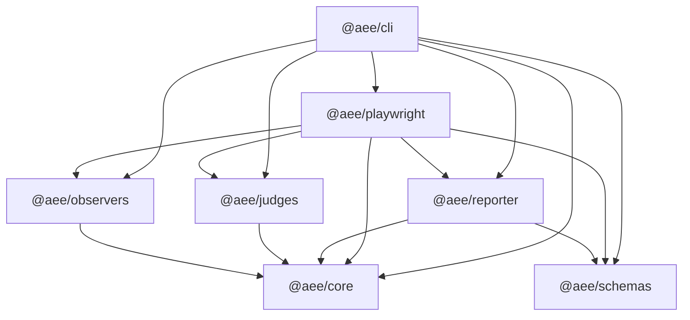

# Architecture

## Intent

AEE separates raw collection, evidence correlation, judgment, policy gating, and reporting. This boundary keeps judges independent of browser APIs and makes every result traceable to normalized evidence records.

The current implementation is a tested vertical slice. Some observer and judge manifests intentionally remain extension points; see the capability table in the [README](../README.md#current-capabilities).

## Execution model

1. A run starts with a versioned configuration and environment snapshot.
2. A checkpoint identifies the page state and interaction boundary.
3. Observers perform setup and capture before-state evidence.
4. The Playwright adapter performs the requested interaction.
5. The adapter waits for the configured stabilization delay.
6. Observers capture after-state evidence.
7. Correlation groups the records and artifacts into one normalized `EvidenceBundle`.
8. Non-release judges emit judgments and findings from that bundle.
9. Release judges apply policy to the preceding judgments.
10. Observers tear down, and reporters render the completed result.

The current engine produces one evidence bundle per execution. A longer user journey can call `runAeeOnPage(...)` at multiple meaningful interaction boundaries.

## Module responsibilities

### `@aee/core`

Owns the normalized domain model, policy types, orchestration, evidence correlation, and plugin contracts. It remains independent of Playwright and concrete observer implementations.

### `@aee/schemas`

Owns the JSON Schema documents and runtime validation. The CLI and Playwright adapter validate their emitted run, bundle, and report payloads against these schemas.

### `@aee/playwright`

Adapts real Playwright pages and virtual fixture pages to the shared execution pipeline. It owns interaction bracketing, fixed-delay stabilization, Playwright-specific accessibility/focus/network adapters, artifact output, and the `runAeeOnPage(...)` entry point.

### `@aee/observers`

Owns observer manifests and built-in DOM, accessibility-tree, focus, visual, and network observers. Guidepup and axe are declared but unsupported extension points. Network logs are sanitized again in this layer before persistence so custom page adapters cannot bypass redaction.

### `@aee/judges`

Owns judge manifests and the built-in structure, keyboard, change-response, and release judges. Interaction, screen-reader, and visual judges currently emit `unknown` judgments as extension scaffolds.

### `@aee/reporter`

Owns JSON and Markdown output. Reporters consume completed runs, normalized evidence, judgments, findings, and artifact references; they do not query the page.

### `@aee/cli`

Owns fixture configuration loading, path resolution, schema validation, virtual-page execution, and report writing. The current CLI requires a fixture path; real-page execution is provided by `@aee/playwright`.

## Dependency graph

## Key invariants

- Judges consume normalized evidence and do not read live page state.
- `unknown`, unsupported capture, and observer errors remain distinct from pass and fail.
- Release judgments run after other selected judges so policy can evaluate their results.
- Plugin manifests and artifact schemas are versioned.
- Raw evidence may be stored as artifacts instead of embedded in reports.
- Network redaction occurs before artifact persistence; other artifact types still require careful handling.

## Current constraints

- Execution currently correlates a single interaction and checkpoint.
- Stabilization is a configured timeout, not a browser-state condition.
- Observer capture runs concurrently with `Promise.all` within each phase.
- Setup, capture, or teardown failures are not yet governed by the declared observer timeout and continuation policy.
- Fix providers and automated remediation plans are not implemented.

See [Evidence privacy](privacy.md) for the artifact trust boundary and [Observer lifecycle](observer-lifecycle.md) for phase-level behavior.
