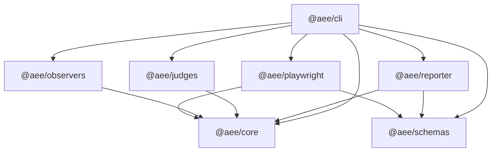

# Architecture

## Intent

This scaffold turns the approved architecture review into concrete module boundaries. The biggest design choice is that raw collection, evidence correlation, judgment, reporting, and fix planning remain separate layers.

## Execution model

1. A run starts with a versioned config and environment snapshot.
2. A checkpoint captures stable page state before or after meaningful events.
3. An interaction request describes what happened, who triggered it, and what target was involved.
4. Observers capture evidence before and after the interaction.
5. Correlation groups observer outputs into one normalized `EvidenceBundle`.
6. Judges consume normalized evidence and emit versioned judgments and findings.
7. Reporters and fix providers operate on judgments rather than raw DOM state.

## Module responsibilities

### `@aee/core`

Owns the normalized domain model and plugin contracts. It should remain dependency-light and avoid direct Playwright or screen-reader coupling.

### `@aee/schemas`

Owns JSON Schema artifacts and the schema catalog. Other packages can depend on the schema filenames and versions without having to own the raw schema documents.

### `@aee/playwright`

Owns adapter contracts that let Playwright tests emit checkpoints and interactions without forcing the rest of the system to depend on Playwright internals.

### `@aee/observers`

Owns observer manifests and registration helpers. Real observer implementations will eventually live here or in sibling packages.

### `@aee/judges`

Owns judge manifests and the default judge pipeline ordering.

### `@aee/reporter`

Owns output formats such as JSON and Markdown summaries.

### `@aee/cli`

Owns config loading and user-facing bootstrap behavior.

## Key constraints

- Judges must not read raw page state directly.
- Observer failures must be distinguishable from lack of evidence.
- Unknown must remain first-class all the way through release policy.
- Plugin contracts must be versioned so teams can extend safely.

## Dependency graph

## First implementation targets

- Real config validation from JSON Schema
- Real Playwright adapter plumbing
- DOM and accessibility tree observers
- Evidence correlation
- Keyboard-focused judge

