# Evidence Pipeline and Artifact Contract

This is the target Accessibility Evidence Engine (AEE) architecture. **Available**, **Partial**, and
**Planned** describe implementation status, not WCAG conformance. AEE rules use ACT-compatible
outcome semantics; a rule is called an “ACT Rule” only after it satisfies the
[ACT Rules Format](https://www.w3.org/TR/act-rules-format/).

The editable Mermaid source is
[`docs/diagrams/aee-evidence-pipeline.mmd`](diagrams/aee-evidence-pipeline.mmd).



## The execution model

1. **Define one complete journey.** Pin the URL, initial state, authorized actions, expected user
   outcomes, browser and tool versions, resolved axe rule IDs, evidence requirements, and privacy
   policy. The journey receives a stable digest.
2. **Fork active input lanes.** Pointer, keyboard, virtual screen reader, and optional real assistive
   technology use separate browser contexts. Two drivers must never move focus or mutate the same
   page.
3. **Checkpoint every meaningful action.** Passive observers capture a synchronized before state;
   the active lane performs one role-aware action; observers capture the after state. Tab, Enter,
   Space, selection, a committed text value, screen-reader navigation, submit, and hover are
   meaningful actions. Individual typing keys remain in the action trace without forcing a full
   checkpoint for every character.
4. **Correlate without flattening.** Join artifacts by run, lane, action, checkpoint, phase, target,
   and timestamp. Raw observer results remain immutable and independently inspectable.
5. **Judge deterministically, then route narrowly.** The remediation registry identifies required
   evidence, WCAG mappings, deterministic detection, the few allowlisted AI questions, and
   verification. AI output is clearly labeled, evidence-citing, provider-neutral, and advisory.
6. **Publish one integrated report.** HTML is the primary review surface; JSON is canonical for
   tools; Markdown works in GitHub. The report synthesizes direct judgments separately from derived
   release gates, preserves positive keyboard and virtual-reader outcomes, and distinguishes unique
   findings, repeated checkpoint occurrences, and incomplete rule results. Each finding dossier
   joins its Axe nodes with the same-action DOM, accessibility tree, focus state, full-page and
   viewport visuals, and reader evidence before presenting deterministic remediation, the bounded
   AI status, effort, and rerun verification. The keyboard-operable Status & plan, Fix review, Tested
   journeys, Visuals & video, and Technical annex tabs separate decisions from implementation detail.
   The first view communicates scoped product health and fix order; the visual review compares current
   evidence with a proposed change; a local evidence-grounded question interface explains status,
   priority, effort, and tested behavior without uploading artifacts. Raw DOM, accessibility-tree,
   focus, Axe, and evidence files remain linked in the annex.

The overall result is a release-policy verdict, not an automated WCAG percentage. Its scorecard
shows direct checks passed, confirmed issues, unresolved checks, and available artifacts. A failing
release gate does not hide an independent passing keyboard, focus, or virtual-reader judgment.
The tabs use progressive enhancement: without JavaScript they remain ordinary in-page links and all
sections remain readable; with JavaScript they follow the ARIA tab keyboard pattern.

## Active drivers and passive observers

An active driver changes page state: pointer, keyboard, virtual screen reader, VoiceOver, or NVDA.
Each active lane owns its page and runs the same journey independently. VoiceOver and NVDA form an
optional AT-fidelity tier, not a core requirement.

Passive observers inspect a lane at a checkpoint without changing focus or application state:

| Observer           | Required output                                                                                     |
| ------------------ | --------------------------------------------------------------------------------------------------- |
| Visual             | viewport PNG and full-page PNG with dimensions and capture metadata                                 |
| DOM                | full serialized DOM, computed target state, and target-specific derived view                        |
| Accessibility tree | full normalized tree plus a target-specific derived view                                            |
| Focus              | `document.activeElement`, deep active element, `aria-activedescendant`, visible focus, and AX focus |
| axe                | unmodified result sets, engine version, resolved rule IDs, tags, disabled rules, URL, and time      |
| Screen reader      | timestamped commands, phrases, item text, focus references, and assertions                          |
| Interaction        | raw key, pointer, hover, selection, authorization, and outcome trace                                |
| Video and network  | lane-spanning video/sidecar/captions and redacted network metadata                                  |

Visual comparison always uses the full page against the full DOM and full accessibility tree. A
target crop or subtree is a derived convenience, never the only evidence supplied to evaluation.

## Three independent result dimensions

Do not overload one `status` field:

| Dimension       | Example values                                             | Meaning                                 |
| --------------- | ---------------------------------------------------------- | --------------------------------------- |
| Execution state | `completed`, `blocked`, `observer-error`, `unsupported`    | Whether the step or observer ran        |
| Rule outcome    | `passed`, `failed`, `cantTell`, `inapplicable`, `untested` | ACT-style evaluation result             |
| Policy decision | `allow`, `warn`, `block`, `review`                         | What the configured release policy does |

If a prerequisite fails, dependent steps become `untested` with `blockedBy`; they do not become
passes. Retries are preserved as attempts, including flaky or contradictory results.

## Deterministic and AI responsibilities

[`rules/remediation-registry.json`](../rules/remediation-registry.json) is the canonical mapping from
issue to requirements, evidence, detection, optional AI contribution, and rerun verification. It is
validated by
[`packages/schemas/json/remediation-registry.schema.json`](../packages/schemas/json/remediation-registry.schema.json).
The public site table is generated from this file with `npm run site:generate`; CI uses
`npm run site:check` to prevent drift.

Examples of the boundary:

- axe deterministically finds an unnamed button; an accessible-name specialist may draft a useful
  name from synchronized context; the rerun recomputes the accessible name and exercises it.
- vision may locate complex foreground/background regions; deterministic code computes the WCAG
  ratio and the closest passing brand token.
- AI may compare visual and semantic heading hierarchy; deterministic extraction and screen-reader
  navigation verify the final outline.
- keyboard, focus movement, hover equivalence, and contrast ratios are exercised or calculated, not
  guessed by a model.

Exact generated text cannot be guaranteed byte-for-byte across all providers. AEE makes the process
reproducible where possible through deterministic routing, pinned prompt and specialist versions,
pinned model settings, structured output, input hashes, caching, and deterministic verification.

## Scenario run directory

```text
aee-output/<scenario-id>-<timestamp>/
├── manifest.json
├── scenario-plan.json
├── aee-report.html
├── aee-report.json
├── aee-report.md
├── <virtual-reader-lane>/
│   ├── manifest.json
│   ├── lane.json
│   ├── transcript.json
│   ├── transcript.txt
│   ├── video.webm
│   ├── video.json
│   ├── video.vtt
│   └── actions/<sequence>-<command>/<run-id>/...before and after evidence...
└── <comparison-id>/
    ├── manifest.json
    ├── interaction-trace.json
    ├── pointer/...lane video and per-action runs...
    └── keyboard/...lane video and per-action runs...
```

See the [manifest example](examples/evidence-run-manifest.example.json).

## Artifact rules

The pointer/keyboard and portable-reader lane runners each write a schema-validated `manifest.json`. The scenario runner verifies those manifests, rejects escaped or symbolic-link child manifests, re-hashes their artifacts, and writes one aggregate manifest. Every indexed path is relative to the assessment directory and receives SHA-256 integrity, byte length, lane/action/run provenance, lifecycle, and conservative privacy metadata. Each action declares its required artifact basenames; absent files are recorded as `missing`, failed inspections as `failed`, and either condition makes the aggregate manifest partial. The manifest does not hash itself.

Each active lane also produces `video.webm`, a schema-validated `video.json` action timeline, and `video.vtt` captions. Recording ends when the isolated browser context closes; the deterministic copies are privacy-sensitive and indexed in the lane manifest.

- The canonical manifest indexes immutable artifacts with relative path, media type, SHA-256,
  provenance, lifecycle, lineage, and per-artifact privacy classification.
- Every binary has a JSON sidecar. Transcript JSON is canonical; TXT and WebVTT are projections.
- Images, axe JSON, interaction traces, and requested transcripts persist for every meaningful
  checkpoint. Video can be temporary for passing runs but persists for failure, review, and demo.
- Raw axe output includes passes, violations, incomplete, and inapplicable results. Pin axe version
  and the cumulative WCAG 2.0, 2.1, and 2.2 A/AA rule selection, including disabled-by-default
  choices.
- A verified rerun records its parent run, scenario digest, environment equivalence, intended
  differences, resolved findings, introduced findings, and all attempts.
- Evidence stays local/private by default. Export requires explicit selection, redaction, and a
  sharing review. A generated report must never silently upload authenticated page content.

## CLI target

```bash
aee run scenario.yml
aee run scenario.yml --open
aee run scenario.yml --ci
aee run scenario.yml --output aee-output/scenarios
```

- `--open` opens the integrated HTML report.
- `--ci` is non-interactive, writes machine-readable output, and returns the configured policy exit
  code.
- `--output` chooses the parent directory for the timestamped assessment.

Optional `--at-fidelity` and review-only `--fix` workflows remain planned.

## Learning from corrections

Never overwrite an AI mistake. Preserve the original evaluation and append an approved correction
with reviewer disposition, evidence hashes, reason codes, privacy/consent, and verified-fix linkage.
Only sanitized and explicitly consented corrections may become immutable evaluation fixtures.

Candidates are tested offline against versioned per-specialist suites before promotion. Gate on
evidence citation validity, verdict accuracy, `cantTell` calibration, verified-fix rate, regressions,
privacy checks, and per-rule slices. Releases are versioned, approved, canaried, and reversible.

The [implementation roadmap](implementation-roadmap.md) separates the available Core flow from planned fidelity and fix workflows.
