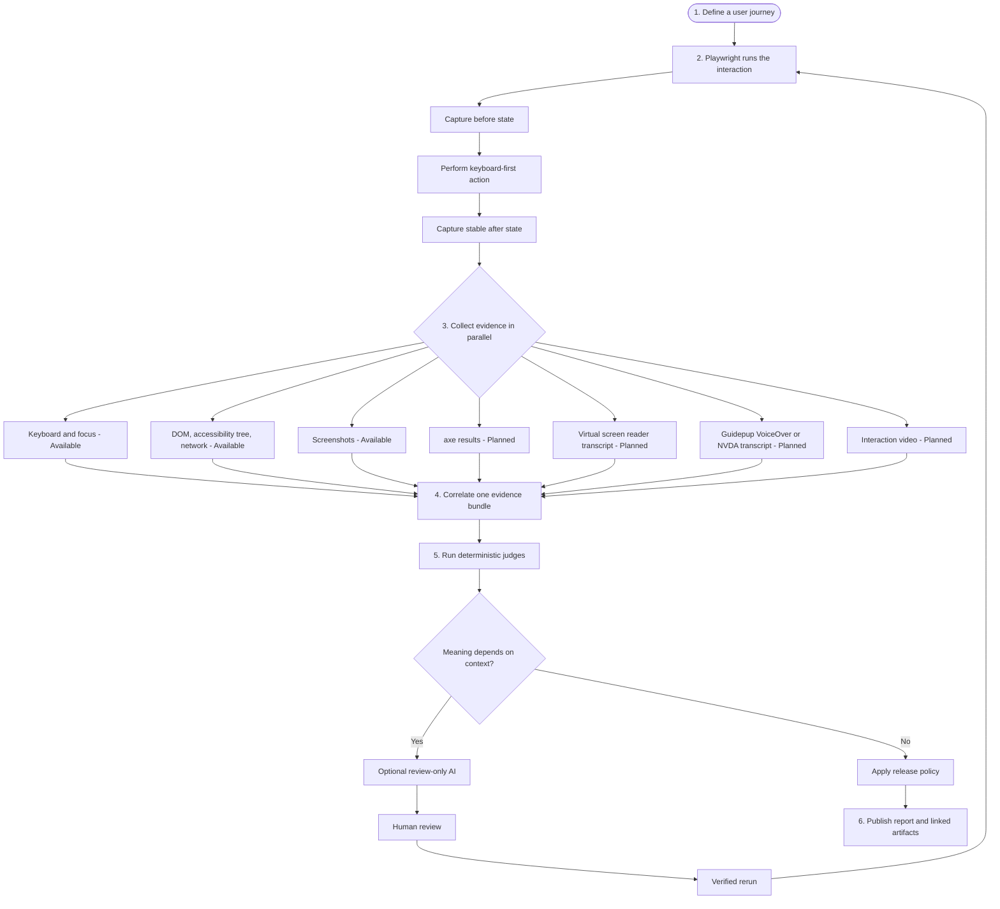

# Target Evidence Pipeline and Artifact Layout

This document proposes the next-stage Accessibility Evidence Engine architecture. It is a target
design, not a claim that every lane is implemented today. The public site and the Mermaid source
use **Available** and **Planned** labels to keep that distinction visible.

## Design choice

Use a deterministic orchestrator with focused evidence workers. The user journey and interaction
boundary are predefined; workers collect independent evidence in parallel and a correlator joins
their output. This is more predictable than giving autonomous sub-agents control of the test.

An optional AI reviewer belongs behind a narrow router. It receives only meaning-dependent cases,
such as whether an icon label is sufficiently specific. It does not replace axe, keyboard checks,
screen-reader evidence, or the release gate.

This combines the useful parts of the parallelization and evaluator patterns described in
[Building effective agents](https://www.anthropic.com/engineering/building-effective-agents) while
keeping the accessibility test itself reproducible.

## End-to-end flow

The editable Mermaid source is
[`docs/diagrams/aee-evidence-pipeline.mmd`](diagrams/aee-evidence-pipeline.mmd).



## What each step does

1. **Define:** create a versioned scenario containing the URL, starting state, interaction,
   expected behavior, browser matrix, stabilization rule, and capture policy.
2. **Exercise:** Playwright establishes the state and performs the exact user input. Keyboard
   scenarios should use actual key presses, not DOM event dispatch.
3. **Observe:** capture each evidence lane independently. A failure in one observer remains visible
   as `observer-error`, `timeout`, or `unsupported`; it must never become a pass.
4. **Correlate:** group records by run, checkpoint, phase, and interaction. Preserve timestamps,
   tool versions, browser/OS information, paths, and checksums.
5. **Judge:** evaluate normalized evidence. Deterministic judges run first; only contextual ambiguity
   may be routed to review-only AI. Release policy runs last.
6. **Publish:** create JSON and Markdown reports whose findings deep-link to raw artifacts. A single
   manifest is the machine-readable table of contents.

## Evidence lanes

| Lane                        | Output                                                                        | Status              |
| --------------------------- | ----------------------------------------------------------------------------- | ------------------- |
| Keyboard and focus          | key sequence, focused element before/after, tab direction, activation outcome | Available           |
| DOM and accessibility tree  | HTML snapshot and normalized tree JSON for each phase                         | Available           |
| Network                     | redacted request/response metadata                                            | Available           |
| Screenshots                 | PNG plus JSON sidecar for each meaningful phase                               | Available           |
| axe                         | complete axe JSON at the meaningful before/after states                       | Planned integration |
| Virtual screen reader       | commands, spoken phrase log, item text log, and assertions                    | Planned integration |
| Guidepup real screen reader | VoiceOver or NVDA commands and captured transcript, with OS metadata          | Planned integration |
| Video                       | WebM, metadata JSON, and WebVTT captions or action transcript                 | Planned integration |

The virtual and real screen-reader lanes are complementary. Guidepup's Virtual Screen Reader can
exercise DOM-style semantic navigation without machine screen-reader setup. Real Guidepup automation
uses VoiceOver on macOS or NVDA on Windows and should run only on matching workers. A virtual-reader
pass must not be presented as proof of VoiceOver or NVDA behavior.

Relevant implementation references:

- [Playwright accessibility testing with axe](https://playwright.dev/docs/accessibility-testing)
- [Playwright video recording](https://playwright.dev/docs/videos)
- [Guidepup Virtual Screen Reader navigation](https://www.guidepup.dev/docs/virtual-screen-reader/testing-navigation)
- [Guidepup Virtual Screen Reader announcement logs](https://www.guidepup.dev/docs/virtual-screen-reader/testing-announcements)
- [Guidepup real screen-reader API](https://www.guidepup.dev/docs/api/class-guidepup)

## Proposed run directory

```text
aee-output/<run-id>/
├── manifest.json
├── run.json
├── scenario.json
├── environment.json
├── bundle.json
├── report/
│   ├── aee-report.json
│   ├── aee-report.md
│   └── aee-report.html                 # optional future renderer
├── evidence/
│   ├── checkpoints/<checkpoint-id>/
│   │   ├── before/
│   │   │   ├── dom.html
│   │   │   ├── dom.json
│   │   │   ├── accessibility-tree.json
│   │   │   ├── focus.json
│   │   │   ├── axe.json
│   │   │   ├── screenshot.png
│   │   │   └── screenshot.json
│   │   └── after/
│   │       └── ...same artifact types...
│   └── interactions/<interaction-id>/
│       ├── interaction.json
│       ├── keyboard.json
│       ├── virtual-screen-reader.json
│       ├── virtual-screen-reader.txt
│       ├── guidepup.json
│       ├── guidepup.txt
│       ├── video.webm
│       ├── video.json
│       └── video.vtt
├── judgments/
│   ├── keyboard.json
│   ├── structure.json
│   ├── axe.json
│   ├── screen-reader.json
│   └── release.json
└── findings/
    └── <finding-id>.json
```

See the proposed [`manifest.json` example](examples/evidence-run-manifest.example.json).

## File contracts

- **One primary JSON record per observer and phase.** Keep machine-readable metadata, diagnostics,
  assertions, provenance, and links together.
- **One sidecar JSON per binary artifact.** A PNG or WebM should have an adjacent JSON record with
  dimensions, duration where relevant, capture time, phase, observer version, and checksum.
- **Two transcript formats.** JSON is canonical and includes command/announcement timestamps; TXT is
  a human-readable projection. Video should also receive WebVTT captions when the transcript can be
  aligned reliably.
- **Raw axe output stays intact.** The report may summarize violations, but `axe.json` should retain
  passes, violations, incomplete results, inapplicable results, test engine version, URL, and time.
- **Every judgment cites evidence IDs.** A report finding must be traceable to the exact records and
  files that support it.
- **The manifest is the only directory index.** It records relative paths, media types, observer IDs,
  phases, and SHA-256 integrity values after files are finalized.
- **Unknown is not pass.** Missing, unsupported, timed-out, and errored lanes remain explicit in both
  the manifest and release policy.

## Recommended implementation order

1. Add the manifest and binary sidecar contract without changing existing observer behavior.
2. Implement the axe observer and store the complete result at before/after checkpoints.
3. Implement the portable Virtual Screen Reader observer and transcript schema.
4. Add Playwright video capture, metadata, and report embedding.
5. Add OS-specific Guidepup runners for VoiceOver and NVDA; keep them separate from the virtual lane.
6. Add minimum-evidence release policy so required lanes can block on fail, unknown, timeout, or
   unsupported status.
7. Add an HTML report only after the JSON contracts are stable.

## Privacy boundary

DOM, accessibility trees, images, videos, transcripts, URLs, and target names can expose private
information. Keep capture policies explicit, redact before persistence where possible, and require a
sharing review flag in `manifest.json`. Do not publish raw evidence from authenticated or production
flows without review.
