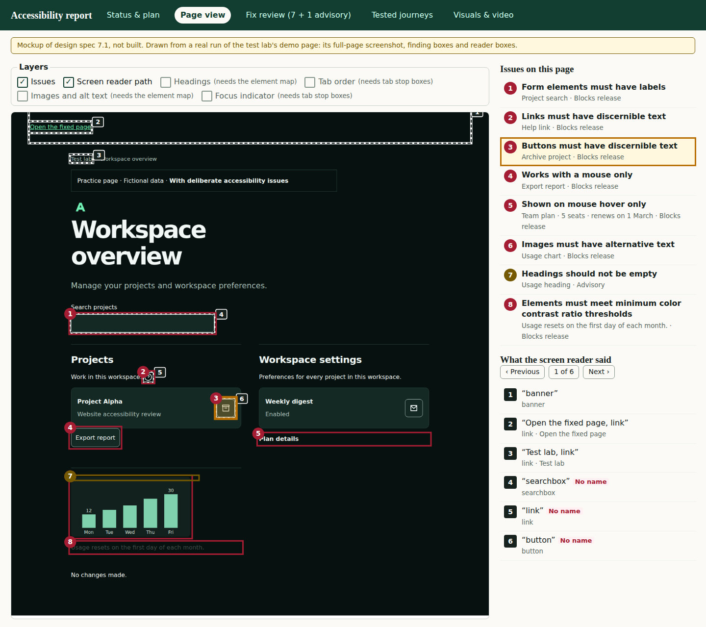

# QA and designer view

A design spec for master plan step 7.1: bring three tools the owner already built into the HTML report, so QA and designers get a report made for them, not only for developers. Nothing here is built yet; [Build steps](#build-steps) proposes the steps that build it.



## Why

The report answers a developer's questions: which rule, which element, what fix. QA and designers ask different ones:

- **Where on the page is it?** The bookmarklets draw headings, tab order, alt text and focus on a live page.
- **What does a screen-reader user hear?** sr-visualizer lists each announcement and highlights its element.
- **Can I file it?** clip-to-ticket turns a finding into a ticket someone else can act on.

Each works on a live page or a recording. This view gives the same answers from the evidence a run already captured, inside the one report the team already shares.

## Rules the view keeps

1. **Evidence only.** The report never loads or injects into the live page; reporters do not query the page ([architecture](architecture.md)). Every overlay is drawn from boxes captured during the run, on the run's own full-page screenshot. So it shows the page as tested, and it works offline, in a CI artifact, months later.
2. **Measured, not guessed.** Tab order is the order the sweep's Tab presses actually reached, not a selector list sorted by `tabindex` as the bookmarklet does. Headings include `role="heading"` with `aria-level`, read from the accessibility tree, which the bookmarklet misses.
3. **Meaning before mood** ([design](../DESIGN.md)). Colour marks results only: Finding Red for blocking, Review Amber for advisory or needs review, Pass Green for a pass. There is no per-level rainbow. Every marker also carries a number or a text label, so nothing relies on colour alone (WCAG 1.4.1).
4. **The list is the interface; the picture illustrates it.** Each layer is a list that works by keyboard and screen reader. The markers on the screenshot mirror the list: selecting an item outlines its marker and scrolls it into view. Markers are not tab stops, since a page can have hundreds.
5. **Works without screenshots.** With screenshot capture off ([privacy](privacy.md)), the lists remain and the picture area says it was not captured.
6. **Same scope, no score.** A layer shows what the run tested. A layer with nothing to show says so, and nothing becomes a percentage.
7. **Accessible itself.** Keyboard only, screen reader, reduced motion, 200% zoom and 320 px width, and axe finds no violations in any state.

## 1. Page view: overlays (from the bookmarklets)

A new **Page view** tab (`#panel-page`), after Status & plan. It has four parts:

- **Page state:** a picker, shown when the run has more than one checkpoint.
- **Layers:** a group of checkboxes (`fieldset` and `legend`).
- **Page:** the full-page screenshot, with the chosen layers drawn over it in SVG. Selecting it opens the existing image viewer.
- **Lists:** one per chosen layer, beside the page on a desktop.

On a phone the full page is a thumbnail too small to read, as the mockup's phone width showed. So there the lists come first, and selecting an item shows a magnified crop of its element, the same crop Fix review uses; the report's rule is to magnify affected regions, not to show unreadable full-page thumbnails ([report surface](accessibility-report-surface.md)). The whole page still opens in the image viewer.

| Layer              | What it draws                                                                                            | Harvested from     | Data                                              |
| ------------------ | -------------------------------------------------------------------------------------------------------- | ------------------ | ------------------------------------------------- |
| Issues (on)        | A numbered outline for each affected element: red when it blocks release, amber when advisory            | New                | Exists: each finding instance's `targetBox`       |
| Screen reader path | A numbered dashed outline for each announced item, in reading order                                      | sr-visualizer      | Exists: each reader entry's `visualBounds`        |
| Headings           | An "H1"–"H6" label and outline for each heading; the list is indented by level and flags a skipped level | highlight-headings | Needs the element map (gap 1)                     |
| Tab order          | A numbered badge for each Tab stop, in the order Tab reached it                                          | show-tab-order     | Needs a box per sweep stop (gap 2)                |
| Images and alt     | For each image: "No alt" (red), "Decorative", or its alt text                                            | show-alt-text      | Needs the element map (gap 1)                     |
| Focus indicator    | For each Tab stop, a crop of it focused, or "No visible focus" where the sweep measured none             | focus-indicator    | Measured already in focus state; crops need gap 2 |

Unlike the bookmarklets, which read `document.querySelectorAll`, the boxes come from the browser's own DOM snapshot, so content in shadow roots is included. Frames are a gap today: the snapshot reads the top document only, and the element map should add each frame's document, offset by its frame's box.

## 2. What the screen reader said (from sr-visualizer)

The Tested journeys tab gets an announcement list above today's reader table, which stays in the annex as the full evidence.

- **Each item, in order:** its number, the phrase as announced, and role and name.
  - A category mark: landmark, heading, control, form field or text. It is taken from the role, not guessed from the words as sr-visualizer does.
  - An item announced without a name is marked "No name" in Finding Red, the same rule as the Virtual reader status row.
- **Selecting an item** outlines its element on the page, which is the Screen reader path layer.
  - The list items are buttons with `aria-current` on the selected one.
  - Previous and Next move through them, with "3 of 6".
  - Nothing plays or moves on its own, and the outline does not animate under reduced motion.
- **The scope, in words:** it lists what the scenario's reader commands reached, not the whole page; add commands to cover more.

Reading the phrase aloud with the browser's voice is left for later. If it is added, it must say it is the browser's voice, not a screen reader.

## 3. Copy as ticket (from clip-to-ticket)

- **Per fix:** each fix row in Fix review gets **Copy as ticket**, which puts the Markdown below on the clipboard.
- **For all fixes:** Fix review gets **Download all as CSV**, one row per fix, with the same fields as columns so an issue tracker's CSV import can map them.
- **Offline:** the report calls no tracker API. It stays offline, and filing is the person's action.

| Field              | From the report                                                                                 | clip-to-ticket field |
| ------------------ | ----------------------------------------------------------------------------------------------- | -------------------- |
| Title              | The finding's title and the element's label                                                     | `issue_title`        |
| Severity           | Blocks release or Advisory                                                                      | `severity`           |
| WCAG               | The registry's criterion, title, level and Understanding link                                   | `wcag_reference`     |
| Rule               | The axe rule or AEE finding id and its documentation link                                       | `axe_rule_id`        |
| How to build it    | The a11y-skills pattern link                                                                    | `apg_pattern`        |
| Where              | The page address, the element's selector and the page state                                     | New                  |
| Steps to reproduce | The journey's start address and the actions up to the checkpoint, from the run                  | New                  |
| Expected / actual  | Expected from the fix; actual from the evidence, such as the announcement or the measured ratio | New                  |
| Suggested fix      | The deterministic fix, then any AI suggestion, labelled "AI suggestion, review before use"      | `suggested_fix`      |
| Affected elements  | How many, and which                                                                             | New                  |
| Evidence           | The report's file name and the crop's image file, to attach                                     | `screenshot_context` |

Clip-to-ticket had no steps to reproduce and no expected and actual; a run knows both. Not carried over:

- **Dropped fields:**
  - `ease_of_fix`: the report already estimates effort per group.
  - `status`, the timestamp and the video index: these belong to recordings.
  - A separate generated-alt-text field: it is the AI suggestion.
- **Its WCAG and APG data files:** the registry already has each criterion's number, title, level and link, and the master plan keeps those files out unless the registry proves insufficient.
- **Example media and names:** none of clip-to-ticket's example media or names come across.

For example, the demo page's unnamed archive button, from a real run:

```markdown
### Buttons must have discernible text: Archive project

- **Severity:** Blocks release
- **WCAG:** 4.1.2 Name, Role, Value (A) — https://www.w3.org/WAI/WCAG22/Understanding/name-role-value.html
- **Rule:** button-name — https://dequeuniversity.com/rules/axe/4.13/button-name
- **How to build it:** https://github.com/Elizabeth1979/a11y-skills/blob/<commit>/patterns/buttons.instructions.md
- **Where:** /test-case.html, `#archive-project`, on page load
- **Steps to reproduce:** Open /test-case.html. Move a screen reader to the archive button in the Projects list.
- **Expected:** it is announced with a name that says what it does.
- **Actual:** the virtual reader announced "button".
- **Suggested fix:** give the button an accessible name, such as `aria-label`.
- **AI suggestion, review before use:** "Archive Project Alpha" (stand-in model)
- **Affected elements:** 1
- **Evidence:** aee-report.html, crop `archive-project.png`
```

## Data gaps

The build closes three. None needs a new browser call:

1. **Element map.** The reader and the heading check already read a DOM snapshot with every element's box (`captureDomSnapshot`), but the saved `dom-snapshot` artifact is the page's HTML only. The build persists one JSON artifact per checkpoint from that same snapshot. It lists headings, images, landmarks and focusable elements, each with its role, name, level or alt state, and its box in page coordinates.
2. **Tab stop boxes.** The sweep records each stop as a selector. The build adds its box, and whether focus was visible, from the focus state the sweep already measures.
3. **Page size for reader boxes.** A reader entry's `visualBounds` has no page width and height. The build takes them from the checkpoint's screenshot, or records them, so outlines scale.

## Build steps

Proposed as master plan steps 7.3 to 7.5, in order of value for the data that exists:

1. **Page view with the Issues and Screen reader path layers, and the announcement list.** The data exists. _Done when:_ on the lab's demo page, every finding and every announcement has an outline at its element; the layers and lists work by keyboard; and axe finds no violations in each state, desktop and phone.
2. **Copy as ticket, and the CSV.** _Done when:_ a copied ticket pasted into a GitHub issue shows every field, and the CSV opens with one row per fix.
3. **The element map and tab stop boxes, then the Headings, Tab order, Images and Focus indicator layers.** _Done when:_ the lab's demo page's heading, keyboard and alt text issues each show on their layer, and the fixed page shows the same layers with nothing flagged.

## Out of scope

- **Drawing on the live page:** the bookmarklets stay a separate tool for that.
- **A real screen reader's voice:** that is Milestone 4's VoiceOver and NVDA lane.
- **Filing tickets from the report through a tracker's API.**
- **clip-to-ticket's video analysis.**
